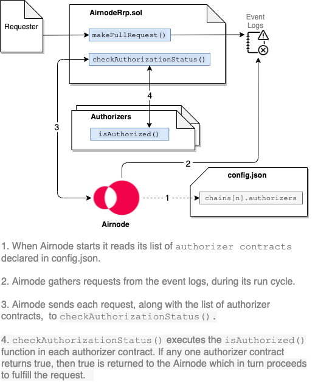

<TitleSpan>Concepts and Definitions</TitleSpan>

# {{$frontmatter.title}}

<TocHeader />
<TOC class="table-of-contents" :include-level="[2,3,4,5]" />

An Airnode can authorize requester contract access to its underlying API using two methods.

- Authorizers: Using authorizer contracts.
- Relay Metadata: Using Airnode relay metadata (`_relay_metadata`).

<divider/>

## Authorizers

When an Airnode receives a request, it can use on-chain authorizer contracts to verify if a response is warranted. Authorizers allow Airnodes to implement a wide variety of policies. Below are some examples:

- Respond to requests from sponsors that have paid their monthly subscription fee in DAI.
- Respond to individual requests for which a per-call fee has been paid in API3 tokens.
- Respond to requests made by requesters that were whitelisted by the API3 DAO.
- Respond to requests made by sponsors who have been whitelisted by the Airnode owner's backend (for example, based on PayPal payments).

A common use case for an authorizer is the [AirnodeRequesterRrpAuthorizer](./authorization.md#airnoderequesterrrpauthorizer) authorizer contract developed for Airnode operators to use right out-of-the-box. It allows the whitelisting of requester contracts (with or without expiration timestamps) on a per endpoint basis. This is the most common use case and may in fact satisfy the needs of many Airnodes.

The diagram below illustrates how Airnode utilizes authorizers.

> 

The authorizers you use will authorize all requests regardless of which endpoint is called. Endpoints are declared in the `ois.endpoints` field of the `config.json` file. To further filter by a particular endpoint you must use a custom authorizer such as AirnodeRequesterRrpAuthorizer or use relay metadata.

### Airnode Authorization Policies

Airnode provides two authorizer contracts, one of which (AirnodeRequesterRrpAuthorizer) can be used by any API provider. The other (DaoRequesterRrpAuthorizer) is used by the API3 DAO. They are detailed within this doc in sections below.

- [`AirnodeRequesterRrpAuthorizer`](./authorization.md#airnoderequesterrrpauthorizer)
- [`DaoRequesterRrpAuthorizer`](./authorization.md#daorequesterrrpauthorizer)

Both these authorizer contracts inherit and extend the `RequesterRrpAuthorizer` abstract contract which also extends the [`Whitelister`](./adminnable.md#whitelister) contract. This means that both authorizer contracts will need to whitelist requester contracts prior to make them available to an Airnode (For `AirnodeRequesterRrpAuthorizer` this can be done using the [admin-cli](../reference/admin-cli-commands.md#airnodeRequesterrrpauthorizer)).

The main difference between them is that `AirnodeRequesterRrpAuthorizer` also inherits [SelfAdminnable](./adminnable.md#selfadminnable) contract where admins are only allowed whitelist requesters on a specific Airnode. Meta-admin and admins in `DaoRequesterRrpAuthorizer` on the other hand, can whitelist requesters across all Airnodes because it inherits [Adminnable](./adminnable.md#adminnable) contract.

Some common functions available are:

- `userIsWhitelisted`: Called to check if a requester is whitelisted to use the Airnode–endpoint pair
- `airnodeToEndpointIdToUserToWhitelistStatus`: Called to get the detailed whitelist status of a requester for the Airnode–endpoint pair

### Custom Authorizers

Custom authorizer contracts can implement any arbitrary authorization logic An example might be where Airnode only responds to requests if the wallet it will use to fulfill the request has a balance more than an amount set by the Airnode operator admin.

### Authorizer List

Airnode authorizers are listed in the config.json file at [`chains[n].authorizers`](../grp-providers/guides/build-an-airnode/configuring-airnode.md#chains). An authorizer typically checks for a single condition (has the requester made their monthly payment, is the `requester` whitelisted, etc.). Authorizers can be combined to enforce more complex policies. If any of the authorizers in the list gives access, the request will considered to be authorized. From a logical standpoint, the authorization outcomes get `OR`ed.

### Authorizer Interface

Authorizer contracts that inherit from `IRrpAuthorizer` can be used to implement an arbitrary authorization policy based on its input parameters.

- `requestId`: bytes32
- `airnode`: address
- `endpointId`: bytes32
- `sponsor`: address
- `requester`: address

Note that the authorizer does not have to use all of the arguments, and can even decide on external criteria such as `blockNumber` (e.g., do not respond to anyone after block number N). An authorizer is a contract with the following interface:

```solidity
interface IRrpAuthorizer {
    function AUTHORIZER_TYPE() external view returns (uint256);

    function isAuthorized(
        bytes32 requestId,
        address airnode,
        bytes32 endpointId,
        address sponsor,
        address requester
    ) external view returns (bool);
}
```

Below is an example of how to create the simplest form of an authorizer. This authorizer allows any requester contract to call the endpointId (0xf2ee...).

```solidity
contract myAuthorizer is IRrpAuthorizer
{
  function isAuthorized(
      bytes32 requestId,
      address airnode,
      bytes32 endpointId,
      address sponsor,
      address requester
  ) external view override returns (bool) {
      bytes32 expected = '0xf2ee...';
      return endpointId == expected;
  }
}
```

### Why is the authorizer scheme needed?

Airnodes need the ability to fulfill requests selectively. This is required for two main reasons:

1. The Airnode only fulfills requests made by requesters who have made payment to the Airnode owner, which allows them to monetize their services.
2. The services of the Airnode are sensitive and can only be accessed by certain requesters, e.g., who have gone through KYC.

A protocol that does not have the authorizer scheme or equivalent functionality cannot be considered as permissionless, and will not be able to achieve wide-spread adoption.

### Are authorizers required?

Authorizers are not required. An Airnode operator could use [_relay_metadata](./authorization.md#relay-metadata) to authorize API access. And it is possible to use both authorizers and `_relay_metadata` together.

### How are authorizers implemented?

There are two main points to consider about how authorization policies are implemented:

1. If the policies are kept off-chain, the requester cannot see them or check if they satisfy them. Furthermore, the Airnode owner updating the policies (e.g., increasing the service fees) requires off-chain coordination with the requester.
2. Embedding the policies in the request–response loop results in a gas cost overhead.

Based on these considerations, Airnode uses a hybrid method. An Airnode announces its authorization policy through off-chain channels as the addresses of a list of authorizer contracts. Whenever the Airnode receives a request, it checks if it should fulfill this request by making a static call that queries this on-chain policy. Similarly, the requester can use this on-chain policy by making a static call to check if they are authorized. This scheme both allows the Airnode to set transparent and flexible policies, and this to be done with no gas overhead.

### Access (deny, allow, filter)

How authorizers impact access is based on the `chains` field of `config.json` for a givin Airnode.

#### Deny All

If the Airnode wants to deny all access for a particular chain, it should not operate on it (i.e., it should not exist in the `chains` list). The below example would "deny all" to chains 1 and 3-n since they do not have entries in the `chains` field.

```json
 chains:[
   id:2,
   authorizers:[]
   ...
 ]
```

#### Allow All

A `chains.authorizers` list of [] means "let everyone through". In the example below chain 2 would allow access to any requester.

```json
  chains:[
    {
      id:2,
      authorizers:[]
      ...
    }
 ]
```

#### Filter All

If the Airnode wants to give access selectively, it should use one or more authorizers that implement filtering logic. In the example below the Airnode will accept requests on chain _"2"_ and the requester would be filtered by two authorizers.

```json
 chains:[
   id:2,
   authorizers:['0xcd...cd8d','0xff...d19c]
   ...
 ]
```

### AirnodeRequesterRrpAuthorizer

This contract implements a requester-based RRP authorizer with multiple levels of admins for multiple "adminned" addresses independently and treats each Airnode's operator address as its respective highest ranked admin.

An Airnode operator and the admins will use `AirnodeRequesterRrpAuthorizer` contract to whitelist requesters. The Airnode operator address and the admins are also authorized to make requests to an Airnode even if they are not whitelisted explicitly.

`AirnodeRequesterRrpAuthorizer` inherits `SelfAdminnable` contract so whitelisting can be changed not only by the Airnode operator address but also by other admins that have the required rank level. This also means that each Airnode is adminned by themselves. [here](./adminnable.md#selfadminnable) you can find more info.

#### setWhitelistExpiration

The `setWhitelistExpiration()` function can be called by a super admin to set the whitelisting expiration of a requester for the Airnode–endpoint pair, this can hasten expiration.

This function emits a `SetWhitelistExpiration` event with the following signagure:

```
    event SetWhitelistExpiration(
        address indexed airnode,
        bytes32 endpointId,
        address indexed user,
        address indexed admin,
        uint256 expiration
    );
```

#### extendWhitelistExpiration

The `extendWhitelistExpiration()` function can be called by an admin to extend the whitelist expiration of a requester for the Airnode–endpoint pair.

This function emits a `ExtendedWhitelistExpiration` event with the following signagure:

```
    event ExtendedWhitelistExpiration(
        address indexed airnode,
        bytes32 endpointId,
        address indexed user,
        address indexed admin,
        uint256 expiration
    );
```

#### setWhitelistStatusPastExpiration

The `setWhitelistStatusPastExpiration()` function can be called by a super admin to set the whitelist status of a requester past expiration for the Airnode–endpoint pair. This status can be useful in cases where we don't want to block access to an API even if the the expiration date has passed. For example, we might want to keep authorizing requests while a sum of API3 tokens is locked.

This function emits a `ExtendedWhitelistExpiration` event with the following signagure:

```
    event SetWhitelistStatusPastExpiration(
        address indexed airnode,
        bytes32 endpointId,
        address indexed user,
        address indexed admin,
        bool status
    );
```

#### isAuthorized

The `isAuthorized()` function will be called by AirnodeRrp to verify the authorization status of a request. This function will return true for all whitelisted requester contracts, admins and Airnode operator address.

### DaoRequesterRrpAuthorizer

This contract implements a requester-based RRP authorizer and assigns the API3 DAO as the meta-admin or in other words, the highest ranking admin across all Airnodes.

The meta-admin and the admins will use `DaoRequesterRrpAuthorizer` contract to whitelist requesters across all Airnodes. The meta-admin and the admins are also authorized to make requests to an Airnode even if they are not whitelisted explicitly.

`DaoRequesterRrpAuthorizer` inherits `Adminnable` contract so whitelisting can be changed not only by the meta-admin but also by other admins that have the required rank level. [here](./adminnable.md#adminnable) you can find more info.

#### setWhitelistExpiration

The `setWhitelistExpiration()` function can be called by a super admin to set the whitelisting expiration of a requester for the Airnode–endpoint pair, this can hasten expiration.

This function emits a `SetWhitelistExpiration` event with the following signagure:

```
    event SetWhitelistExpiration(
        address indexed airnode,
        bytes32 endpointId,
        address indexed user,
        address indexed admin,
        uint256 expiration
    );
```

#### extendWhitelistExpiration

The `extendWhitelistExpiration()` function can be called by an admin to extend the whitelist expiration of a requester for the Airnode–endpoint pair.

This function emits a `ExtendedWhitelistExpiration` event with the following signagure:

```
    event ExtendedWhitelistExpiration(
        address indexed airnode,
        bytes32 endpointId,
        address indexed user,
        address indexed admin,
        uint256 expiration
    );
```

#### setWhitelistStatusPastExpiration

The `setWhitelistStatusPastExpiration()` function can be called by a super admin to set the whitelist status of a requester past expiration for the Airnode–endpoint pair. This status can be useful in cases where we don't want to block access to an API even if the the expiration date has passed. For example, we might want to keep authorizing requests while a sum of API3 tokens is locked.

This function emits a `ExtendedWhitelistExpiration` event with the following signagure:

```
    event SetWhitelistStatusPastExpiration(
        address indexed airnode,
        bytes32 endpointId,
        address indexed user,
        address indexed admin,
        bool status
    );
```

#### isAuthorized

The `isAuthorized()` function will be called by AirnodeRrp to verify the authorization status of a request. This function will return true for all whitelisted requester contracts, admins and the meta-admin address.

<divider/>

## Relay Metadata

Airnode operators can use the [\_relay_metadata](../reference/specifications/reserved-parameters.md#relay-metadata) named reserved parameter to instruct Airnode to send metadata to an endpoint. The endpoint can then use the metadata to process and respond (or not) accordingly to the requester.

> 

This option has been implemented because sometimes the Airnode operator does not want to use on-chain authorizers.

- The parameter that authorization depends on (e.g., if the requester has paid) should not be made public.
- The Airnode operator does not want to interact with the chain to alter authorization statuses (e.g., does not want to make a transaction to whitelist a new user, which will cost them gas fees).

Activate the sending of the metadata by adding a reserved parameter with a name of `_relay_metadata` that defaults to `v1`. Note that the use of `v1` is specific to Airnode version `v1.x.x`. The Airnode will attach the metadata in the query string for `GET` and request body for `POST`, before performing the endpoint call.

```json
// Go to: ois.endpoints[n]reservedParameters[n].name in config.json
"reservedParameters": [
  ...
  {
    "name": "_relay_metadata",
    "default": "v1"
  }
],
```

Below is a list of metadata values send to an endpoint when `_relay_metadata` is activated.

```sh
_airnode_airnode_id: '0x19255a4ec31e89cea54d1f125db7536e874ab4a96b4d4f6438668b6bb10a6adb',
_airnode_requester_address: '0xe7f1725E7734CE288F8367e1Bb143E90bb3F0512',
_airnode_sponsor_wallet: '0x1c5b7e13fe3977a384397b17b060Ec96Ea322dEc',
_airnode_endpoint_id: '0xeddc421714e1b46ef350e8ecf380bd0b38a40ce1a534e7ecdf4db7dbc9319353',
_airnode_request_id: '0xd1984b7f40c4b5484b756360f56a41cb7ee164d8acd0e0f18f7a0bbf5a353e65',
_airnode_chain_id: '31337',
_airnode_chain_type: 'evm',
_airnode_airnode_rrp: '0x5FbDB2315678afecb367f032d93F642f64180aa3',
```
