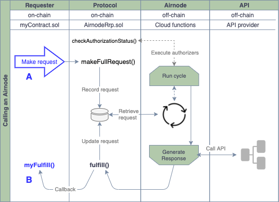

# {{$frontmatter.title}}

<TocHeader />
<TOC class="table-of-contents" :include-level="[2,3]" />

A requester is a contract that can trigger an Airnode request. To do so, requester needs to be sponsored and make the request using a matching sponsor wallet. See [Requesters and Sponsors](requesters-sponsors.md) on how to sponsor a requester and derive the sponsor wallet.

Airnode is composed of two parts: the off-chain **Airnode** (cloud provider functions, e.g., AWS) and the on-chain **protocol contract** ( AirnodeRrp.sol). A requester calls the protocol contract, which emits a blockchain event with the request parameters. Airnode listens to the events emitted by the AirnodeRrp contract. During its next run cycle, Airnode gets the request parameters from the emitted event. The diagram below illustrates the mechanics of the entire process as does the diagram in the [Overview](./) doc for developers.

The AirnodeRrp protocol is designed to be flexible and is meant to serve a variety of use cases. See the Airnode [requester examples](https://github.com/api3dao/airnode/tree/master/packages/examples/contracts) for some potential design patterns.
<!-- TODO: replace the above with master branch once the issue is merged -->

Ignoring the mechanics of the overall process, the requester primarily focuses on two tasks as indicated by points A & B in the diagram below when calling an Airnode.

- <span style="color:blue;">A</span>: Make the request
- <span style="color:blue;">B</span>: Accept and decode the response

> 

In the above diagram a requester makes a request to the AirnodeRrp.sol contract which emits an event. This event is retrieved by the Airnode during its next run cycle. Airnode then gathers the requested data from the API and creates a transaction to call the function `fulfill()` in AirnodeRrp.sol which in turn makes a callback to the function `myFulfill` in the requester. This response transaction is covered by sponsor using the sponsor wallet.

This remainder of this doc focuses on the requester implementation, it's deployment and sponsoring.

## Step #1: Inherit RrpRequester.sol

A requester inherits from the [RrpRequester.sol](https://github.com/api3dao/airnode/blob/master/packages/protocol/contracts/rrp/requesters/RrpRequester.sol) contract. This will expose the AirnodeRrp.sol protocol contract to the requester allowing it to make Airnode requests.

```solidity
import "@api3/protocol/contracts/rrp/requesters/RrpRequester.sol";

contract MyRequester is RrpRequester {
  ...
  constructor (address airnodeRrpAddress)
      public
      RrpRequester(airnodeRrpAddress)
  {}
  ...
}
```
Note the constructor parameter `airnodeRrpAddress` which is the public address of the AirnodeRrp.sol protocol contract on the blockchain you wish to use. It is used by RrpRequester.sol to point itself to AirnodeRrp.sol. See the list of all [Airnode contract addresses](../reference/airnode-addresses.md) in the reference section.

## Step #2: Implement the request logic

There are three types of requests provided by the AirnodeRrp.sol contract. See [Request Types](../reference/concepts/request.md#request-types) in the Reference section for information related to each request type. 

This example will use a [full request](../reference/concepts/request.md#_3-full-request) type (note the `airnode.makeFullRequest` function call in the code below) which is called from the requester's own function `callTheAirnode`. The function `makeFullRequest` requires that the requester pass all parameters needed by Airnode to call its underlying API.

Once the request has been made to `airnode.makeFullRequest` the AirnodeRrp.sol contract will return a `requestId` confirming the request has been accepted and is in process of being executed. Your requester would most likely wish to track all requestIds. Note the line `incomingFulfillments[requestId] = true;` in the code below that stores the requestIds in a mapping. This will be useful when the Airnode responds to the requester later at the function (`airnodeCallback`) with the `requestId` and the `data` requested.

```solidity
import "@api3/protocol/contracts/rrp/requesters/RrpRequester.sol";

contract MyRequester is RrpRequester {
  mapping(bytes32 => bool) public incomingFulfillments;
  mapping(bytes32 => int256) public fulfilledData;

  constructor (address airnodeRrpAddress)
      public
      RrpRequester(airnodeRrpAddress)
  {}

  function callTheAirnode(
      address airnode,
      bytes32 endpointId,
      address sponsor,
      address sponsorWallet,
      bytes calldata parameters // Inbound API parameters which may already be ABI encoded
      )
      external
  {
      bytes32 requestId = airnode.makeFullRequest( // Make the Airnode request 
          airnode,                        // airnode
          endpointId,                     // endpointId
          sponsor,                        // sponsor's address
          sponsorWallet,                  // sponsorWallet
          address(this),                  // fulfillAddress
          this.airnodeCallback.selector,  // fulfillFunctionId
          parameters                      // API parameters
          );
      incomingFulfillments[requestId] = true;
  }
  
  function airnodeCallback(   // The AirnodeRrp.sol protocol contract will callback here.
      bytes32 requestId,
      bytes calldata data
  { 
      ...
  }
}
```

### Request Parameters

<Fix>The request parameters have changed.</Fix>

A full request using the AirnodeRrp.sol contract `makeFullRequest` function requires all parameters needed by the Airnode application to be passed at runtime. This is in contrast to a template request that would use a template for some or all of the required parameters. Learn more about [using templates](call-an-airnode.md#using-templates).

Since the `callTheAirnode` function is going to make a [full request](../reference/concepts/request.md#full-request) it must gather the following parameters to pass on to `airnode.makeFullRequest`.

- **airnode** and **endpointId**: As a pair these uniquely identify the endpoint desired at a particular Airnode.

- **sponsor**: The [sponsor](requesters-sponsors.md#what-is-a-sponsor) address. 

- **sponsorWallet**: The [sponsor wallet](requesters-sponsors.md#how-to-derive-a-sponsor-wallet) address that the sponsor received when deriving the wallet for the Airnode being called.
  
- **fulfillAddress** and **fulfillFunctionId**: The public address of your requester contract and its function that will be called when the request is returned.

- **parameters**: Specify the API parameters and any [reserved parameters](../reference/specifications/reserved-parameters.md), these must be encoded. See [Airnode ABI specifications]() for how these are encoded.

  <Fix>Not sure what to say about the encoding or if the following is even close.</Fix>

  In most cases the parameters will be encoded off-chain and passed to the requester. Most APIs will have some sort of security such as an apiKey which cannot be made public inside a requester. Consider the following example which encodes the parameters off-chain before executing a requester. This is done using  the [@api3/airnode-abi](https://github.com/api3dao/airnode/tree/master/packages/airnode-abi) library.

    ```solidity
    import { encode } from '@api3/airnode-abi';

    const parameters = [
      { type: 'bytes32', name: 'coin', value: 'ETH' },
      { type: 'bytes32', name: 'apiKey', value: 'UHHS7SRGC975E' },
    ];
    const encodedData = encode(parameters);

    console.log(encodedData);
    // '0x...'
    ```

For additional information on request parameters when calling `airnode.makeFullRequest()` see [Request Parameters](../reference/concepts/request.md#request-parameters) in the Reference section.

## Step #3: Capture the Response

As soon as the Airnode gets a request it will gather the data and start an on-chain transaction responding to the request. The Airnode calls the AirnodeRrp.sol contract function `fulfill()` which in turn will call the requester, in this case, at `airnodeCallback`. Recall the request supplied the request contract address and the desired callback function which the AirnodeRrp.sol protocol contract stored with the `requestId` for the purpose of the callback.

```solidity
import "@api3/protocol/contracts/rrp/requesters/RrpRequester.sol";

contract MyRequester is RrpRequester {
    mapping(bytes32 => bool) public incomingFulfillments;
    mapping(bytes32 => int256) public fulfilledData;

    constructor (address airnodeRrpAddress)
        public
        RrpRequester(airnodeRrpAddress)
    {}

    function callTheAirnode(
        ...
    }

    function airnodeCallback(        // The AirnodeRrp.sol protocol contract will callback here.
        bytes32 requestId,
        bytes calldata data
        )
        external
        onlyAirnodeRrp
    {
        require(incomingFulfillments[requestId], "No such request made");
        delete incomingFulfillments[requestId];
        int256 decodedData = abi.decode(data, (int256));
        fulfilledData[requestId] = decodedData;
    }
}
```

### Response Parameters

The callback to a requester will contain three parameters.

- **requestId**: First acquired when making the request and passed here as a reference to identify which request the response is for.
- **data**: For a successful response the requested data which has been encoded. Decode it using the function `decode()` from the `abi` object .


## Step #4: Deploy and Sponsor the Requester

Deploy the requester to the desired blockchain and then sponsor the requester. See [Requesters and Sponsors](requesters-sponsors.md#how-to-sponsor-a-requester) to learn more about sponsoring a requester. 
