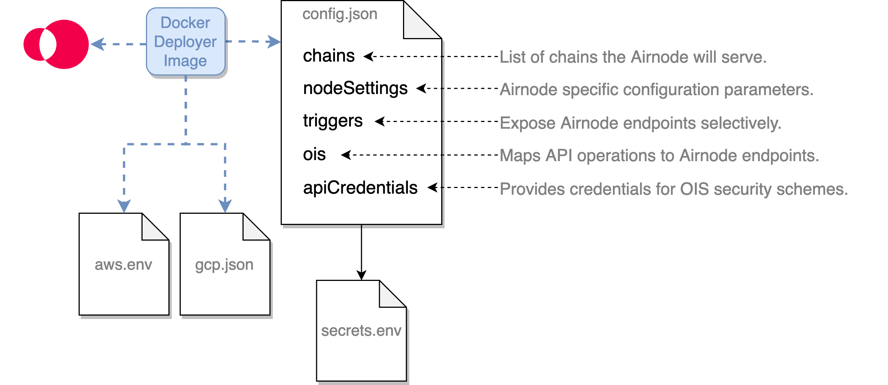

<TitleSpan>{{$frontmatter.folder}}</TitleSpan>

# {{$frontmatter.title}}

<VersionWarning/>

<TocHeader />
<TOC class="table-of-contents" :include-level=[2,5] />

::: tip Complete the following before configuring your Airnode.

- [API Integration](api-integration.md)
- [API Security](api-security.md)

Note that this guide is complementary to, and not a replacement of, the
[config.json reference documentation](../../../reference/deployment-files/config-json.md).

:::

An Airnode is deployed or redeployed using configuration values from its
`config.json` and `secrets.env` files. The `config.json` specifies the
[Oracle Integration Specifications OIS](/ois/v1.2/ois.md) and other specific
configuration details. The `secrets.env` file holds secrets, such as API keys
and chain provider URLs, which are referenced within the config.json file using
interpolation.

> 
>
> - <p class="diagram-line">The <b>config.json</b> file is used during the deployment/redeployment of an Airnode to configure its behavior and to provide mappings of API operations.</p>
> - <p class="diagram-line">The <b>secrets.env</b> file holds values for config.json that must be kept secret.</p>
> - <p class="diagram-line">The <b>aws.env</b> file holds AWS credentials for deployments targeted to AWS.</p>
> - <p class="diagram-line">The <b>gcp.json</b> file holds GCP credentials for deployments targeted to GCP.</p>

The following example files are useful while reading this doc.

- [config.json](../../../reference/examples/config-json.md)
- [secrets.env](../../../reference/examples/secrets-env.md)
- [aws.env](../../../reference/examples/aws-env.md)

## Creating `config.json`

Use the [config.json template](../../../reference/templates/config-json.md) to
build your own Airnode configuration file or alter the
[config.json example](../../../reference/examples/config-json.md) file. There
are five root level fields in `config.json`.

- [chains](./configuring-airnode.md#chains)
- [nodeSettings](./configuring-airnode.md#nodesettings)
- [triggers](./configuring-airnode.md#triggers)
- [templates](./configuring-airnode.md#templates)
- [ois](./configuring-airnode.md#ois)
- [apiCredentials](./configuring-airnode.md#apicredentials)

### chains

Each row in the `chains` array represents an Ethereum blockchain the Airnode
will serve as identified by the `id`. Currently Airnode only supports Ethereum
blockchains as denoted by `type: "evm"`. There are several supported
blockchains, see them in the
[Airnode contract addresses](../../../reference/airnode-addresses.md) doc. You
can use multiple chain providers for each chain and declare multiple chains each
with one of more chain providers. See
[Chains Providers](../../../concepts/chain-providers.md) in _Concepts and
Definitions_.

Below is a simple chain array with a single chain provider.

```json
"chains": [
  {
    "authorizers": {
      "requesterEndpointAuthorizers": [
        "0xf18c105D0375E80980e4EED829a4A68A539E6178"
      ]
    },
    "authorizations": {
        "requesterEndpointAuthorizations": {}
      },
    "contracts": {
      "AirnodeRrp": "0xa0AD79D995DdeeB18a14eAef56A549A04e3Aa1Bd"
    },
    "id": "11155111",
    "providers": {
      "infuraSepolia": {
        "url": "${INFURA_SEPOLIA_PROVIDER_URL}"
      }
    },
    "type": "evm",
    "options": {
      "fulfillmentGasLimit": 500000,
      "gasPriceOracle": [
        {
          "gasPriceStrategy": "latestBlockPercentileGasPrice",
          "percentile": 60,
          "minTransactionCount": 20,
          "pastToCompareInBlocks": 20,
          "maxDeviationMultiplier": 2,
        },
        {
          "gasPriceStrategy": "providerRecommendedGasPrice",
          "recommendedGasPriceMultiplier": 1.2,
        },
        {
          "gasPriceStrategy": "providerRecommendedEip1559GasPrice",
          "baseFeeMultiplier": 2,
          "priorityFee": {
            "value": 3.12,
            "unit": "gwei",
          }
        },
        {
          "gasPriceStrategy": "constantGasPrice",
          "gasPrice": {
            "value": 10,
            "unit": "gwei"
          }
        }
      ],
    },
    "maxConcurrency": 100,
    "blockHistoryLimit": 300,
    "minConfirmations": 0
  }
],
```

::: warning Idiosyncrasies

See the dedicated
[Chain Idiosyncrasies](../../../reference/chain-idiosyncrasies.md) page for
chain-specific configuration considerations.

:::

#### Considerations: Gas Price Oracle

The gas price oracle strategies are applied in the order that they are listed.
Airnode supports four strategies: `latestBlockPercentileGasPrice`,
`providerRecommendedGasPrice`, `providerRecommendedEip1559GasPrice` and
`constantGasPrice`. The only required strategy is `constantGasPrice` and it is
recommended to place it as the last strategy in the list as it should be the
final fallback for the Airnode to use if all other strategies fail. For more
detail on these strategies, see the
[Gas Prices](../../../concepts/gas-prices.md) page.

#### Considerations: Concurrency

If you set the `maxConcurrency` field to value X, then Airnode will guarantee
that:

- At most X api calls are made to the API
- At most X transactions (made by blockchain providers) will be made by the
  blockchain providers of the respective chain

When doing this, Airnode will calculate the total number of requests reported by
all blockchain providers. If this number exceeds the maximum concurrency limit,
Airnode will start processing the oldest request from the blockchain providers
until the number of processed requests reaches the limit. All other requests are
dropped and will be processed in the next Airnode run.

Note that this request dropping happens for each **chain** separately.

For example, if `maxConcurrency` is set to 5 and there are three providers (A, B
and C) and they reported the following requests:

- A1, A2, A3, A4 and A5
- B1, B2 and B3
- C1 and C2

The above example results in the following requests: A1, A2, B1, B2, and C1.

::: warning

Note, that this limit only applies to the requests initiated on chain. For
example, requests initiated using HTTP gateway are not included in this limit.

Also note that, this limit is configured per chain and the limits of different
chains are unrelated to each other.

:::

#### References: `chains`

The below links offer details for each field:

- [authorizers](../../../reference/deployment-files/config-json.md#authorizers)
- [contracts](../../../reference/deployment-files/config-json.md#contracts)
- [id](../../../reference/deployment-files/config-json.md#id)
- [providers](../../../reference/deployment-files/config-json.md#providers)
- [type](../../../reference/deployment-files/config-json.md#type)
- [options](../../../reference/deployment-files/config-json.md#options)
  - [options.fulfillmentGasLimit](../../../reference/deployment-files/config-json.md#options-fulfillmentgaslimit)
  - [options.gasPriceOracle](../../../reference/deployment-files/config-json.md#options-gaspriceoracle-n)
  - [options.withdrawalRemainder](../../../reference/deployment-files/config-json.md#options-withdrawalremainder)
- [maxConcurrency](../../../reference/deployment-files/config-json.md#maxconcurrency)
- [blockHistoryLimit](../../../reference/deployment-files/config-json.md#blockhistorylimit)
- [minConfirmations](../../../reference/deployment-files/config-json.md#minconfirmations)

### nodeSettings

The `nodeSettings` field holds node-specific (Airnode) configuration parameters.

```json
{
"nodeSettings": {
    "cloudProvider": {
      "type": "aws",
      "region": "us-east-1",
      "disableConcurrencyReservations": false
    },
    "airnodeWalletMnemonic": "${AIRNODE_WALLET_MNEMONIC}",
    "heartbeat": {
      "enabled": true,
      "apiKey": "${HEARTBEAT_API_KEY}",
      "url": "${HEARTBEAT_URL}"
    },
    "httpGateway": {
      "enabled": true,
      "maxConcurrency": 20,
      "corsOrigins": []
    },
    "httpSignedDataGateway": {
      "enabled": true,
      "maxConcurrency": 20,
      "corsOrigins": []
    },
    "logFormat": "plain",
    "logLevel": "INFO",
    "nodeVersion": "0.10.0",
    "stage": "dev"
  },
```

#### Considerations: Cloud Providers

Currently, Amazon Web Services (AWS) and Google Cloud Platform (GCP) are
supported cloud providers for hosting Airnode. Note that while many fields
within `nodeSettings` are required by both, there are some cloud provider
specific fields. For example, `cloudProvider.projectId` is only required with
GCP. Also note that not all cloud provider regions can be deployed to; see the
[cloudProvider.region reference](../../../reference/deployment-files/config-json.md#cloudprovider-region)
for more information.

#### Considerations: Gateways

Airnode offers two gateways for accessing provider HTTP endpoints without using
the blockchain: `httpGateway` and `httpSignedDataGateway`. For more information
on each of these see the [HTTP Gateways](./http-gateways.md) documentation. Also
note that that distinct API keys must be used for each.

#### References: `nodeSettings`

- [cloudProvider](../../../reference/deployment-files/config-json.md#cloudprovider)
  - [cloudProvider.type](../../../reference/deployment-files/config-json.md#cloudprovider-type)
  - [cloudProvider.region](../../../reference/deployment-files/config-json.md#cloudprovider-region)
  - [cloudProvider.disableConcurrencyReservations](../../../reference/deployment-files/config-json.md#cloudprovider-disableconcurrencyreservations)
  - [cloudProvider.projectId](../../../reference/deployment-files/config-json.md#cloudprovider-projectid)
- [airnodeWalletMnemonic](../../../reference/deployment-files/config-json.md#airnodewalletmnemonic)
- [heartbeat](../../../reference/deployment-files/config-json.md#heartbeat)
  - [heartbeat.enabled](../../../reference/deployment-files/config-json.md#heartbeat-enabled)
  - [heartbeat.apiKey](../../../reference/deployment-files/config-json.md#heartbeat-apikey)
  - [heartbeat.url](../../../reference/deployment-files/config-json.md#heartbeat-url)
- [httpGateway](../../../reference/deployment-files/config-json.md#httpgateway)
  - [httpGateway.enabled](../../../reference/deployment-files/config-json.md#httpgateway-enabled)
  - [httpGateway.maxConcurrency](../../../reference/deployment-files/config-json.md#httpgateway-corsorigins)
  - [httpGateway.corsOrigins](../../../reference/deployment-files/config-json.md#httpgateway-maxconcurrency)
- [httpSignedDataGateway](../../../reference/deployment-files/config-json.md#httpsigneddatagateway)
  - [httpSignedDataGateway.enabled](../../../reference/deployment-files/config-json.md#httpsigneddatagateway-enabled)
  - [httpSignedDataGateway.maxConcurrency](../../../reference/deployment-files/config-json.md#httpsigneddatagateway-maxconcurrency)
  - [httpSignedDataGateway.corsOrigins](../../../reference/deployment-files/config-json.md#httpsigneddatagateway-corsorigins)
- [logFormat](../../../reference/deployment-files/config-json.md#logformat)
- [logLevel](../../../reference/deployment-files/config-json.md#loglevel)
- [nodeVersion](../../../reference/deployment-files/config-json.md#nodeversion)
- [stage](../../../reference/deployment-files/config-json.md#stage)

### triggers

The `triggers` field allows you to expose Airnode endpoints from an OIS
selectively for the RRP protocol or via the HTTP gateway. For example, your OIS
may include 10 endpoints, but you may only want to serve 2 for RRP and all 10
for the gateway.

List the endpoints that you want to serve with the request–response protocol
(RRP) under `triggers.rrp`. List the endpoints that you want to serve with the
HTTP gateway under `triggers.http`. List the endpoints which can be used to get
the signed data in `triggers.httpSignedData`. In most cases, you would create a
trigger for each endpoint in your OIS object.

```json
"triggers": {
    "rrp": [
      {
        "endpointId": "0xd4b0718c9a3316dbd831e6d01058202e5dde20a116304419f0d79e07a82b46bf",
        "oisTitle": "CoinGecko Requests",
        "endpointName": "coinGeckoMarketData",
        "cacheResponses": false
      }
    ],
    "http": [
      {
        "endpointId": "0xd4b0718c9a3316dbd831e6d01058202e5dde20a116304419f0d79e07a82b46bf",
        "oisTitle": "CoinGecko Requests",
        "endpointName": "coinGeckoMarketData"
      }
    ],
    "httpSignedData": [
      {
        "endpointId": "0xd4b0718c9a3316dbd831e6d01058202e5dde20a116304419f0d79e07a82b46bf",
        "oisTitle": "CoinGecko Requests",
        "endpointName": "coinGeckoMarketData"
      }
    ]
  },
```

#### Considerations: triggers

The `endpointId` required for `rrp`, `http`, and `httpSignedData` can be derived
from the `oisTitle` and `endpointName` using the CLI command
[derive-endpoint-id](../../../reference/packages/admin-cli.md#derive-endpoint-id).
Remember that an Airnode's config.json file can have more than one OIS object
and that these endpoints can be triggers for `rrp`, `http`, and/or
`httpSignedData` as desired.

#### References: `triggers`

- [rrp](../../../reference/deployment-files/config-json.md#rrp)
  - [rrp[n].endpointId](../../../reference/deployment-files/config-json.md#rrp-n-endpointid)
  - [rrp[n].oisTitle](../../../reference/deployment-files/config-json.md#rrp-n-oistitle)
  - [rrp[n].endpointName](../../../reference/deployment-files/config-json.md#rrp-n-endpointname)
  - [rrp[n].cacheResponses](../../../reference/deployment-files/config-json.md#rrp-n-cacheresponses)
- [http](../../../reference/deployment-files/config-json.md#http)
  - [http[n].endpointId](../../../reference/deployment-files/config-json.md#http-n-endpointid)
  - [http[n].oisTitle](../../../reference/deployment-files/config-json.md#http-n-oistitle)
  - [http[n].endpointName](../../../reference/deployment-files/config-json.md#http-n-endpointname)
- [httpSignedData](../../../reference/deployment-files/config-json.md#httpsigneddata)
  - [httpSignedData[n].endpointId](../../../reference/deployment-files/config-json.md#httpsigneddata-n-endpointid)
  - [httpSignedData[n].oisTitle](../../../reference/deployment-files/config-json.md#httpsigneddata-n-oistitle)
  - [httpSignedData[n].endpointName](../../../reference/deployment-files/config-json.md#httpsigneddata-n-endpointname)

### templates

The templates field allows you to specify templates to be used to make template
requests. The array can be left empty if no templates will be used.

#### References: templates

- [templateId](../../../reference/deployment-files/config-json.md#templateid)
- [endpointId](../../../reference/deployment-files/config-json.md#endpointid)
- [encodedParameters](../../../reference/deployment-files/config-json.md#encodedparameters)

### ois

The `ois` field is a list OIS objects that Airnode will be serving. This means
that a single instance of an Airnode can serve multiple APIs. You can simply
copy paste OIS objects that you will be serving into the `ois` list. Use the
previous guide [API Integration](api-integration.md) to create an OIS object.
The full specification is available in the
[Oracle Integration Specifications (OIS)](/ois/v1.2/) documentation.

### apiCredentials

Each entry in `apiCredentials` maps to a security scheme defined in an OIS
(`ois[n].components.securitySchemes.{securitySchemeName}` and
`ois[n].security`), where `oisTitle` is the `title` field of the related OIS,
and `securitySchemeName` is the name of the respective security scheme. These
would be `myOisTitle` and `mySecurityScheme` in the example below.
`securitySchemeValue` is the value used for the authentication with the security
scheme (e.g., the API key).

Note that if you do not need a security scheme, leave the `apiCredentials` array
empty.

```json
// apiCredentials
[
  {
    "oisTitle": "myOisTitle",
    "securitySchemeName": "mySecurityScheme",
    "securitySchemeValue": "${SS_MY_API_KEY}"
  }
]

// From the OIS object apiCredentials is referencing
// using the oisTitle/securitySchemeName pair.
{
  "title": "myOisTitle",
  ...,
  "components": {
    "securitySchemes": {
      "mySecurityScheme": {
        "in": "header",
        "type": "apiKey",
        "name": "X-api-key"
      }
    }
  },
  "security":{
    "mySecurityScheme": []
  }
  ...
}
```

#### Considerations: apiCredentials

Currently Airnode supports the following security scheme types when making API
calls: `apiKey` and `http`. For more detail, visit the previous section on
[API Security](./api-security.md).

#### References: `apiCredentials`

- [oisTitle](../../../reference/deployment-files/config-json.md#oistitle)
- [securitySchemeName](../../../reference/deployment-files/config-json.md#securityschemename)
- [securitySchemeValue](../../../reference/deployment-files/config-json.md#securityschemevalue)

## Creating `secrets.env`

The `secrets.env` file contains values (secrets) such as blockchain provider
urls, chain provider urls, etc. These secrets are embedded in
[config.json](../../../reference/deployment-files/config-json.md) using
interpolation.

```json
// Sample interpolation value from config.json
"heartbeat": {
  "enabled": true,
  "apiKey": "${HEARTBEAT_API_KEY}"
},

// Sample variable in secrets.env
// Variable names cannot contain dashes (-) or start with a number.
HEARTBEAT_API_KEY="d714a900-3b9e-4e4d-8eae-756ef06a8836"
```

Use the [secrets.env](../../../reference/templates/secrets-env.md) template and
refer to
[Reference > Deployment Files > secrets.env](../../../reference/deployment-files/secrets-env.md)
as needed.

## AWS setup (AWS deployment only)

When it is time to deploy the Airnode to AWS, the Docker
[deployer image](../../docker/deployer-image.md) will need the AWS credentials
to build the node on AWS Lambda.

### Creating `aws.env` (AWS only)

Follow [this video](https://www.youtube.com/watch?v=KngM5bfpttA) if needed. It
will show you how to create an IAM user and get security credentials. Put them
in the `aws.env` file as shown below. See an
[example file](../../../reference/templates/aws-env.md) in the reference
section.

- Variable names cannot contain dashes (-) or start with a number.

```bash
AWS_ACCESS_KEY_ID=XYZ...123
AWS_SECRET_ACCESS_KEY=ABC7...89
```

## GCP setup (GCP deployment only)

When it is time to deploy the Airnode to GCP, the Docker
[deployer image](../../docker/deployer-image.md) will need the GCP project ID to
build the Airnode.

### Creating a GCP project

First, you need to
[create a GCP project](https://cloud.google.com/resource-manager/docs/creating-managing-projects)
under which will the Airnode be deployed. Once the project is created, insert
its [projectId](./configuring-airnode.md#cloudprovider) into your `config.json`.

### Enable required API

In order for Airnode to deploy successfully, you need to enable
[App Engine Admin API](https://console.cloud.google.com/apis/library/appengine.googleapis.com)
for your GCP project. After enabling it, wait a few minutes before the
deployment itself so the change will take place.

### Creating a Service Account

Create a new service account from the
[Service accounts](https://console.cloud.google.com/iam-admin/serviceaccounts)
menu. Grant this service account access to the project by adding a role `Owner`
during the creation process.

Once the account is created, add a new access key of type JSON for this account.
Download the key file as `gcp.json` into the root of your project.

## Summary

In this guide you created the `config.json`, `secrets.env` and obtained cloud
provider credentials required to deploy an Airnode to a cloud provider. Note
that `config.json` is user-specific and therefore it is not much use to others.

The `secrets.env`, `aws.env` and `gcp.json` files contains keys, chain provider
urls and security credentials, so they should be kept secret. Make sure that you
do not push your credentials to a repository or otherwise expose them as these
credentials can be used to gain access to your Airnode's private key, AWS
account or GCP account.

The next three steps in this guide are optional.

- [Using Authorizers](./apply-auth.md) optional
- [Heartbeat](./heartbeat.md) optional
- [HTTP Gateways](./http-gateways.md) optional
