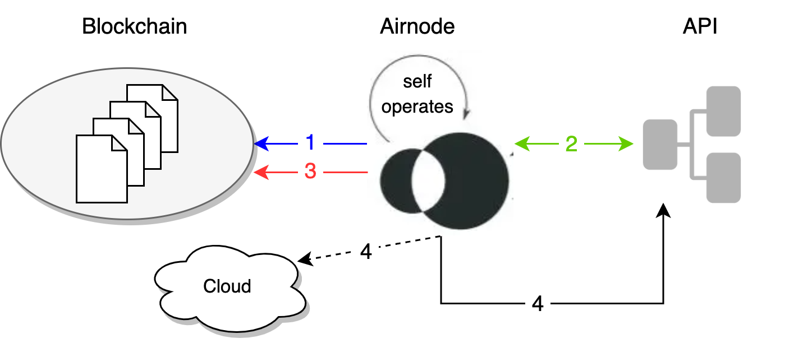

<TitleSpan>{{$frontmatter.folder}}</TitleSpan>

# {{$frontmatter.title}}

<VersionWarning/>

At the end of an Airnode's run (every minute), Airnode can make an HTTP POST
request to a specified URL. This is both to signal that the Airnode is alive and
working (useful especially right after the deployment) and also as a
notification every time it runs (self-operates).

> 
>
> 1.  <p class="diagram-line" style="color:blue;">Airnode gathers on-chain requests targeting the API it supports.</p>
> 2.  <p class="diagram-line" style="color:green;">The required API operation for each request is called.</p>
> 3.  <p class="diagram-line" style="color:red;">A response is sent to each request.</p>
> 4.  <p class="diagram-line" style="color:black;">Finally Airnode makes a request to the heartbeat URL (HTTP POST). This could be to an operation within the API Airnode supports or to any cloud REST endpoint such as a monitoring service.</p>

Turn on the optional heartbeat functionality by setting all fields in the
`config.json` section for `nodeSettings.heartbeat`.

```json
{
  ois:{...},
  triggers:{...},
  chains:{...},
  environment:{...},
  nodeSettings:{
      "airnodeWalletMnemonic": "<FILL_*>",
      "cloudProvider": {
        "type": "aws",
        "region": "us-east-1"
      },
      "heartbeat": {
        "enabled": true,
        "url": "${HEARTBEAT_URL}",
        "apiKey": "${HEARTBEAT_API_KEY}"
      },
      "httpGateway": {
        "enabled": true,
        "maxConcurrency": 20,
        "corsOrigins": []
      },
      "httpSignedDataGateway": {
        "enabled": true,
        "maxConcurrency": 20,
        "corsOrigins": []
      },
      "oevGateway": {
        "enabled": true,
        "maxConcurrency": 20,
        "corsOrigins": []
      },
      "logFormat": "json",
      "logLevel": "INFO",
      "nodeVersion": "0.11.0",
      "stage": "testnet"
  }
}
```

- `enabled`: Enable/disable Airnode's heartbeat.
- `url`: The URL to make the heartbeat request to.
- `apiKey`: The API key to authenticate with the heartbeat URL.

## Heartbeat Endpoint

The table below illustrates the parameters passed to the Heartbeat URL.

| name                         | in     | type   |
| ---------------------------- | ------ | ------ |
| airnode-heartbeat-api-key    | header | string |
| http_gateway_url             | body   | string |
| http_signed_data_gateway_url | body   | string |
| oev_gateway_url              | body   | string |
| cloud_provider               | body   | string |
| stage                        | body   | string |
| region                       | body   | string |
| signature                    | body   | string |
| timestamp                    | body   | string |

Below is an example of what is included in the request body to `heartbeat.url`:

```json
{
  "payload": {
    "timestamp": 1661582891,
    "region": "us-east-1",
    "stage": "2209100913",
    "cloud_provider": "aws",
    "http_gateway_url": "https://some.aws.http.gateway.url/v1/01234567-abcd-abcd-abcd-012345678abc",
    "http_signed_data_gateway_url": "https://some.aws.http.signed.data.gateway.url/v1/01234567-abcd-abcd-abcd-012345678abc",
    "oev_gateway_url": "https://some.aws.oev.gateway.url/v1/01234567-abcd-abcd-abcd-012345678abc"
  },
  "signature": "0x733f81fa1dffab3188e50ad66c178a22aca3a781d79a1b8daee7828cff31d1443d89efd5a2b1f40fc70953c9c5838cc8d5747374f3cf25d092331ba15b6420651c"
}
```

The method by which the heartbeat payload is generated is as follows:

- An object is marshalled to JSON - this object contains a timestamp, gateway
  URLs, the cloud provider and cloud region.
- The Airnode's mnemonic (using the default EVM derivation path to derive a key)
  is used to sign the payload.
- The payload and signature are included in a new object and marshalled to JSON.

The reason this nested JSON approach has been used is to prevent subtle
inconsistencies between JSON marshallers in different languages causing the
signature to not match the payload.

The airnode's public key can be recovered from this signature and be used,
generally, to verify the authenticity of the payload.

The inner payload's contents are as follows:

<table>
  <tr>
    <td>airnode-heartbeat-api-key:</td><td>API key for heartbeat calls configured in nodeSettings.heartbeat.apiKey. Used for authentication against the heartbeat service running on URL from nodeSettings.heartbeat.url.</td>
  </tr>
  <tr>
    <td>http_gateway_url:</td><td>If HTTP gateway is enabled this is the URL of the gateway you can make test HTTP calls against.</td>
  </tr>
  <tr>
    <td>http_signed_data_gateway_url:</td><td>If HTTP signed data gateway is enabled this is the URL of the gateway you can make HTTP calls against.</td>
  </tr>
  <tr>
    <td>oev_gateway_url:</td><td>If OEV gateway is enabled this is the URL of the gateway you can make HTTP calls against.</td>
  </tr>
  <tr>
    <td>cloud_provider:</td><td>This is the deployment cloud provider.</td>
  </tr>
  <tr>
    <td>region:</td><td>This is the deployment region.</td>
  </tr>
  <tr>
    <td>stage:</td><td>This is the deployment stage.</td>
  </tr>
  <tr>
    <td>signature:</td><td>This is the signature of the heartbeat payload signed with the Airnode wallet.</td>
  </tr>
  <tr>
    <td>timestamp:</td><td>This is the heartbeat timestamp.</td>
  </tr>
</table>
