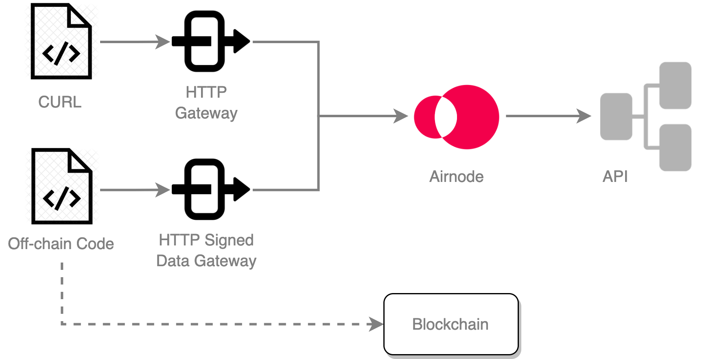

<TitleSpan>{{$frontmatter.folder}}</TitleSpan>

# {{$frontmatter.title}}

<VersionWarning/>

<TocHeader />
<TOC class="table-of-contents" :include-level="[2,3]" />

As part of the Airnode deployment you can decide to deploy different HTTP
Gateways.

- HTTP Gateway: testing
- HTTP Signed Data Gateway: production use
- OEV Gateway: production use

## Gateway Differences

All gateways are setup identically. The differences are in their purpose and
response.

> 

### HTTP Gateway

The HTTP gateway is strictly for testing purposes. Using a simple tool like CURL
you can test that endpoints in the Airnode configuration are working properly
without accessing the blockchain.

### HTTP Signed Data Gateway

The HTTP signed data gateway is used for production purposes. While it is
executed in a similar way as the HTTP gateway, its response is signed and does
not contain a `rawValue` field. This gateway is executed by an off-chain code
source that may in turn push data to a blockchain.

### OEV Gateway

The OEV gateway is used for production purposes and is intended to be called by
OEV relay which is a service faciliating OEV signed data updates. You can learn
more about OEV in https://api3.org/oev.

## Setup

To enable a gateway you need to modify the `config.json`. The respective fields
are `nodeSettings.httpGateway`, `nodeSettings.httpSignedDataGateway` and
`nodeSettings.oevGateway`.

- **enabled**: A boolean to enable/disable for the gateway.
- **maxConcurrency**: (optional) A number higher than zero that represents the
  maximum number of serverless functions serving gateway requests. When omitted,
  there is no maximum concurrency set. This field is ignored for Airnode client
  gateways.
- **corsOrigins**: A list of allowed origins, `['*']` to allow all origins or an
  empty array to disable CORS.

```json
"nodeSettings": {
  "cloudProvider": {
    "type": "aws",
    "region": "us-east-1"
  },
  "airnodeWalletMnemonic": "${AIRNODE_WALLET_MNEMONIC}",
  "heartbeat": {...},
  "httpGateway": {
    "enabled": true,
    "maxConcurrency": 20,
    "corsOrigins": []
  },
  "httpSignedDataGateway": {
    "enabled": true,
    "maxConcurrency": 20,
    "corsOrigins": []
  },
  ...
},
```

Add the desired endpoints the gateways can respond to in the `triggers.http[n]`
and/or `triggers.httpSignedData[n]` arrays. The corresponding arrays do not need
to match. You may want to test all endpoints but only serve certain endpoints
using the HTTP signed data gateway or via RRP.

The OEV gateway does not need triggers, because it used to sign the beacons
belonging to the specific Airnode that is being requested and the data for these
beacons is specified via request body.

```json
// in config.json
"triggers": {
  "rrp": [
    {
      "endpointId": "0x6db9e3e3d073ad12b66d28dd85bcf49f58577270b1cc2d48a43c7025f5c27af6",
      "oisTitle": "CoinGecko Basic Request",
      "endpointName": "coinMarketData",
      "cacheResponses": false
    }
  ],
  "http": [
    {
      "endpointId": "0x6db9e3e3d073ad12b66d28dd85bcf49f58577270b1cc2d48a43c7025f5c27af6",
      "oisTitle": "CoinGecko Basic Request",
      "endpointName": "coinMarketData",
    }
  ],
  "httpSignedData": [
    {
      "endpointId": "0x6db9e3e3d073ad12b66d28dd85bcf49f58577270b1cc2d48a43c7025f5c27af6",
      "oisTitle": "CoinGecko Basic Request",
      "endpointName": "coinMarketData",
    }
  ]
}
```

## Gateway URLs

The gateway implementation is different depending on how Airnode is deployed.
When deployed on a cloud provider, the serverless gateway is used. Inside
Airnode client, the gateway is implemented via a simple web server inside the
docker container. There are subtle differences in how the gateways work and what
the gateway URLs look like.

The deployer generates a secret `UUID` path parameter which ensures that the
endpoints are not openly accessible. Therefore, the gateway URLs should be kept
secret.

The gateway URLs are also available as part of the payload sent from Airnode's
[heartbeat](./heartbeat.md) to your specified heartbeat URL.

### When deployed on a cloud provider

A gateway URL is generated for each gateway (when enabled) when Airnode is
deployed. You can see the URLs including the secret `UUID` path parameter,
displayed on your terminal at the end of an Airnode deployment using a
[Docker image](../../docker/).

### When using Airnode client

Airnode client can be used to run Airnode as a docker container locally. There
is a common web server for all gateways, which is exposed on the host machine.
Doing so will make the gateways API accessible like a regular web server running
on the machine. Each gateway has a separate endpoint as shown below. Note the
`PORT` which is exposed as part of the Airnode client container. See the
[Airnode client usage](../../docker/client-image.md#usage) for more details.

- `http://localhost:<PORT>/http-data/01234567-abcd-abcd-abcd-012345678abc/<endpointId>` -
  Gateway URL for the HTTP Gateway
- `http://localhost:<PORT>/http-signed-data/01234567-abcd-abcd-abcd-012345678abc/<endpointId>` -
  Gateway URL for the HTTP Signed Data Gateway
- `http://localhost:4500/sign-oev/01234567-abcd-abcd-abcd-012345678abc` -
  Gateway URL for the OEV Gateway

## Using CURL

In order to execute an endpoint served by either gateway, the following are
required as part of the CURL call.

- Make a POST request with the `endpointId` as a path parameter. An `endpointId`
  can found in config.json under `triggers.http.endpointId` or
  `triggers.httpSignedData.endpointId`.
- Add the `Content-Type` header, set to `application/json`.
- Pass the correct request body.

### Request

:::: tabs

::: tab HTTP Gateway

```sh
curl \
-X POST \
-H 'Content-Type: application/json' \
-d '{"parameters": {"param1": "myValue", "param2": 5}}' \
'<gatewayUrl>/<endpointId>'
```

The HTTP gateway body accepts `parameter` which are passed to the API endpoint
being called.

:::

::: tab HTTP Signed Data Gateway

```sh
curl \
-X POST \
-H 'Content-Type: application/json' \
-d '{"encodedParameters": "0x3173737300....000"}' \
'<gatewayUrl>/<endpointId>'
```

The HTTP signed data gateway requires that the specified `encodedParameters` are
encoded using
[Airnode ABI](../../../reference/specifications/airnode-abi-specifications.md)

:::

::: tab OEV Gateway

```sh
curl --location '<gatewayUrl>' \
--header 'Content-Type: application/json' \
--data '{
    "chainId": 6999,
    "bidAmount": "50000000000000000",
    "bidderAddress": "0xf20e5d27690078c102FDbDe117a990a337820A51",
    "dapiServerAddress": "0xCf7Ed3AccA5a467e9e704C703E8D87F634fB0Fc9",
    "oevProxyAddress": "0x29fbec16e63F1881a50423030e540037cecBd5A6",
    "beacons": [
         {
            "airnodeAddress": "0xaD1b4e9F83bA33d9B0A92b0085f8606bFe4a41d0",
            "endpointId": "0xc8e28c6013672bd9ef31bd065dab8843acdba163ec69c27478cb989f4a9c038f",
            "encodedParameters": "0x",
            "signedData": {
                "encodedValue": "0x000000000000000000000000000000000000000000000000000000006d16277b",
                "timestamp": "1679589673",
                "signature": "0x36b4ba2ea19063e0f32055ef80774f302666bf9209f7f33b364fbfbd5079e8e61486f89aa9d63a392f2af2dd925b94da592fc5acb976303a095ffdcd77f1dc7d1b"
            }
        }
    ],
    "updateId": "0x336a3067645a4e33616f4e4c723734376633644555576a463675737900000000"
}'
```

The OEV gateway request body specifies the payload for the gateway to sign. The
most important part is `beacons` which defines the beacons of the data feed
that. The gateway provides a signature only for its beacons.

:::

::::

### Response

:::: tabs

::: tab HTTP Gateway

```json
{
  "rawValue": { "usd": "6421.4" },
  "encodedValue": "0x0000000000000000000000000000000000000000000000000000000ef373e180",
  "values": ["64214000000"]
}
```

The response format is a JSON object with the following fields:

- `rawValue` - the API response
- `values` - an array of values after they are
  [extracted and converted](../../../reference/packages/adapter.md#conversion)
  to the target type
- `encodedValue` - the encoded bytes value that is sent as payload in the
  response transaction on chain

:::

::: tab HTTP Signed Data Gateway

```json
{
  "timestamp": "1648226003",
  "encodedValue": "0x0000000000000000000000000000000000000000000000000000000a571a14c0",
  "signature": "0xa74e4312e2e6fa2de2997ef43e417e3b82d0019ac2a84012300f706f8b213e0d6e1ae9301052ec25b71addae1b1bceb4617779abfc6acd5a951e20a0aaabe6f61b"
}
```

The response format is a JSON object with the following fields:

- `timestamp` - The UNIX timestamp applied to the response.
- `encodedValue` - The encoded bytes value that is sent as payload in the
  response. Suitable for use on-chain.
- `signature` - The response has been signed by Airnode.

:::

::: tab OEV Gateway

```json
[
  "0xf9ada63d498bca65598b7a2504a89f61a82665dd7e2a0828cf21c6715aca5214103998ac98e5ddc3d32ba50c79de984d286b3d602019acf6689f31845ec04abb1b"
]
```

The response format is an array of signatures for the beacons belonging to the
Airnode being called.

:::

::::

## Tutorials

The `airnode-examples` monorepo hosts examples demonstrating use of the HTTP
Gateway and HTTP Signed Data Gateway,
[see here](../../tutorial/README.md#monorepo-examples). Furthermore, there are
additional examples of using CURL to call the HTTP gateway in both the
[Quick Deploy AWS](../../tutorial/quick-deploy-aws/#execute-endpoint) and
[Quick Deploy GCP](../../tutorial/quick-deploy-gcp/#execute-endpoint) tutorials.
