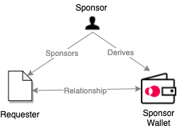

<TitleSpan>Concepts and Definitions</TitleSpan>

# {{$frontmatter.title}}

<VersionWarning/>
<TocHeader /> <TOC class="table-of-contents" :include-level="[2,3]" />

A sponsor is an entity (individual, business, etc.). Sponsors create relationships between [requesters](requester.md) and [sponsorWallets](sponsor.md#sponsorwallet). They do so by sponsoring requesters and deriving sponsorWallets for Airnodes they want their requesters to call.

> 

Making the relationship:

- A sponsor "sponsors" a requester.
- A sponsor "derives" a [sponsorWallet](sponsor.md#sponsorwallet) for a desired Airnode.

Making a request.

1. The now "sponsored" requester makes a [request](request.md) of an Airnode. Parameters passed to the Airnode include the `sponsorAddress` and the `sponsorWalletAddress`.
2. The Airnode verifies that the sponsor of the requester is the sponsor that derived the `sponsorWallet` associated with the Airnode.
3. The Airnode uses the respective sponsor's `sponsorWallet` to fulfill the request, meaning that the sponsor covers the gas cost.

How a requester refers to the sponsor.

1. A requester can have multiple sponsors that have sponsored it. While making a request, the requester provides the `sponsorAddress` that it wants to have the request fulfilled by. The AirnodeRrp.sol protocol contract checks if the requester is sponsored, and if so, emits the request event.

2. Next Airnode derives the `sponsorWallet` address using the provided `sponsorAddress`, then checks if this matches `sponsorWallet`. Airnode will ignore the request if the two do not match. This is done this way because deriving the `sponsorWallet` address from the `sponsorAddress` on-chain is not feasible.

## sponsorAddress

A sponsor is identified by a `sponsorAddress` which is usually the default account `m/44'/60'/0'/0/0` of a BIP 44 wallet owned by the sponsor. The sponsor can use a different address from the wallet if desired such as `m/44'/60'/0'/0/2`.

Note that a sponsor could use multiple addresses from multiple wallets. Below are some example reasons why one would want to have multiple `sponsorAddress` identities on-chain:

- To keep separate `sponsor-wallets` for two separate use-cases for easier accounting.
- To duplicate transaction queues for a single use-case and increase response throughput.

## sponsorWallet

Each [Airnode](airnode.md) can keep a unique`sponsorWallet` for a sponsor. The wallet is identified by a `sponsorAddress/airnodeAddress` pair. A sponsor must take action to [derive](#derive-a-sponsor-wallet) a `sponsorWallet` for a particular Airnode. [Requesters](requester.md), that have been sponsored by a sponsor, can specify their requests be fulfilled by the `sponsorWallet` designated to the sponsor. This allows the sponsor to cover the gas cost of request fulfillments by the Airnode since the sponsor must send funds to this wallet before making the request.

### Derivation Path

Each sponsor is identified by a `sponsorAddress`, and their sponsor wallets are designated implicitly by a derivation path. The derivation path for a `sponsorWallet` starts with `m/44'/60'/0'/0/...` The zero here is allocated for RRP, and the other branches will be used to derive the sponsor wallets for other protocols such as PSP.

The path of a `sponsorWallet` for the request–response protocol is `m/44'/60'/0'/0/${sponsorAddress}`. Other branches such as `m/44'/60'/0'/1/...`, `m/44'/60'/0'/2/...`, etc. are reserved for other protocols (e.g., the pub–sub protocol).

An Ethereum address is 20 bytes-long, which makes 160 bits. Each index in the HD wallet non-hardened derivation path goes up to 2^31. This requires the division of these 160 bits into six 31 bit-long chunks, therefore derivation path for a sponsor wallet of a requester would be:

```sh
m/44'/60'/0'/0/...
  /1st least significant 31-bits of the sponsor address (sponsor && 0x7FFFFFFF)…
  /2nd least significant 31-bits of the sponsor address (sponsor >> 31 && 0x7FFFFFFF)…
  /3rd least significant 31-bits of the sponsor address (sponsor >> 62 && 0x7FFFFFFF)…
  /4th least significant 31-bits of the sponsor address (sponsor >> 93 && 0x7FFFFFFF)…
  /5th least significant 31-bits of the sponsor address (sponsor >> 124 && 0x7FFFFFFF)…
  /6th least significant 31-bits of the sponsor address (sponsor >> 155 && 0x7FFFFFFF)
```

Anyone can use the xpub that the Airnode has announced (through off-chain channels) and the sponsor's `sponsorAddress` to derive a `sponsorWalletAddress` for a specific Airnode–sponsor pair. In other words, a sponsor can calculate the address of their respective sponsor wallet for an Airnode and have requesters use it to make requests right away.

### Gas Costs

Although the `sponsorWallet` scheme allows the sponsor to cover the fulfillment gas costs, it is just as easy to have the Airnode cover the gas costs. In this case the Airnode funds the `sponsorWallet`, instead of the sponsor. Furthermore, this scheme allows hybrid use-cases where the Airnode covers the fulfillment gas costs for one sponsor (e.g., because they have made a special service agreement with them), while requiring others to cover their own fulfillment gas costs.

### Trusting the `sponsorWallet`

<airnode-SponsorWalletWarning/>

The risk mentioned above becomes negligible when:

1. The Airnode is a first-party oracle, because first-party oracles are trustworthy
2. The Airnode is being used for a high value use-case, which already implies a high level of trust

If the sponsor does not trust the Airnode at all, they can fund the sponsor wallet just enough to cover a single fulfillment for each request to the Airnode. Therefore, this scheme both supports the traditional per-call payments, but also allows the protocol to leverage the trustworthiness of Airnodes to reduce unnecessary gas costs caused by microtransactions.

### Withdrawals

If the sponsor decides not to use a particular `sponsorWallet` going forward, they can make a request to withdraw funds from it, see the [`request-withdrawal`](../reference/packages/admin-cli-commands.md#request-withdrawal) command. The Airnode listens for withdrawal requests and fulfills them automatically. Therefore, the sponsor should be able to receive their funds from their `sponsorWallet` in a few minutes notice. The `sponsorWallet` does not get deleted, and can be used in the future simply by funding it again.

## Sponsoring a Requester

A sponsor uses a `sponsorAddress` and there the requester's on-chain `requesterAddress` when sponsoring a requester. This sponsorship allows the requester to use the sponsor's `sponsorWallet` at a particular Airnode to cover gas costs incurred by the Airnode in response to a request.

Use the [Admin CLI tool](../reference/packages/admin-cli-commands.md#sponsor-requester) to sponsor a requester. An example can be seem in the [Requesters and Sponsors](../grp-developers/requesters-sponsors.md#how-to-sponsor-a-requester) doc.

## Derive a Sponsor Wallet

When a sponsor wishes to access an Airnode (via a requester) it must create a `sponsorWallet` for the Airnode. Requesters that have been sponsored by the same sponsor, can specify their requests be fulfilled by the `sponsorWallet` belonging to the sponsor. A sponsor uses a [`sponsorAddress`](sponsor.md#sponsoraddress) and the [`xpub`](airnode.md#xpub) of a particular Airnode to derive a [sponsorWallet](#sponsorwallet) for the Airnode. The sponsor must also provide the [`airnodeAddress`](airnode.md#airnodeaddress) because it will be used to verify that the provided xpub belongs to the Airnode wallet before deriving a child sponsor wallet address.

Use the [Admin CLI tool](../reference/packages/admin-cli-commands.md#derive-sponsor-wallet-address) to derive a `sponsorWallet`. An example can be seem in the [Requesters and Sponsors](../grp-developers/requesters-sponsors.md#how-to-derive-a-sponsor-wallet) doc.
