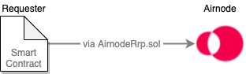
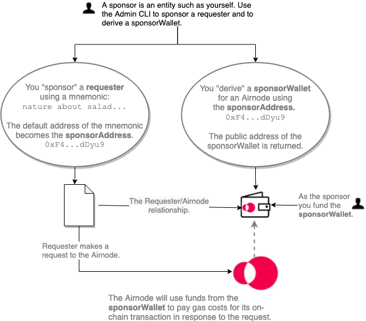

# {{$frontmatter.title}}

<TocHeader />
<TOC class="table-of-contents" :include-level="[2,3]" />

As a developer it helps to understand what a **requester** is and what a
**sponsor** does. They are both important parts of the Airnode ecosystem. This
doc will further define them and walk you through the process of sponsoring a
requester and deriving a sponsor wallet using the admin CLI commands.

## What is a Requester?

The term [requester](../concepts/requester.md) is important to remember. When
requester is mentioned, the reference is to your smart contract that calls an
Airnode.

> 

As an example see the `myContract.sol` contract in the diagram within the
[Overview](./) doc, it is a requester.

## What is a Sponsor?

Equally important is the term [sponsor](../concepts/sponsor.md). A sponsor is an
entity such as yourself, an organization, etc. Sponsors create relationships
between requesters and Airnodes.

### Sponsor's Requester/Airnode Relationships

As a sponsor you will use the mnemonic from a digital wallet you own to
"**sponsor a requester**" and then use its default account as a
[sponsorAddress](../concepts/sponsor.md#sponsoraddress) to "**derive a
[sponsorWallet](../concepts/sponsor.md#sponsorwallet)**" for an Airnode. This
action creates a relationship between a sponsor's requester and a particular
Airnode. You do this because a sponsor is the entity that pays for the
fulfillment of a request, the gas costs the Airnode will incur. These costs will
be withdrawn from the `sponsorWallet` of the Airnode when the requester calls
it.

In the diagram below a sponsor uses a mnemonic to sponsor a requester with the
Admin CLI. The CLI will use the default address of the mnemonic as the
`sponsorAddress` for the sponsorship. Next the sponsor will derive a
`sponsorWallet` for an Airnode using the `sponsorAddress`. The requester can now
make requests of the Airnode.

> 

---

In the above diagram it is possible to use the same sponsorAddress
`(0xF4...dDyu9)` to derive other sponsor wallets for other Airnodes. And it is
possible to sponsor more than one requester with the same mnemonic. However it
is important to remember that all requesters can now access all the Airnodes
regardless if they need to. There is no harm in this scenario.

### Advanced Scenarios

- **Two requesters, one Airnode, one sponsorWallet**:

  Two requesters sponsored with the same mnemonic, which returns a
  `sponsorAddress` (e.g., `0xF4...dDyu9`), would access the same Airnode using a
  single sponsorWallet derived by the sponsorAddress.

- **Two requesters, one Airnode, two sponsorWallets**:

  Sponsor two different requesters with different mnemonics which results in
  each having a separate `sponsorAddress` (e.g., `0xF4...dDyu9` and
  `0xG9...fFzc5`). Using these separate sponsorAddresses you can derive two
  separate sponsorWallets for the same Airnode. Now each requester will deplete
  funds from a separate Airnode sponsorWallet when using the Airnode.

- **One requester, two Airnodes, two sponsorWallets**:

  A requester can make requests from two different Airnodes. Sponsor the
  requester with a mnemonic where the resulting sponsorship returns a
  `sponsorAddress`. Derive two sponsorWallets, one for each of two the Airnodes,
  using the `sponsorAddress`. Despite the fact that the sponsorWallet for each
  Airnode was derived with the same `sponsorAddress`, the sponsorWallets are
  different since they are derived using the airnode's xpub plus the
  `sponsorAddress`. The sponsor must fund both wallets separately using the
  unique `sponsorWalletAddress` of the two sponsorWallets.

### Things to Remember

When you sponsor a requester with a mnemonic (returning a `sponsorAddress`), you
are giving it permission to use the sponsorWallet (associated with a Airnode)
that was derived using the same `sponsorAddress`.

When the requester makes a request to the Airnode, the Airnode will use funds
from the corresponding sponsorWallet to pay gas costs in response to the
request. Therefore the sponsor pays for the fulfillment of the request.

## Admin CLI Commands

There are several sponsor and requester related commands in the
[Admin CLI Commands](../reference/packages/admin-cli.md) package. You can also
see a list of available commands using `npx @api3/airnode-admin --help`.

In the next two sections of this doc you will use two commands from the
`@api3/airnode-admin` package to _sponsor a requester_ and to _derive a sponsor
wallet_.

1. [sponsor-requester](../reference/packages/admin-cli.md#sponsor-requester)
   sponsors a requester.
2. [derive-sponsor-wallet-address](../reference/packages/admin-cli.md#derive-sponsor-wallet-address)creates
   a sponsor wallet associated with an Airnode.

## How to Sponsor a Requester

When a sponsor uses a mnemonic to "sponsor a requester" and the resulting
'sponsorAddress` to "derive a sponsorWallet" for an Airnode, the requester will
have permission to make requests to the Airnode on behave of the sponsor. This
allows the sponsor to cover the gas costs incurred by the Airnode when
responding to the request. Sponsors need to keep their sponsorWallets topped off
if they want Airnodes to fulfill requests made by their requesters. However this
does not cover the cost of API data that the Airnode serves, see
[API Provider Fees](fees.md#api-provider-fees).

To sponsor a requester execute the `sponsor-requester` command using the
parameters detailed in the list below. Your requester should already be deployed
on-chain. This command has transaction gas costs.

- `providerURL`: A blockchain provider URL (such as Infura) with providerID for
  the desired network.
- `mnemonic`: Used for gas costs to fund the sponsorship and used to derive the
  sponsorAddress from the default address. The sponsorAddress will be needed to
  derive a sponsorWallet for an Airnode.
- `requesterAddress`: The address of the requester contract.

The command `sponsor-requester` will return the requesterAddress and
sponsorAddress.

:::: tabs

::: tab Linux/Mac

```bash
npx @api3/airnode-admin sponsor-requester \
  --providerUrl https://ropsten.infura.io/v3/<KEY> \
  --mnemonic "cricket...oppose" \
  --requester 0x2c...gDER7

Requester 0x2c...gDER7 sponsored using sponsorAddress 0xF4...dDyu9
```

:::

::: tab Windows

```
npx @api3/airnode-admin sponsor-requester ^
  --providerUrl https://ropsten.infura.io/v3/<KEY> ^
  --mnemonic "cricket...oppose" ^
  --requester 0x2c...gDER7

Requester 0x2c...gDER7 sponsored using sponsorAddress 0xF4...dDyu9
```

:::

::::

## How to Derive a Sponsor Wallet

To use a particular Airnode you must _derive a sponsorWallet_. Once the
sponsorWallet is created it must be funded using the public address
(`sponsorWalletAddress`) returned by the command`derive-sponsor-wallet-address`.
Each Airnode keeps a separate list of individual sponsorWallets that can access
the Airnode. Learn more about a
[sponsorWallet](../concepts/sponsor.md#sponsorwallet).

To derive a sponsorWallet for an Airnode execute the
`derive-sponsor-wallet-address` command using the parameters detailed in the
list below. There are no transaction gas costs to do so.

- `providerURL`: A blockchain provider URL (such as Infura) with providerID for
  a desired network.
- `airnode`: The address of the desired Airnode.
- `sponsor`: The sponsorAddress (an address of an Ethereum account) owned by a
  sponsor. Usually the sponsorAddress is the one returned when sponsoring a
  requester.

The command `derive-sponsor-wallet-address` will return the public address
(`sponsorWalletAddress`) of the sponsorWallet to be funded by the sponsor.

:::: tabs

::: tab Linux/Mac

```bash
npx @api3/airnode-admin derive-sponsor-wallet-address \
  --providerUrl https://ropsten.infura.io/v3/<KEY> \
  --airnode 0xe1...dF05s \
  --sponsor 0xF4...dDyu9

Sponsor wallet address: 0x14D5a34E5a370b9951Fef4f8fbab2b1016D557d9
```

:::

::: tab Windows

```bash
npx @api3/airnode-admin derive-sponsor-wallet-address ^
  --providerUrl https://ropsten.infura.io/v3/<KEY> ^
  --airnode 0xe1...dF05s ^
  --sponsor 0xF4...dDyu9

Sponsor wallet address: 0x14D5a34E5a370b9951Fef4f8fbab2b1016D557d9
```

:::

::::

If you forget the public address (`sponsorWalletAddress`) of the sponsorWallet
simply run `derive-sponsor-wallet-address` again. Since the wallet already
exists for the airnodeAddress/sponsorAddress pair it will just return the
address.

<SponsorWalletWarning/>

## Record Keeping

During and after deriving a sponsorWallet and sponsoring requesters there are a
few things to keep track of.

| Item                   | Description                                                                                                                                                                                                                                                          |
| ---------------------- | -------------------------------------------------------------------------------------------------------------------------------------------------------------------------------------------------------------------------------------------------------------------- |
| sponsor's mnemonc      | The mnemonic used by the sponsor when sponsoring a requester.                                                                                                                                                                                                        |
| sponsor address        | Derived from the sponsor's mnemonic (default account) when sponsoring a requester. Record which `sponsorAddress` was used to create a sponsorWallet for each Airnode.                                                                                                |
| sponsor wallet address | Record the `sponsorWalletAddress` of the sponsorWallet derived for an Airnode. For each Airnode you have derived a sponsorWallet, the Airnode keeps the private key and returns the public address (`sponsorWalletAddress`) which is used to fund the sponsorWallet. |

You can acquire the public address (`sponsorWalletAddress`) of a sponsorWallet
later, if you loose it, by running the command `derive-sponsor-wallet-address`
again. Since the sponsorWallet was already created for the
`sponsorAddress/airnodeAddress` pair, the command will only return the public
address for the wallet. However you must use the same `sponsorAddress` used when
the wallet was first created or a new sponsorWallet will be created.
