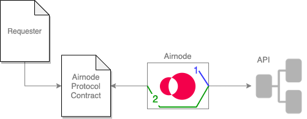

<TitleSpan>Build an Airnode</TitleSpan>

# {{$frontmatter.title}}

<VersionWarning/>

<TocHeader /> <TOC class="table-of-contents" :include-level="[2,3]" />

Airnode can pass along security information (schemes) when making calls to API operations. These come in two forms, _authentication security schemes_ such as `apiKey or http` and _relay security schemes_ which is information extracted from the request.

<!-- prettier-ignore-->
>  <br/> 1.  <p class="diagram-line" style="color:blue;">The Airnode uses <i><b>authentication security schemes</b></i> to authenticate itself to an API operation of which the values are know only to the Airnode.</p>
  2.  <p class="diagram-line" style="color:green;">The Airnode can forward <i><b>relay security scheme</b></i> information from a requester's request to the API operation.</p>
## Supported Security Schemes

Each security scheme has a certain type specified by the required `type` property inside the security scheme definition. The following security scheme types are supported.

- [apiKey](./api-security.md#apikey)
- [http](./api-security.md#http)
- [relayRequesterAddress](./api-security.md#relayrequesteraddress)
- [relayChainId](./api-security.md#relaychainid)
- [relayChainType](./api-security.md#relaychaintype)

**Authentication Security Schemes**

An Airnode can use the following security scheme types to authenticate itself. This is different then [Authorization](./apply-auth.md) of requesters to access the Airnode.

- apiKey
- http (basic & bearer)

**Relay Security Schemes**

In addition to authenticating itself, Airnode can "relay" security information about a request to an API operation. For relay security schemes you do not provide any values as they are extracted from the request by Airnode.

- relayRequesterAddress
- relayChainId
- relayChainType

### apiKey

The `apiKey` security schema type allows you to define an API key for your API. It is an object which consists of the following fields

- `type` must be `apiKey`
- `in` can be one of the `query`, `header` or `cookie`. This value specifies how should the value be sent to your API.

::: warning Using the "query" option

When using the `query` option, the API key will be sent in the request body for POST requests and in query string for GET requests.

:::

- `name` is the name of the API key that should be sent to your API. For example "X-Api-Key".

Schema definition example:

```json
{
  "requiresXApiKey": {
    "in": "header",
    "type": "apiKey",
    "name": "X-api-key"
  }
}
```

and `apiCredentials` example:

```json
{
  "oisTitle": "Ois Title",
  "securitySchemeName": "requiresXApiKey",
  "securitySchemeValue": "${X_API_KEY}" // interpolated from secrets.env
}
```

### http

The `http` security schema type allows you to define a `basic` or `bearer` authentication. It consists of the following fields

- `type` must be `http`
- `scheme` is either `basic` or `bearer`

Schema definition example:

```json
{
  "requiresBasicAuth": {
    "scheme": "basic",
    "type": "http"
  }
}
```

and `apiCredentials` example:

```json
{
  "oisTitle": "Ois Title",
  "securitySchemeName": "requiresBasicAuth",
  "securitySchemeValue": "${BASE_64_ENCODED_BASIC_AUTH}" // interpolated from secrets.env
}
```

This security schema will always be sent in the headers. The security scheme value should be base64 encoded value "username:password" for `basic` auth and the encoded token for `bearer` auth.

### relayRequesterAddress

The `relayRequesterAddress` security schema type instructs Airnode to forward the [requester](../../../concepts/requester.md) address to your API. The schema definition is similar to the [`apiKey`](./api-security.md#apikey), however the `type` must be `relayRequesterAddress`.

Schema definition example:

```json
{
  "in": "header",
  "type": "relayRequesterAddress",
  "name": "requesterAddress"
}
```

since this value will be relayed by Airnode, there is no `apiCredentials` definition.

Note that Airnode is just relaying (forwarding) the requester address to your API and does not perform any additional logic. If you intend to implement some logic based on the requester, you need to do so in the implementation of your API.

### relayChainId

The `relayChainId` security schema type instructs Airnode to forward the chain id to your API. The schema definition is similar to the [`apiKey`](./api-security.md#apikey), however the `type` must be `relayChainId`.

Schema definition example:

```json
{
  "in": "query",
  "type": "relayChainId",
  "name": "chainId"
}
```

since this value will be relayed by Airnode, there is no `apiCredentials` definition.

### relayChainType

The `relayChainType` security schema type instructs Airnode to forward the chain type to your API. The schema definition is similar to the [`apiKey`](./api-security.md#apikey), however the `type` must be `relayChainType`.

Schema definition example:

```json
{
  "in": "query",
  "type": "relayChainType",
  "name": "chainType"
}
```

since this value will be relayed by Airnode, there is no `apiCredentials` definition.

## Example

OIS security is inspired by OAS security practices. This is implemented using the security schemes and security field. All supported security schemes are described in detail in the [supported security schemes section](./api-security.md#supported-security-schemes). Working with security schemes can be described in three steps.

1. [Define the security schemes for an OIS](./api-security.md#step-1-define-the-security-schemes-for-an-ois)
2. [Turn on the defined security schemes](./api-security.md#step-2-turn-on-the-defined-security-schemes)
3. [Specify the values for the defined security schemes](./api-security.md#step-3-specify-the-values-for-the-defined-security-schemes)

Following is an example of a partial `config.json` which demonstrates the usage of security scheme and security field.

```json
{
  "ois": [
    {
      "title": "My OIS title",
      "apiSpecifications": {
        "components": {
          "securitySchemes": {
            "requiresXApiKey": {
              "in": "header",
              "type": "apiKey",
              "name": "X-api-key"
            }
          }
        },
        "security": {
          "requiresXApiKey": []
        }
      }
    }
  ],
  "apiCredentials": [
    {
      "oisTitle": "My OIS title",
      "securitySchemeName": "requiresXApiKey",
      "securitySchemeValue": "${X_API_KEY}"
    }
  ]
}
```

### Step #1: Define the security schemes for an OIS

You use `ois[n].apiSpecifications.components.securitySchemes` to define the security schemes your API will use. Consider the partial `config.json` above that declares a security scheme named "requiresXApiKey". This scheme declares that the API requires an API key that must exist in the HTTP header named "X-api-key".

### Step #2: Turn on the defined security schemes

When the scheme is defined, it is not turned on by default. You need to explicitly list the security schemes you intend to use in the `security` field located in `ois[n].apiSpecifications.security` object. The keys in this object are the names of security schemes to be used. Use empty array (`[]`) as values for now.

_Be aware that this step seems like extra work since there is no reason to define a security schema that will not be used. However, Airnode may support [more complex authentication](https://github.com/OAI/OpenAPI-Specification/blob/main/versions/3.0.3.md#security-requirement-object) logic in the future and using `[]` allows its implementation without a breaking change._

### Step #3: Specify the values for the defined security schemes

After defining and turning on a security scheme, it may be unclear what provides the value and how it is set.

The authentication schemes are intended to be common for the whole OIS and set by the API provider using `apiCredentials` part of the `config.json`. The `apiCredentials` is an array which specifies the values for all security schemes in all OIS definitions. Each element of this array contains the following fields

- `oisTitle` is the title of the OIS for the particular security scheme
- `securitySchemeName` is the name of the security scheme
- `securitySchemeValue` is the actual value that should be used by Airnode when making the API request. This value is usually a secret and it is recommended to interpolate it from `secrets.env`.

If you want to base your API authentication on dynamic data, for example [requester](../../../concepts/requester.md) address, you can utilize the "relay" security schemes [described above](./api-security.md#relayrequesteraddress) which can forward this data to your API.

::: warning Relay security schemes do not require a scheme value

The "relay" security schemes do not require the value, because it will be provided (relayed) by Airnode depending on the particular request.

:::

## Using Different Security Schemes

Currently, if you want different API operations to use different security schemes they must be grouped in different OIS objects based on their common security schemes. For example, your API has four operations, three require an API key in the HTTP header, another (public `/ping` endpoint) requires no security.

- The first three API operations might be in the `ois[0]` object with a security scheme named _requiresXApiKey_ of type _apiKey_ as shown above.
- The /ping API operation would be in `ois[1]` which would not have any `component.securitySchemes` and `security` would be an empty array.

## Multiple Security Schemes

You can use multiple security schemes (e.g., an API key goes in the header, and an additional secret goes in the query).

```json
// inside ois[n].apiSpecifications.
"components": {
  "securitySchemes": {
    "requiresXApiKey": {
      "type": "apiKey",
      "in": "header",
      "name": "X-api-key"
    },
    "specificQuerySecret": {
      "type": "apiKey",
      "in": "query",
      "name": "secret"
    }
  }
},
"security": {
  "requiresXApiKey": [],
  "specificQuerySecret": []
}
```

## No Security

If the API you are integrating is publicly accessible, you can set both the `security schemes` and `security` fields to empty objects.
