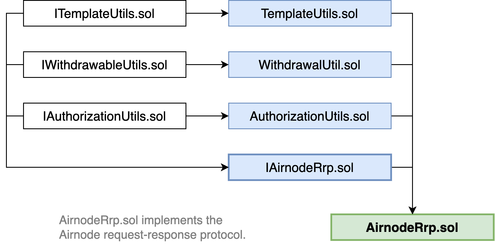

<TitleSpan>Concepts and Definitions</TitleSpan>

# {{$frontmatter.title}}

<VersionWarning/>

<TocHeader />
<TOC class="table-of-contents" :include-level="[2,3]" />

The first protocol implemented for Airnode is request–response. An Airnode
serving the request–response protocol listens for requests, makes the API call
specified by the request, and finally makes the response transaction back on
chain.

## Contracts

> This sections briefly describes the structure of the request response protocol
> contracts. You can find more information in the
> [source files on github](https://github.com/api3dao/airnode/tree/v0.5/packages/airnode-protocol/contracts/rrp).

The request–response protocol is implemented as a single permissionless contract
that all Airnodes interact with, which is named `AirnodeRrp.sol`. This base
contract has the following inheritance tree that compartmentalizes the aspects
of the protocol.

> 

### AirnodeRrp.sol

The
[AirnodeRrp.sol](https://github.com/api3dao/airnode/blob/v0.5/packages/airnode-protocol/contracts/rrp/AirnodeRrp.sol)
contract sits between a [requester](./requester.md) and the
[Airnode](./airnode.md). It inherits from four additional contracts as
illustrated in the diagram above:

- [IAirnodeRrp.sol](README.md#iairnoderrp-sol)
- [AuthorizationUtils.sol](README.md#authorizationutils-sol)
- [WithdrawalUtils.sol](README.md#withdrawalutils-sol)
- [TemplateUtils.sol](README.md#templateutils-sol)

This contract has two key responsibilities:

- It is used by requesters to make requests.
- It is used by Airnodes to fulfill requests.

However, this contract is shared for all requesters and Airnodes on a particular
chain. This means that neither Airnode operators nor requesters need to deploy
this contract themselves. Instead, API3 will deploy this contract once per chain
and you simply connect your Airnode or requester contract to that deployed
contract. See the
[Airnode contract addresses](../reference/airnode-addresses.md) for reference.

The [`@api3/airnode-admin`](../reference/packages/admin-cli.md) package is a CLI
tool used to interact with `AirnodeRrp.sol` and perform administrative actions.

### IAirnodeRrp.sol

The
[IAirnodeRrp.sol](https://github.com/api3dao/airnode/blob/v0.5/packages/airnode-protocol/contracts/rrp/interfaces/IAirnodeRrp.sol)
interface describes all functions and events of the `AirnodeRrp.sol` contract
which implements this interface.

This interface inherits:

- [IAuthorizationUtils.sol](https://github.com/api3dao/airnode/blob/v0.5/packages/airnode-protocol/contracts/rrp/interfaces/IAuthorizationUtils.sol)
- [IWithdrawalUtils.sol](https://github.com/api3dao/airnode/blob/v0.5/packages/airnode-protocol/contracts/rrp/interfaces/IWithdrawalUtils.sol)
- [ITemplateUtils.sol](https://github.com/api3dao/airnode/blob/v0.5/packages/airnode-protocol/contracts/rrp/interfaces/ITemplateUtils.sol)

### AuthorizationUtils.sol

The
[AuthorizationUtils.sol](https://github.com/api3dao/airnode/blob/v0.5/packages/airnode-protocol/contracts/rrp/AuthorizationUtils.sol)
contract implements Airnode [Authorizer](./authorization.md) checks.

### WithdrawalUtils.sol

The
[WithdrawalUtils.sol](https://github.com/api3dao/airnode/blob/v0.5/packages/airnode-protocol/contracts/rrp/WithdrawalUtils.sol)
contract allows the [sponsor](./sponsor.md) to trigger a withdrawal request
which is later fulfilled by Airnode and all sponsor wallet funds are sent back
to the sponsor.

### TemplateUtils.sol

The
[TemplateUtils.sol](https://github.com/api3dao/airnode/blob/v0.5/packages/airnode-protocol/contracts/rrp/TemplateUtils.sol)
contract is used to create and store Airnode [templates](./template.md) used to
create a [template request](./request.md#template-request).
