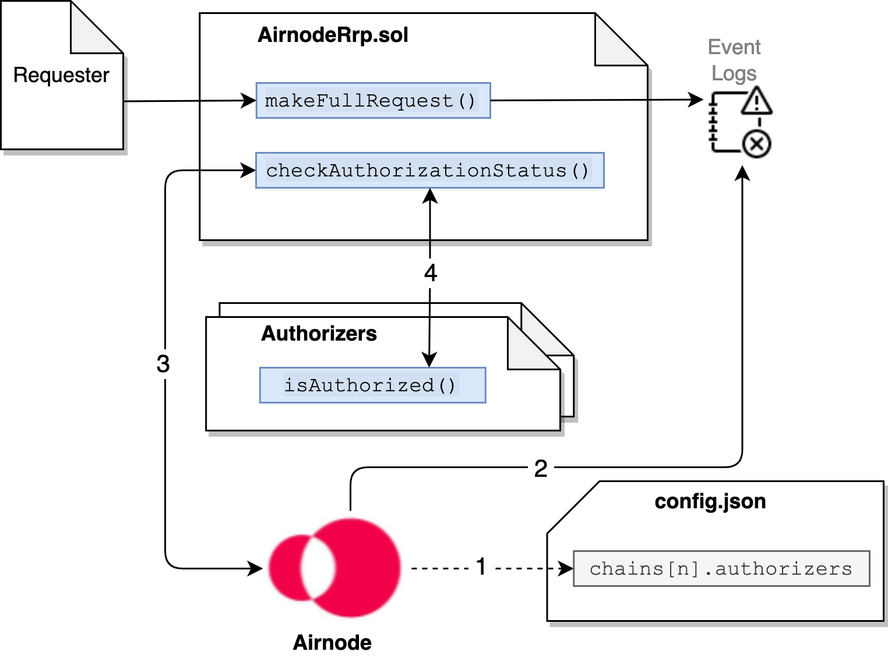

<TitleSpan>Concepts and Definitions</TitleSpan>

# {{$frontmatter.title}}

<VersionWarning/>

<TocHeader />
<TOC class="table-of-contents" :include-level="[2,5]" />

An Airnode can authorize requester contract access to its underlying API using
authorizers. As an alternative, an API provider could also use
[Relayed Meta Data](./relay-meta-auth.md) to authenticate requests. Authorizers
require blockchain knowledge by the API provider, relayed meta data does not.

Other docs related to authorizers and relayed meta data:

- [Using Authorizers](../grp-providers/guides/build-an-airnode/apply-auth.md)
- [API Security](../grp-providers/guides/build-an-airnode/api-security.md)

When an Airnode receives a request, it can use on-chain authorizer contracts to
verify if a response is warranted. Authorizers allow Airnodes to implement a
wide variety of policies. Below are some examples:

- Respond to requests from sponsors that have paid their monthly subscription
  fee in DAI.
- Respond to individual requests for which a per-call fee has been paid in API3
  tokens.
- Respond to requests made by requesters that were whitelisted by the API3 DAO.
- Respond to requests made by sponsors who have been whitelisted by the Airnode
  owner's backend (for example, based on PayPal payments).

A common use case for an authorizer is the
[RequesterAuthorizerWithAirnode](#requesterauthorizerwithairnode) authorizer
contract developed for Airnode operators to use right out-of-the-box. It allows
the whitelisting of requester contracts (with or without expiration timestamps)
on a per endpoint basis. This is the most common use case and may in fact
satisfy the needs of many Airnodes.

The diagram below illustrates how Airnode utilizes authorizers.

> 
>
> 1. <p class="diagram-line">When Airnode starts it reads its list of authorizer contracts declared in config.json.</p>
> 2. <p class="diagram-line">Airnode gathers requests from the event logs, during its run cycle.</p>
> 3. <p class="diagram-line">Airnode sends each request, along with the list of authorizer contracts, to <code>checkAuthorizationStatus()</code>.</p>
> 4. <p class="diagram-line"><code>checkAuthorizationStatus()</code> executes the <code>isAuthorized()</code> function in each authorizer contract. If any one authorizer contract returns true, then true is returned to the Airnode which in turn proceeds to fulfill the request.</p>

### Airnode Authorization Policies

Airnode provides two authorizer contracts, one of which
(RequesterAuthorizerWithAirnode) can be used by any API provider. The other
(RequesterAuthorizerWithManager) is meant to be used by the API3 DAO. They are
detailed within this doc in sections below.

- [`RequesterAuthorizerWithAirnode`](#requesterauthorizerwithairnode)
- [`RequesterAuthorizerWithManager`](#requesterauthorizerwithmanager)

Both these authorizer contracts inherit and extend the `RequesterAuthorizer`
abstract contract which also extends the `Whitelist` contract. This means that
both authorizer contracts will need to whitelist requester contracts prior to
make them available to an Airnode (For `RequesterAuthorizerWithAirnode` this can
be done using the
[admin-cli](../reference/packages/admin-cli.md#requesterauthorizerwithairnode)).

The main difference between them is that `RequesterAuthorizerWithAirnode` allows
the Airnode address to grant whitelisting roles for that specific Airnode. On
the other hand, `RequesterAuthorizerWithManager` allows the manager address
(read: the API3 DAO) to grant whitelisting roles for all Airnodes that use it.

Some common functions available are:

- `requesterIsWhitelisted`: Called to check if a requester is whitelisted to use
  the Airnode–endpoint pair.
- <code style="  overflow-wrap: break-word;">airnodeToEndpointIdToRequesterToWhitelistStatus</code>:
  Called to get the detailed whitelist status of a requester for the
  Airnode–endpoint pair.

### Custom Authorizers

Custom authorizer contracts can implement any arbitrary authorization logic. An
example might be where Airnode only responds to requests if the requester has
made less than a specific number of requests to the Airnode in the last month,
effectively implementing an on-chain call quota.

### Authorizer List

Airnode authorizers are listed in the config.json file at
[`chains[n].authorizers`](../grp-providers/guides/build-an-airnode/configuring-airnode.md#chains).
An authorizer typically checks for a single condition (has the requester made
their monthly payment, is the `requester` whitelisted, etc.). Authorizers can be
combined to enforce more complex policies. If any of the authorizers in the list
gives access, the request will considered to be authorized. From a logical
standpoint, the authorization outcomes get `OR`ed.

### Authorizer Interface

Authorizer contracts that inherit from `IAuthorizer` can be used to implement an
arbitrary authorization policy based on its input parameters.

- `requestId`: bytes32
- `airnode`: address
- `endpointId`: bytes32
- `sponsor`: address
- `requester`: address

Note that the authorizer does not have to use all of the arguments, and can even
decide on arbitrary on-chain criteria such as `block.number` (e.g., do not
respond to anyone after block number N). An authorizer is a contract with the
following interface:

```solidity
interface IAuthorizer {
    function isAuthorized(
        bytes32 requestId,
        address airnode,
        bytes32 endpointId,
        address sponsor,
        address requester
    ) external view returns (bool);
}
```

Below is an example of how to create the simplest form of an authorizer. This
authorizer allows any requester contract to call the endpointId (0xf2ee...).

```solidity
contract myAuthorizer is IAuthorizer
{
  function isAuthorized(
      bytes32 requestId,
      address airnode,
      bytes32 endpointId,
      address sponsor,
      address requester
  ) external view override returns (bool) {
      bytes32 expected = 0xf2ee...;
      return endpointId == expected;
  }
}
```

### Why is an authorization scheme needed?

Airnodes need the ability to fulfill requests selectively. This is required for
two main reasons:

1. The Airnode only fulfills requests made by requesters who have made payment
   to the Airnode owner, which allows them to monetize their services.
2. The services of the Airnode are sensitive and can only be accessed by certain
   requesters, e.g., who have gone through KYC.

A protocol that does not have the authorizer scheme or equivalent functionality
cannot be considered as permissionless, and will not be able to achieve
wide-spread adoption.

### Are authorizers required?

Authorizers are not required. An Airnode operator could use
[Relayed Meta Data Security Schemes](../grp-providers/guides/build-an-airnode/api-security.md#relayed-meta-data-security-schemes).
It is possible to use both authorizers and relay security schemes together.

### How are authorizers implemented?

There are two main points to consider about how authorization policies are
implemented:

1. If the policies are kept off-chain, the requester cannot see them or check if
   they satisfy them. Furthermore, the Airnode owner updating the policies
   (e.g., increasing the service fees) requires off-chain coordination with the
   requester.
2. Embedding the policies in the request–response loop results in a gas cost
   overhead.

Based on these considerations, Airnode uses a hybrid method. An Airnode
announces its authorization policy through off-chain channels as the addresses
of a list of authorizer contracts. Whenever the Airnode receives a request, it
checks if it should fulfill this request by making a static call that queries
this on-chain policy. Similarly, the requester can use this on-chain policy by
making a static call to check if they are authorized. This scheme both allows
the Airnode to set transparent and flexible policies, and this to be done with
no gas overhead.

### Access (deny, allow, filter)

How authorizers impact access is based on the `chains` field of `config.json`
for a given Airnode.

#### Deny All

If the Airnode wants to deny all access for a particular chain, it should not
operate on it (i.e., it should not exist in the `chains` list). The below
example would "deny all" to chains 1 and 3–n since they do not have entries in
the `chains` field.

```json
 chains:[
   {
    id:2,
    authorizers:[],
    ...
   }
 ]
```

#### Allow All

A `chains.authorizers` list of [] means "let everyone through". In the example
below chain 2 would allow access to any requester.

```json
  chains:[
    {
      id:2,
      authorizers:[]
      ...
    },
    ...
 ]
```

#### Filter All

If the Airnode wants to give access selectively, it should use one or more
authorizers that implement filtering logic. In the example below the Airnode
will accept requests on chain _"2"_ and the requester would be filtered by two
authorizers.

```json
 chains:[
   id:2,
   authorizers:['0xcd...cd8d','0xff...d19c]
   ...
 ]
```

### RequesterAuthorizerWithAirnode

This contract implements a requester-based RRP authorizer with three types of
roles

1. Whitelist expiration extender: Is allowed to extend temporary whitelisting
   expiration
2. Whitelist expiration setter: Is allowed to set the temporary whitelisting
   expiration (i.e., they can also reduce the expiration time)
3. Indefinite whitelister: Is allowed to whitelist/unwhitelist indefinitely Each
   Airnode's address is treated as if they have all these three roles for the
   respective Airnode, and they can also grant these roles to other accounts,
   which includes contracts that implement arbitrary business logic.

#### extendWhitelistExpiration

The `extendWhitelistExpiration()` function can be called by a whitelist
expiration extender or the Airnode address to extend the whitelist expiration of
a requester for the Airnode–endpoint pair.

This function emits a `ExtendedWhitelistExpiration` event with the following
signature:

```
    event ExtendedWhitelistExpiration(
        address indexed airnode,
        bytes32 endpointId,
        address indexed requester,
        address indexed sender,
        uint256 expiration
    );
```

#### setWhitelistExpiration

The `setWhitelistExpiration()` function can be called by a whitelist expiration
setter or the Airnode address to set the whitelisting expiration of a requester
for the Airnode–endpoint pair. This can hasten expiration.

This function emits a `SetWhitelistExpiration` event with the following
signature:

```
    event SetWhitelistExpiration(
        address indexed airnode,
        bytes32 endpointId,
        address indexed requester,
        address indexed sender,
        uint256 expiration
    );
```

#### setWhitelistStatusPastExpiration

The `setWhitelistStatusPastExpiration()` function can be called by an indefinite
whitelister or the Airnode address to set the whitelist status of a requester
past expiration for the Airnode–endpoint pair. This is useful to allow access to
an API even if the expiration date has passed. For example, keep authorizing
requests while a sum of API3 tokens is locked.

This function emits a `ExtendedWhitelistExpiration` event with the following
signature:

```
    event SetWhitelistStatusPastExpiration(
        address indexed airnode,
        bytes32 endpointId,
        address indexed requester,
        address indexed sender,
        bool status
    );
```

#### isAuthorized

The `isAuthorized()` function will be called by AirnodeRrp to verify the
authorization status of a request. This function will return true for all
whitelisted requester contracts, admins and Airnode operator address.

### RequesterAuthorizerWithManager

This contract implements a requester-based RRP authorizer and assigns the API3
DAO as the manager or in other words, the highest ranking admin across all
Airnodes.

The manager and the accounts that it has granted the whitelist expiration
extender, whitelist expiration setter and the indefinite whitelister roles will
use `RequesterAuthorizerWithManager` to whitelist requesters across all
Airnodes.

#### extendWhitelistExpiration

The `extendWhitelistExpiration()` function can be called by a whitelist
expiration extender or the manager to extend the whitelist expiration of a
requester for the Airnode–endpoint pair.

This function emits a `ExtendedWhitelistExpiration` event with the following
signature:

```
    event ExtendedWhitelistExpiration(
        address indexed airnode,
        bytes32 endpointId,
        address indexed requester,
        address indexed sender,
        uint256 expiration
    );
```

#### setWhitelistExpiration

The `setWhitelistExpiration()` function can be called by a whitelist expiration
setter or the manager to set the whitelisting expiration of a requester for the
Airnode–endpoint pair. This can hasten expiration.

This function emits a `SetWhitelistExpiration` event with the following
signature:

```
    event SetWhitelistExpiration(
        address indexed airnode,
        bytes32 endpointId,
        address indexed requester,
        address indexed sender,
        uint256 expiration
    );
```

#### setWhitelistStatusPastExpiration

The `setWhitelistStatusPastExpiration()` function can be called by an indefinite
whitelister or the manager to set the whitelist status of a requester past
expiration for the Airnode–endpoint pair. This is useful to allow access to an
API even if the expiration date has passed. For example, keep authorizing
requests while a sum of API3 tokens is locked.

This function emits a `ExtendedWhitelistExpiration` event with the following
signature:

```
    event SetWhitelistStatusPastExpiration(
        address indexed airnode,
        bytes32 endpointId,
        address indexed requester,
        address indexed sender,
        bool status
    );
```

#### isAuthorized

The `isAuthorized()` function will be called by AirnodeRrp to verify the
authorization status of a request. This function will return true for all
whitelisted requester contracts, admins and the meta-admin address.

<divider/>
