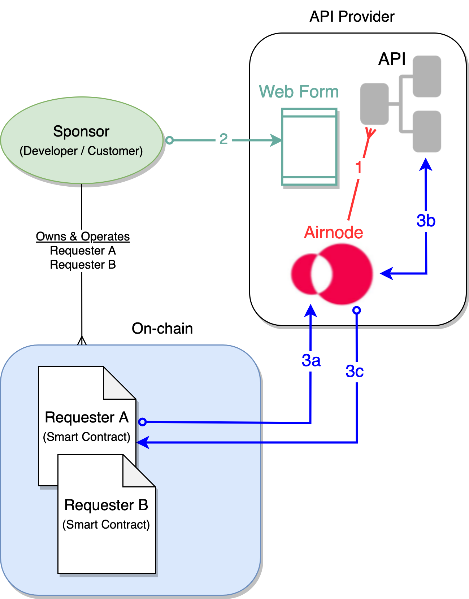

<TitleSpan>Concepts and Definitions</TitleSpan>

# {{$frontmatter.title}}

<VersionWarning/>

<TocHeader /> <TOC class="table-of-contents" :include-level="[2,3]" />

There are two methods by which the API provider can manage access to their API by on-chain smart contracts known as requesters.

- [Authorizers](../grp-providers/guides/build-an-airnode/apply-auth.md) (on-chain)
- [Relayed Meta Data Security Schemes](../grp-providers/guides/build-an-airnode/api-security.md) (off-chain)

Relayed meta data is known information about the requester (smart contract) passed along to the API endpoint by Airnode.

Using the relayed meta data security schemes does not require blockchain-specific knowledge or blockchain interaction by an API provider and there are no blockchain transaction (gas) fees. Just apply the desired security scheme fields in the Airnode `config.json` file during deployment of an Airnode, see [Building an Airnode](../grp-providers/guides/build-an-airnode/). Then have your API operations check for any security scheme values you configured (typically the `sponsorAddress`) against your customer database.

## Simple Example

The illustration below is one way to make use of relayed meta data for security purposes. Here a sponsor (a.k.a. developer or customer) submits their `sponsorAddress` to be stored by an API provider. The `sponsorAddress` can be used to authenticate requests by a sponsor's smart contracts.

The following sections relate to the numbers shown in the diagram above.

### 1: Deploy Airnode

An Airnode is deployed with the `sponsorAddress` security scheme instructing Airnode to pass along the `sponsorAddress` with all requests.

### 2: Register Sponsors

A sponsor is the developer of an on-chain smart contract that wishes to request off-chain data from an API provider. A sponsor has a know `sponsorAddress`. The API provider can request the `sponsorAddress` from the sponsor using a webform as part of a paid subscription setup.

### 3: Making Requests

When a smart contract (requester) makes a request of any API operation, the `sponsorAddress` will be part of the request. A sponsor can have more than one requester.

- 3a: The requester makes a request to Airnode.
- 3b: Airnode adds the `sponsorAddress` to the request before passing the request to the API operation. The API operation performs a lookup on the `sponsorAddress` to verify it has a subscription. If verified the API operation returns the response to Airnode.
- 3c: Airnode returns the response to the requester.

## Security Schemes

Including the `sponsorAddress` used in the [Simple Example](./relay-meta-auth.md#simple-example) above, there are five _relayed meta data security schemes_ that can be incorporated into any Airnode.

- [relayChainId](../grp-providers/guides/build-an-airnode/api-security.md#relaychainid) - The chain ID the request came from.
- [relayChainType](../grp-providers/guides/build-an-airnode/api-security.md#relaychaintype) - The chain type the request came from.
- [relaySponsorAddress](../grp-providers/guides/build-an-airnode/api-security.md#relaysponsoraddress) - The sponsor's wallet address. The sponsor owns and operates one or more requesters.
- [relaySponsorWalletAddress](../grp-providers/guides/build-an-airnode/api-security.md#relaysponsorwalletaddress) - Other wallet addresses associated with each requester. These are owned and funded by a sponsor to pay on-chain gas costs.
- [relayRequesterAddress](../grp-providers/guides/build-an-airnode/api-security.md#relayrequesteraddress) - The on-chain address of the requester (smart contract).
