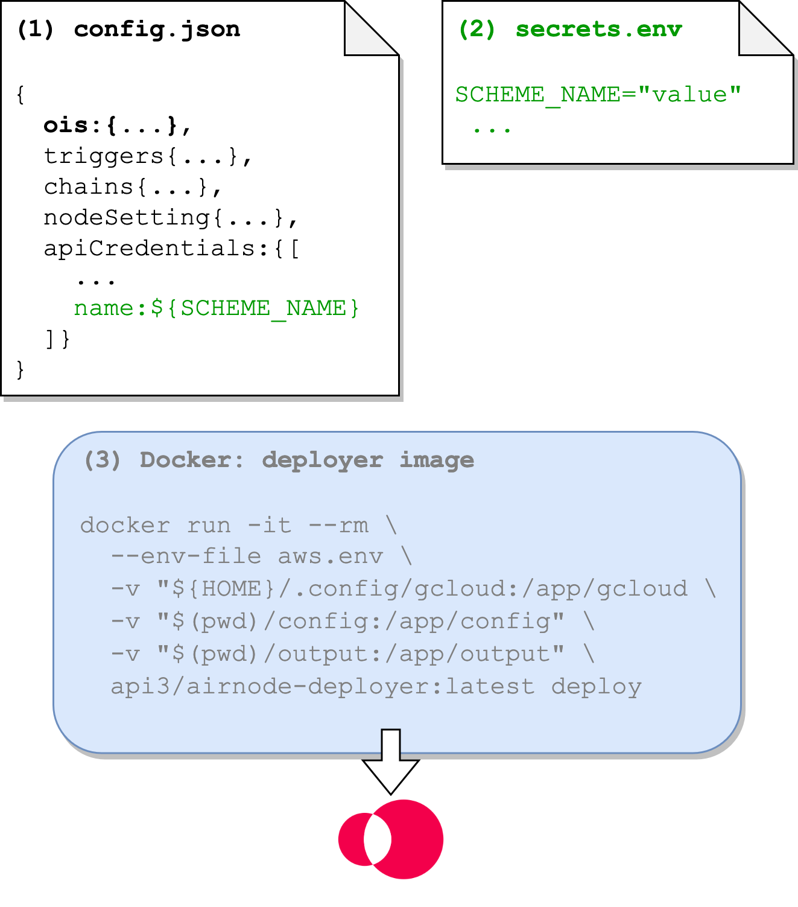
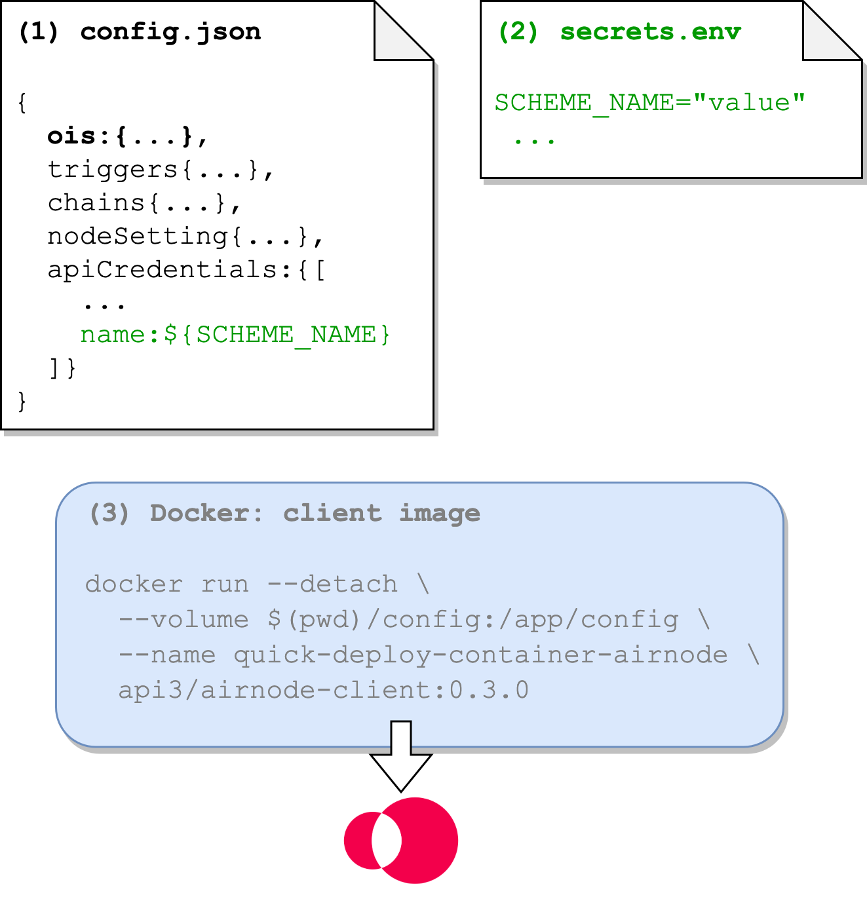

<TitleSpan>API Providers</TitleSpan>

# {{$frontmatter.title}}

An **API Provider** is you, if you wish to publish data from your API to
on-chain contracts which are called requesters. You can do so by building an
Airnode. An Airnode is a first-party oracle that will push off-chain API data to
any on-chain requester. See the [Developer](../grp-developers/) section to learn
more about how developers will use your Airnode.

See the [Guides](guides/build-an-airnode/) section in the API Provider docs to
build the necessary files required to deploy an Airnode. The diagrams below
illustrate the required components to successfully deploy an Airnode to AWS, GCP
or a Docker Container.

:::: tabs

::: tab AWS

1. 
<b>config.json</b>: Contains the Airnode's configuration. The OIS object is important as it maps an API to Airnode endpoints.

2. 
<b>secrets.env</b>: Values that should not be exposed in config.json.

3. 
aws.env: AWS credentials required by the Docker deployer image.

4. 
<b>Docker deployer image</b>: Deploys Airnode using its deploy command.

:::

::: tab GCP

1. 
<b>config.json</b>: Contains the Airnode's configuration. The OIS object is important as it maps an API to Airnode endpoints.

2. 
<b>secrets.env</b>: Values that should not be exposed in config.json.

3. 
<b>Docker deployer image</b>: Deploys Airnode using its deploy command.

:::

::: tab Container

1. 
<b>config.json</b>: Contains the Airnode's configuration. The OIS object is important as it maps an API to Airnode endpoints.

2. 
<b>secrets.env</b>: Values that should not be exposed in config.json.

3. 
<b>Docker client image</b>: Deploys Airnode using its deploy command.

:::

::::
