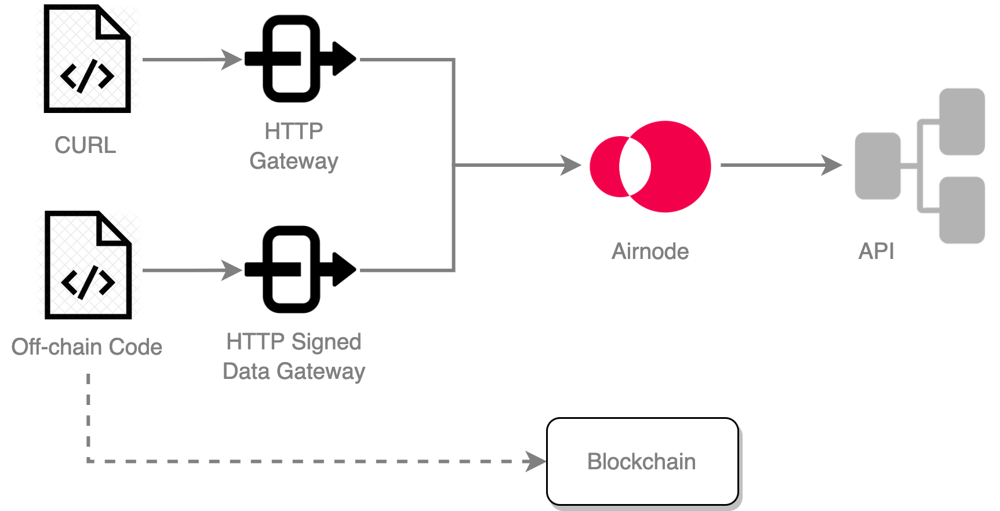

<TitleSpan>Build an Airnode</TitleSpan>

# {{$frontmatter.title}}

<TocHeader />
<TOC class="table-of-contents" :include-level="[2,3]" />

As part of the Airnode deployment you can decide to deploy an HTTP Gateway. The
gateway allows the testing of defined Airnode endpoints without accessing the
blockchain. You provide endpoint arguments directly to the Airnode with a tool.
of your choice and get a response from an integrated API operation. This results
in confirmation your integration is set up properly. The HTTP gateway feature is
only available when deploying an Airnode to AWS cloud provider.

> 

## Setup

Enable the HTTP gateway by setting two fields in the config.json
(`nodeSettings.httpGateway`).

- **enabled**: A boolean setting enable/disable for the Airnode's HTTP gateway.
- **apiKey**: A user defined API key to authenticate against the gateway. The
  key must have a length of between 30 - 120 characters.

```json
"nodeSettings": {
  "cloudProvider": {
    "type": "aws",
    "region": "us-east-1"
  },
  "airnodeWalletMnemonic": "${AIRNODE_WALLET_MNEMONIC}",
  "heartbeat": {...},
  "httpGateway": {
    "enabled": true,
    "apiKey": "${HTTP_GATEWAY_API_KEY}"
  },
  ...
},
```

You must also add the [testable](./configuring-airnode.md#testable) boolean flag
for each endpoint you want to test in the respective `triggers` object
(`triggers.rrp[n].testable`). This indicates whether the endpoint can be used
via the HTTP gateway or not. It’s optional and by default is `false`.

```json
// in config.json
"triggers": {
  "rrp": [
    {
      "endpointId": "0xf466b8feec41e9e50815e0c9dca4db1ff959637e564bb13fefa99e9f9f90453c",
      "oisTitle": "CoinGecko Basic Request",
      "endpointName": "coinMarketData",
      "testable": true // This endpoint can be tested by the gateway
    }
  ]
}
```

## Gateway URL

A gateway URL is generated when your Airnode is deployed. You can obtain the URL
(`api.httpGatewayUrl`) from the receipt.json file returned by the deployer or as
part of a request sent from Airnode's [heartbeat](heartbeat.md) to your
specified heartbeat URL.

## Using CURL

In order to test an endpoint, via the HTTP gateway, make an HTTP POST request
with endpointId as a path parameter, the `Content-Type` header set to
`application/json`, the `x-api-key` header and endpoint parameters in the
request body. As an alternative to CURL try an app such as
[Insomnia](https://insomnia.rest/) or
[Postman](https://www.postman.com/product/rest-client/). Windows users can also
use
[Windows Subsystem for Linux](https://docs.microsoft.com/en-us/windows/wsl/install)
(WSL2) to run CURL for Linux.

- An `endpointId` can found in config.json under `triggers[n].endpointId`.
- The `x-api-key` can found in config.json under
  `nodesettings.httpGateway.apiKey`.

| parameter         | in     | CURL options                                             |
| ----------------- | ------ | -------------------------------------------------------- |
| Content-Type      | header | `-H 'Content-Type: application/json'`                    |
| x-api-key         | header | `-H 'x-api-key: 8d890a46-799d-48b3-a337-8531e23dfe8e'`   |
| endpointId        | path   | `0xf466b8feec...99e9f9f90453c`                           |
| &lt;user-defined> | body   | `-d '{"parameters": {"param1": "string", "param2": 5}}'` |

Replace `<httpGatewayUrl>` in the example below with your gateway URL from the
`receipt.json` file using the `httpGatewayUrl` field. The
[receipt.json](./deploying-airnode.md#receipt-json) file is created when you
deploy an Airnode.

Request:

:::: tabs

::: tab Linux/Mac/WSL2

```sh
curl \
-X POST \
-H 'Content-Type: application/json' \
-H 'x-api-key: 8d890a46-799d-48b3-a337-8531e23dfe8e' \
-d '{"parameters": {"param1": "string", "param2": 5}}' \
'<httpGatewayUrl>/0xf466b8feec...99e9f9f90453c'
```

:::

::: tab Windows

```sh
curl ^
-X POST ^
-H 'Content-Type: application/json' ^
-H "x-api-key: 8d890a46-799d-48b3-a337-8531e23dfe8e" ^
-d "{\"parameters\": {\"param1\": \"string\", \"param2\": 5}}" ^
<httpGatewayUrl>/0xf466b8feec...99e9f9f90453c
```

:::

::::

Response:

```json
{
  "rawValue": { "usd": "6421.4" },
  "encodedValue": "0x0000000000000000000000000000000000000000000000000000000ef373e180",
  "values": ["64214000000"]
}
```

The response format is a simple JSON object with the following fields:

- `rawValue` - the API response
- `values` - an array of values after they are
  [extracted and converted](../../../reference/packages/adapter.md#conversion)
  to the target type
- `encodedValue` - the encoded bytes value that is sent as payload in the
  response transaction on chain
