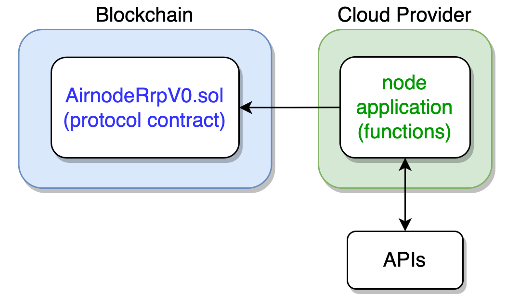

<TitleSpan>简介</TitleSpan>

# {{$frontmatter.title}}

<VersionWarning/>

<TocHeader /> <TOC class="table-of-contents" :include-level="[2,3]" />

Airnode是一个无服务器的预言机节点，以 "一劳永逸 "的理念设计。 Airnode由两部分组成：作为自我托管或云提供商功能（如AWS或GCP）部署的链外**Airnode** （又称 "节点"），以及链上**协议合约**AnnodeRrp.sol。

>    
> 
> 
Airnode由两部分组成：>链外Airnode 又称 "节点"），通常部署为一组云供应商的> 函数（如AWS或GCP），以及链上协议合同AnnodeRrp.sol。

**Airnode**的核心哲学是让API供应商轻松运行自己的_预言机节点_。 这样，他们就可以向任何对其服务感兴趣的链上_去中心化应用_（dApp）提供数据，而不需要中间商。

这个机制的核心是 **Airnode**, 一个开源的预言机节点。 它被设计成任何API供应商均可轻松部署，几乎无需维护。 Airnode让dApp开发者编写_智能合约_，与API供应商的链上数据交互。

Airnode的设计机制消除了API供应商对链上和链下的担忧。 Airnode的设置后不管的框架就是为了实现其简易性而生。

::: tip

如果你想了解更多关于Airnode的应用情况，请阅读<a href="/api3-whitepaper-v1.0.2.pdf#Airnode:%20A%20Node%20Designed%20for%20First-Party%20Oracles" 
target="_api3-whitepaper">API3白皮书</a>的第4节，_Airnode：专为第一方预言机设计的节点_。

:::

## 专为第一方预言机设计

第一方预言机是API3解决方案的组成部分。 这意味着每个API都由API的所有者，而不是第三方操作的预言机来提供服务。

本文讨论了使用第一方预言机的优点，讨论了API供应商用目前可用的解决方案来操作自己的预言机不可行的原因，以及如何用Airnode解决这个问题。

## 摆脱中间商的好处

第一方预言机是针对中间商问题的一个简单明了的解决方案。 原则上，这些是由API供应商自己操作的预言机，他们将在智能合约平台的协议层面用他们的私钥签署响应。 这种方法是数据没有被篡改的最好证明。 此外，第一方预言机是默认私有的，因为第三方无法观察到正在处理的API的原始数据，这就扩大了他们可以原生使用的用例范围。

由第一方预言机组成的数据源与雇用中间商的数据源相比，更具成本效益，因为后者需要为中间商的服务付费，并为数据源的获取提供激励（被称为中间商税）。 此外，第一方的数据馈送，将需要设置更少的预言机，因为它不需要在预言机层面进行过度冗余的去中心化，以防止第三方攻击。 假设每个API通常由至少两个第三方预言机提供服务，我们保守地估计，由第一方预言机提供的数据馈送在gas成本方面，将至少提高50%的效率。

第一方预言机也提供了数据源和去中心化方面必须的透明度。 鉴于每个API供应商都有一个预言机（可以在链上看到），服务于一个数据源的预言机数量，将准确地代表它的去中心化程度。 这是因为在预言机和数据源之间是一对一映射的。 此外，API供应商将通过链外渠道发布其链上身份，这将允许用户验证他们在给定时间消费的数据。

最后，让 API 提供商运营预言机有助于解决法律问题，因为 API 服务不再需要授权给第三方，API 供应商将获得全部收入。 此外，这解决了寻租的第三方预言机问题，并允许将资金重新分配到承担繁重工作的群体，即API供应商。 激励 API 供应商，使他们的经济利益与 API3 生态系统的利益保持一致，从而在两者之间建立起牢固的相互联系。

## 链外数据签名

这里有一种混合解决方案，仍然依赖于第三方预言机，但不会让他们篡改数据。 在这个方案中，API供应商用他们的私钥在链外签署他们的数据，并通过常规 API 端点提供服务。 第三方预言机调用此端点以获取签名数据，并将其发布到链上。 然后可以使用 API 提供者的公钥，在链上验证数据的真实性——即第三方预言机没有篡改。

虽然这个方案消除了在预言机层面上的数据篡改风险，但它本质上只是一种折衷。 由于依赖第三方预言机，它只得继续遭受由此引起的生态系统问题，此外，它需要修改API以实现链外签名。 这导致即使与常规的基于第三方预言机的解决方案相比，API的选择也非常有限，并且限制了该解决方案的生态系统在应用规模上的增长潜力。

## API提供商运行预言机 的障碍

在之前的工作过程中，API3与API供应商进行了广泛的沟通，观察到预言机部署和运营的障碍如下：

1. 传统的API供应商通常和普通人一样对区块链技术不了解。 这甚至适用于那些管理加密货币市场数据的公司--因为他们的主要业务是从交易所的API中收集数据，处理它们，并通过自己的API提供结果--这不需要任何特定于区块链的专业知识。 因此他们通常无法使用内部资源轻松操作预言机节点。

2. 预言机节点操作员没有就业市场。 即使一些API供应商通过雇佣为数不多的节点操作员，来获得所需的特定技术，这也不是一个可扩展的解决方案。

3. 运营一个预言机节点需要消耗大量的资源，包括工时和基础设施成本。 除非保证获得大量补贴或未来利润，否则运营一个预言机节点在财务上是不可行的。

4. 运营一个预言机节点需要API供应商使用加密货币进行交易。 具体来说，他们必须以本地货币（如ETH）支付gas费用，并以一种或多种加密货币接收付款。 由于合规性、法律和会计方面的原因，这使绝大多数的API供应商失去了资格。 此外，由于与金融风险有关的类似原因，任何要求 API 提供商质押资金的计划都会被断然拒绝。

## Airnode 功能

Airnode 是一个完全无服务器的预言机节点，专为 API 供应商运营自己的预言机而设计。 它解决了 API 提供商面临的与预言机节点相关的许多问题：

1. 它不需要任何特定的操作知识。 事实上，甚至很难说有什么操作，因为 Airnode 是围绕“设置后不管”的原则设计的。

2. 由于现有的完全托管的无服务器技术，它不需要任何日常维护，例如更新操作系统或监控节点的正常运行时间。 它被设计为无状态的，这使得它对任何可能导致永久停机并需要操作员干预的问题，都具有极强的弹性。

3. 它建立在按需定价的服务之上，这意味着节点运营商只按其节点的使用量收费。 这允许API供应商免费运行预言机，并且只有在他们开始产生收入后才开始付费。

4. 它完全不要求节点操作员处理加密货币。 其协议的设计方式是由请求者承担所有gas 费用。

看待Airnode的一种方式是将其作为网络API的轻量级包装，使其能够与智能合约平台进行通信，没有开销或支付代币摩擦。 就API供应商所需的参与而言，使用Airnode可以比作使用API网关，使API可以通过网络访问，而不是作为副业运营区块链节点。 其目的是让Airnode成为像使用API网关一样无处不、和平平无奇，这将使 API3 可以使用大量的第一方预言机。

API 提供商投入大量资源，来构建具有高可用性的基础设施。 重要的是，预言机节点的实现不包含可能导致停机的单个故障点。 使用第三方预言机的现有解决方案，依赖于预言机层面的过度冗余来解决这一问题，这会导致成本过高。 API3 设想每个 API 仅由其第一方预言机提供服务，这意味着冗余必须在单个 Airnode层面实现。 节点是完全无服务器的，这有利于在单个云提供商的不同可用区，甚至是多个云提供商之间实现冗余。 除此之外，还可以将 Airnode 容器化并在企业内部运行。 然而，几乎所有的使用案例都会推荐使用无服务器版本。

Airnode 由 API3 的创始成员开发，现已开源。 该软件功能齐全，适用于当前协议，API3 将以赠款的形式资助进一步的开发。

## Airnode协议

与预言机问题相比，API3更倾向于更好地规范API连接问题，API3认为预言机节点应该被设计成，能够很好地将 API 与智能合约平台连接，而不是作为一个沙盒，声称可以用于任何可以想象的目的。 基于这一理念，Airnode协议被设计为遵循API使用的自发模式，以实现API-智能合约平台接口尽可能地透明和无摩擦。

第一种也是最常用的 API 样式，就是遵循请求-响应模式，用户使用参数发出请求，API 会尽快响应。 这是 Airnode 支持的第一个模式，因为它很容易标准化并与遵循相同模式的现有 API 集成。 该方案的一个示例用例是请求交付特定匹配的结果，该结果可用于解决相应的预测市场问题。 此外，Airnode 计划支持发布-订阅模式，即当参数化的条件得到满足时，用户请求预言机回调一个特定的方法。 例如，当 ETH 价格跌至特定价格以下时，去中心化交易所可能会请求预言机为处于杠杆头寸的用户触发清算事件。 这些模式中的任何一种，都可用于实现 DeFi 应用程序当前使用的实时数据馈送，但它们也可以以 dAPI 的形式，支持更多种类的用例。

Airnode 协议的设计方式是，请求合约的发起人承担所有 gas 成本，甚至包括请求履行（响应）交易。 这是通过每个 Airnode 为每个赞助商拥有一个单独的钱包来实现的，类似于加密货币交易所自动指定用户将资金存入钱包的方式。 赞助商用本地货币（如ETH）为这个钱包提供资金，可以是一次性的，也可以是通过每个请求的微交易。 此钱包中的资金用于满足赞助商提出的以下所有要求。 该方案具有显著优势：

- Gas成本和支付代币价格（如LINK）的波动性，使得预言机几乎不可能设定有利可图但具有竞争力的价格。 在链上动态计算价格时需要多个数据源，并且每个请求都会增加大量的 gas 开销 使用 Airnode 协议，API 提供商不必担心 gas 成本，可以使用每次调用 0.1 美元或每月 100 美元等定价方案，这类似于典型的 API 定价模型。

- 期望API供应商能够将法币转换成加密货币，并为其节点钱包提供资金，作为其日常运作的一部分，这是不合理的。 在这个方案中，节点运营商永远不必考虑他们的节点钱包余额。

- 正如在对Airnode竞争对手的数据源进行的攻击中所看到的那样，使用普通钱包来满足请求的预言机节点，很容易受到攻击者的垃圾邮件请求，以耗尽他们的钱包余额。 解决这个问题的办法是，节点运营商维护他们将接受请求的可信地址的白名单。 除了难以确定哪些合约在这种情况下应该被信任之外，这使得任何公共列表服务实际上都不可行。 这是一个关键的问题，因为它使弱小的独立生态系统发展止步不前。 Airnode不容易受到这种类型的攻击，因为赞助商的指定钱包只用于满足该赞助商的请求，而不能被其他人耗尽。

- 传统的预言机节点必须以非常高的 gas 价格满足所有请求，因为它们不能容忍他们的交易队列被以低 gas 价格进行的单个交易阻塞 使用Airnode协议，这不再是一个问题，因为每个赞助商将有一个单独的交易队列。 然后，那些请求不具有时间紧迫性的赞助商，将能够提供履行 gas 价格作为请求参数，并以低得多的 gas 成本享受服务。 这一方案可望与EIP-1559产生协同效应。

最后，让我们简要介绍一下 Airnode 协议是如何实现货币化的。 将项目特定的代币加入协议的核心是很常见的，以确保需要该代币。 然而，这会导致巨大的gas费用开销，严重限制替代货币化选择并造成整体摩擦。 由于这些原因，Airnode 协议有目的地避免使用这样的代币。 相反，节点运营商被允许将自定义授权合同与其预言机端点相关联，这基本上决定是否应根据可以在链上实施的任何标准来响应请求者。 授权人合约可用于强制执行白名单、黑名单、每月订阅付款或每次通话费用。 方案既非常灵活，又不会增加任何 gas 成本开销。 尽管 dAPI 货币化是一个完全独立的问题，但 Airnode 提供的灵活性将延续下去，例如，可以实现一个用户承担所有 gas 成本的 dAPI，这在现有的预言机解决方案中是不可能的。

## API 集成

在将 API 集成到预言机时，我们面临着先有鸡还是先有蛋的问题。 如果在预言机生态系统中没有对 API 的现有需求，那么没有人有动力去集成它。 如果由于缺少集成而导致 API 不可用，那么就没有人去开发可以创造需求的应用。

为了充分发挥其潜力，API3 将需要成百上千个第一方预言机，这样它就可以很容易地建立新的dAPIs或重新组合现有的dAPIs。 只有在 API 能够以更具可扩展性的方式集成到 Airnode 时，才能实现这一目标。 为此，专有集成工具的改进版将为Airnode开放源代码。 借用 [OpenAPI 规范格式](https://github.com/OAI/OpenAPI-Specification/blob/master/versions/3.0.3.md)，预言机集成规范 (OIS) 定义了 API 的操作、预言机的端点以及将它们相互映射的方式。 Airnode用户只需向他们的节点提供其OIS，就可以通过他们的预言机提供 API。 以这种标准化格式进行的集成，将非常容易收集、标记版本和分发。

OIS是一个JSON文件，主要是为了描述Airnode使用的集成规范。 这意味着它首先不以人的可读性为目标，而且手动创建它来指定一个集成会很困难。 这个问题将由ChainAPI（来自API3的产品，目前正在开发中）解决，这个集成平台将允许用户通过一个易于使用的图形界面为其API生成OIS。 这将伴随着Airnode用户的其他生活质量的改善，包括一个节点仪表板和一个市场来列出他们的端点。 因此，API3将有大量的第一方神谕可供选择，以构成dAPIs，生态系统的发展将不再受到集成能力的瓶颈。
