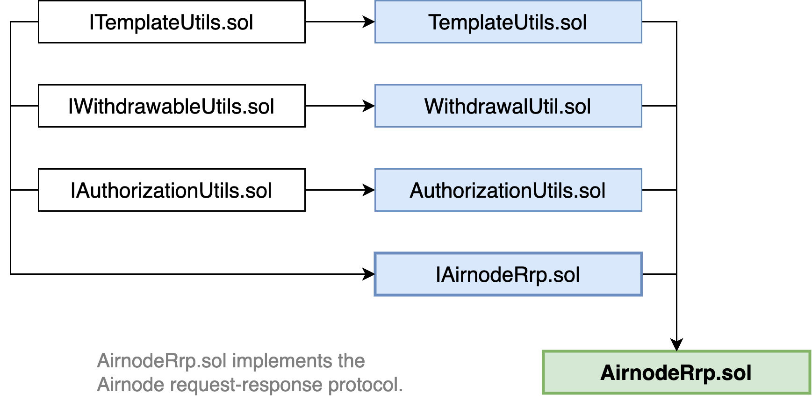

<TitleSpan>A. 概念和定义</TitleSpan>

# {{$frontmatter.title}}

<VersionWarning/>

<TocHeader /> <TOC class="table-of-contents" :include-level="[2,3]" />

为Airnode实现的第一个协议是请求-响应协议。 服务于请求-响应协议的Airnode监听请求，进行请求所指定的API调用，最后在链上进行响应交易。

## 合约

> 本节简要介绍请求响应-协议合约的结构。 您可以在 [source files on github](https://github.com/api3dao/airnode/tree/v0.5/packages/airnode-protocol/contracts/rrp) 中找到更多信息。

请求-响应协议被实现为单一的无权限合约，所有的Airnode都与之交互，它被命名为`AirnodeRrp.sol`。 这个基础合约有以下的继承树，将协议的各方面分门别类。

> 

### AirnodeRrp.sol

[AirnodeRrp.sol](https://github.com/api3dao/airnode/blob/v0.5/packages/airnode-protocol/contracts/rrp/AirnodeRrp.sol) 合约位于[请求者](./requester.md) 和 [Airnode](./airnode.md)之间。 它继承了四个额外的合约，如上图所示：

- [IAirnodeRrp.sol](README.md#iairnoderrp-sol)
- [AuthorizationUtils.sol](README.md#authorizationutils-sol)
- [WithdrawalUtils.sol](README.md#withdrawalutils-sol)
- [TemplateUtils.sol](README.md#templateutils-sol)

该合约有两项重要责任：

- 请求者使用它提出请求。
- Airnodes使用它来完成请求。

然而，这个合约是为特定链上的所有请求者和Airnode共享的。 这意味着，无论是Airnode运营商还是请求者都不需要自己部署这个合约。 相反，API3将在每条链上部署一次该合约，你只需将你的Airnode或请求者合约连接到该部署的合约。 请参阅 [Airnode contracting address](../reference/airnode-addresses.md) 以获取参考信息。

[`@api3/airnode-admin`](../reference/packages/admin-cli.md)软件包是一个CLI工具，用于与`AirnodeRrp.sol`互动并执行管理动作。

### IAirnodeRrp.sol

[IAirnodeRrp.sol](https://github.com/api3dao/airnode/blob/v0.5/packages/airnode-protocol/contracts/rrp/interfaces/IAirnodeRrp.sol) 接口描述了 `AirnodeRrp.sol` 合约用于 实现此接口的所有功能和事件。

这个接口继承了：

- [IAuthorizationUtils.sol](https://github.com/api3dao/airnode/blob/v0.5/packages/airnode-protocol/contracts/rrp/interfaces/IAuthorizationUtils.sol)
- [IWithdrawalUtils.sol](https://github.com/api3dao/airnode/blob/v0.5/packages/airnode-protocol/contracts/rrp/interfaces/IWithdrawalUtils.sol)
- [ITemplateUtils.sol](https://github.com/api3dao/airnode/blob/v0.5/packages/airnode-protocol/contracts/rrp/interfaces/ITemplateUtils.sol)

### AuthorizationUtils.sol

[AuthorizationUtils.sol](https://github.com/api3dao/airnode/blob/v0.5/packages/airnode-protocol/contracts/rrp/AuthorizationUtils.sol) 合约用于实施Airnode [Authorizer](./authorization.md) 检查功能.

### WithdrawalUtils.sol

[WithdrawalUtils.sol](https://github.com/api3dao/airnode/blob/v0.5/packages/airnode-protocol/contracts/rrp/WithdrawalUtils.sol)合约允许[赞助者](./sponsor.md)触发提款请求，随后由Airnode完成，所有赞助者的钱包资金被送回给赞助者。

### TemplateUtils.sol

[TemplateUtils.sol](https://github.com/api3dao/airnode/blob/v0.5/packages/airnode-protocol/contracts/rrp/TemplateUtils.sol)合约用于创建和存储用于创建[模板请求](./request.md#template-request)的Airnode[templates](./template.md)。
