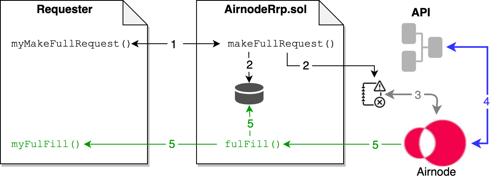
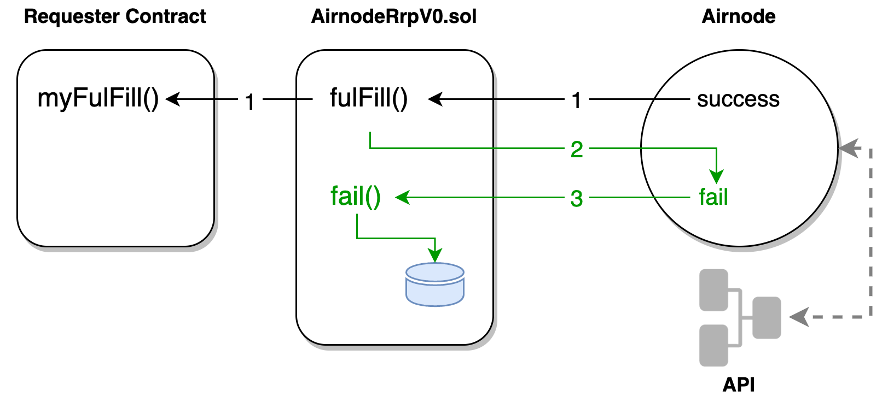

<TitleSpan>概念和定义</TitleSpan>

# {{$frontmatter.title}}

<VersionWarning/>

<TocHeader /> <TOC class="table-of-contents" :include-level="[2,3,4]" />

由 [请求者](requester.md)提出了请求， 传递到[AirnodeRrp. ol](README.md#airnoderrp-sol) 协议合约的`makeFullRequest()` 或 `makeTemplateRequest()` 函数 ，将请求添加到它的存储。 目标链外 [Airnode](airnode.md) 从AirnodeRrp.sol的存储中收集请求，并使用AirnodeRrp.sol的`fulFill()`函数进行响应。

> 
> 
> 1. <p class="diagram-line">请求者在 AirnodeRrp 协议合约上调用 makeFullRequest() 函数 。</p>
> 2. <p class="diagram-line">makeFullRequest() 为请求分配了一个requestId用于跟踪，将requestId添加到存储，将请求发送到事件日志，并将requestId返回给请求者。</p>
> 3. <p class="diagram-line" style="color:gray;">Airnode在其运行周期中，从事件日志中挑选请求。</p>
> 4. <p class="diagram-line" style="color:blue;">Airnode从API获得数据并进行编码。 编码响应的长度不能超过 1024 字节。 (这在实践中可以忽略不计，因为大型响应的存储成本很高）。</p>
> 5. <p class="diagram-line" style="color:green;">Airnode将响应发送给AirnodeRrp中的fulFill()，后者反过来从存储中移除待定的requestId并将响应转发给myFulFill()。 RequestId被作为响应的一部分。</p>

了解更多关于如何 [调用 Airnode](../grp-developers/call-an-airnode. md)。

## `requestId`

`requestId` 唯一标识了一个请求。 当请求者使用AirnodeRrp.sol发出请求时，在请求被添加到事件日志之前，会生成一个`requestId`，并将requestId返回给请求者。 这个 `requestId`是某些数据成员的哈希值，取决于哪种类型的请求，如`makeFullRequest()` 或`makeTemplateRequest()`。 它们的不同之处在于，一个使用 `endpointId` 加上`airnode`地址，另一个使用`templateId` （因为模板已经包含 `airnode`地址）。

| makeFullRequest()                                              | makeTemplateRequest()                                          |
|:-------------------------------------------------------------- |:-------------------------------------------------------------- |
| block.chainid                                                  | block.chainid                                                  |
| address(this)                                                  | address(this)                                                  |
| msg.sender                                                     | msg.sender                                                     |
| requesterRequestCount                                          | requesterRequestCount                                          |
|                                                                | airnode                                                        |
| <span style="color:purple;font-weight:bold;">endpointId</span> | <span style="color:purple;font-weight:bold;">templateId</span> |
| sponsor                                                        | sponsor                                                        |
| sponsorWallet                                                  | sponsorWallet                                                  |
| fulfillAddress                                                 | fulfillAddress                                                 |
| fulfillFunctionId                                              | fulfillFunctionId                                              |
| parameters                                                     | parameters                                                     |

在请求（与 `requestId`）被添加到事件日志后，Airnode收集请求，并在响应请求前通过重新计算其哈希值来验证`requestId`。 这是用来验证参数没有被篡改。

## 请求参数

下面的列表概括了请求的参数的预期值。

- `templateId`是要使用的模板的ID_(仅用于 `makeTemplateRequest`)_。

- `airnode` (address)（地址）和 `endpointId` 用于指定端点 _(仅用于 `makeFullRequest`)_。

- `sponsor` 和`sponsorWallet` （地址）用于指定哪个钱包将被用来完成请求。

- `fulfillAddress`和`fulfillFunctionId` 用于指定哪个合约/函数将被调用，以完成请求。

- `parameters` 用于指定API和[保留的](/ois/v1.0.0/ois.md#_5-4-reservedparameters)参数（参见[Airnode ABI规范](../reference/specifications/airnode-abi-specifications.md)，了解这些参数的编码方式）。

## 完整请求

完整的请求根本不会被引用模板。 如果请求者不会再提出类似的请求（例如，在预测市场的背景下），完整请求是有用的。

```solidity
function makeFullRequest(
    address airnode,
    bytes32 endpointId,
    address sponsor,
    address sponsorWallet,
    address fulfillAddress,
    bytes4 fulfillFunctionId,
    bytes calldata parameters
){...}
```

## 模板请求

模板请求引用 `airnode` 地址, `endpointId` 和 `parameters` 的模板。

```solidity
struct Template {
  address airnode;
  bytes32 endpointId;
  bytes parameters;
}
```

请求者在提出请求时，可以参考模板的 `templateId`，Airnode将获取这些模板并在请求中使用它们。

```solidity
function makeTemplateRequest(
    bytes32 templateId,
    address sponsor,
    address sponsorWallet,
    address fulfillAddress,
    bytes4 fulfillFunctionId,
    bytes calldata parameters
)
```

当使用模板提出请求时， 在模板`parameters` 中，编码的参数和在请求时提供的`parameters` 将被Airnode使用。 如果两者包括一个具有相同名称的参数，将使用在请求时提供的参数。

## 请求结果

向Airnode 提出的请求有三种可能的结果：

- [完成](./request.md#fulfill)
- [失败](./request.md#fail)
- [忽略](./request.md#ignore)

### 完成

`fulfill()` 是期望的结果，只有当Airnode从API提供者那里收到成功的响应时，它才会被调用。

> 
> 
> 1. <p class="diagram-line">Airnode只有在API没有回应错误的情况下，才会调用AirnodeRRP.fulFill()，并给出回应。 AirnodeRrp.fulfill()执行对myFulFill()的回调，后者接收到响应。</p>
> 2. <p class="diagram-line" style="color:green;">如果AirnodeRrp.fulFill()在内部发生失败，或者底层对myFulFill()的低级调用发生逆转，那么Airnode将启动步骤3中的过程，使请求失败。</p>
> 3. <p class="diagram-line" style="color:green;">如果Airnode出错，或者被AnnodeRrp.fulFill()告知出错，它就会调用AnnodeRrp.fail()，将该请求从链上的requestIds的待定列表中删除。</p>

::: tip 重要备注

Fulfilly是将结果返还给请求者合约的唯一结果。

:::

对于一个成功的请求，Airnode调用AirnodeRrp.sol中的 `fulfill()`函数，该函数将反过来使用函数 `data`，在 `fulfillAddress`回调请求者合约，发送`data`。

`fulfill()` 也会收到一个签名，以验证链上的响应数据是由Airnode提交的。 这是为了防止请求者完成他们自己的请求，用以操纵AirnodeRrp.sol提交的数据。

如果`fulfillFunctionId`的外部调用发生逆转， `fulfill()`将不会恢复。 然而，在这种情况下，或者如果在`fulfillAddress`没有匹配签名的函数，它将返回 `false`。 另一方面，如果外部调用成功返回或在`fulfillAddress`上没有部署合约，它将返回`true`。 在返回`false`的情况下，一个报错信息也将被返回到一个变量中，可以通过解码来检索恢复的字符串。 例如，当这个函数返回`false`时，Airnode将对这个变量进行解码，并在AirnodeRrp.sol上调用`fail()`，将恢复字符串作为错误信息。

### 失败

如上图所示，如果调用`fulfill()`的时候返回`false`，Airnode 会解码恢复字符串，并调用 `fail()` 方法来报告失败。 出于隐私和安全原因，API错误信息不会在链上发送。 还要注意的是，节点不会在事后尝试履行失败的请求。

Airnode是无状态的，这意味着没有数据库存储哪些请求已经完成或失败，哪些在等待确认，哪些仍在等待。 这些信息是在每个请求-响应周期（大约每分钟）从链上检索的。 在每个周期中，检索到的请求需要以相同的方式排序，以确保它们是使用相同的nonce提交的。 这一点很重要，因为一个交易也有可能在下一个周期运行时还没有被确认。 如果发生这种情况，该交易将以 "更快的 "交易费用重新提交，覆盖之前的交易。

### 已阻止

Airnode 也依赖区块链供应商为它提供链上数据。 如果区块链提供商因为某些原因都不可用，有可能无法完全验证请求， 这意味着它无法将数据提交回到区块链。 如上所述，保持请求按照同一顺序，使用相同的nonce是至关重要的。 因此，任何由于区块链供应商的错误而无法完全验证的请求，都会被 "阻止"。 这意味着，它和其后的任何请求都无法在当前周期内提交，只能在下一个周期内重试。 值得注意的是，这是针对每个请求者的都有效的， 例如，从请求者A发出的请求变成 "阻止"，将不会阻止从请求者B发出的请求。

被阻止的请求在`ignoreBlockedRequestsAfterBlocks`（默认值：20）之后被忽略，这意味着它们被当作一个被忽略的请求（无效的请求被忽略，例如，赞助者和赞助者钱包不匹配的请求）。

#### 阻止的案例

在 Coordinator 生命周期中按时间顺序排列。

1. Airnode RRP有完整的请求（`makeFullRequest()1`），其中指定了所有的参数，也有模板请求，其中指定了一些参数并指定了包含其余参数的模板ID。 在获取模板后，如果节点找不到模板请求的模板，该请求会被阻止。 如果区块链供应商不能响应有效的请求（例如，节点提出了太多的请求并被限制了速率），就可能发生这种情况。

2. 为了检查请求的授权，节点需要知道其端点ID。 整的请求已经指定了端点ID，这时应该为模板请求获取模板，指定端点ID。 在检查授权时，如果一个请求的端点ID没有被指定，该请求会被阻止。 永远不会发生这种情况，因因为缺少模板的模板请求在上面的例子#1中已经被阻止了。

3. 节点用一些请求参数进行静态调用，检查一个特定的请求是否被授权（即是否应该响应它）。 在获取授权结果后，如果节点找不到某个请求的结果，该请求就会被阻止。如果区块链供应商不能响应有效的请求，就可能发生这种情况（例如，节点提出了太多的请求，并且受到速率限制）

4. 节点为每个请求调用具有唯一请求ID的实施者，来进行API调用。 这些实施者应该返回一个有效载荷或一个错误信息（如果调用已经超时或API出错）。 在将实施者的响应映射回来时（代码中称为 "分类"），如果节点找不到某个请求的响应，该请求就会被阻止。 理论上，永远不应该发生这种情况。

### 忽略

如果Airnode 甚至不能拒绝请求(例如请求者不是赞助者赞助的)，请求将被忽略。

在 X 块 (默认是 EVM 链的 20) 后，任何将会变成"阻止"的请求将会变成"忽略"。 这意味着Airnode将停止尝试处理该请求，以便处理后来的请求。

## 检查请求是否正在等待完成

在AirnodeRrp.sol中有一个方便的方法，叫做`requestIsAwaitingFulfillment()`，它可以被调用来检查一个请求是否被提出但尚未完成/失败。 如果请求者提出了一个请求，收到了一个`requestId`，但没有听到回音，它可以调用这个方法来检查Airnode是否已经回调了 `fail()`。如果请求正在等待完成（即，如果`fulfill()` 或 `fail()`还没有被回调，则返回`true`，否则返回`false`。
