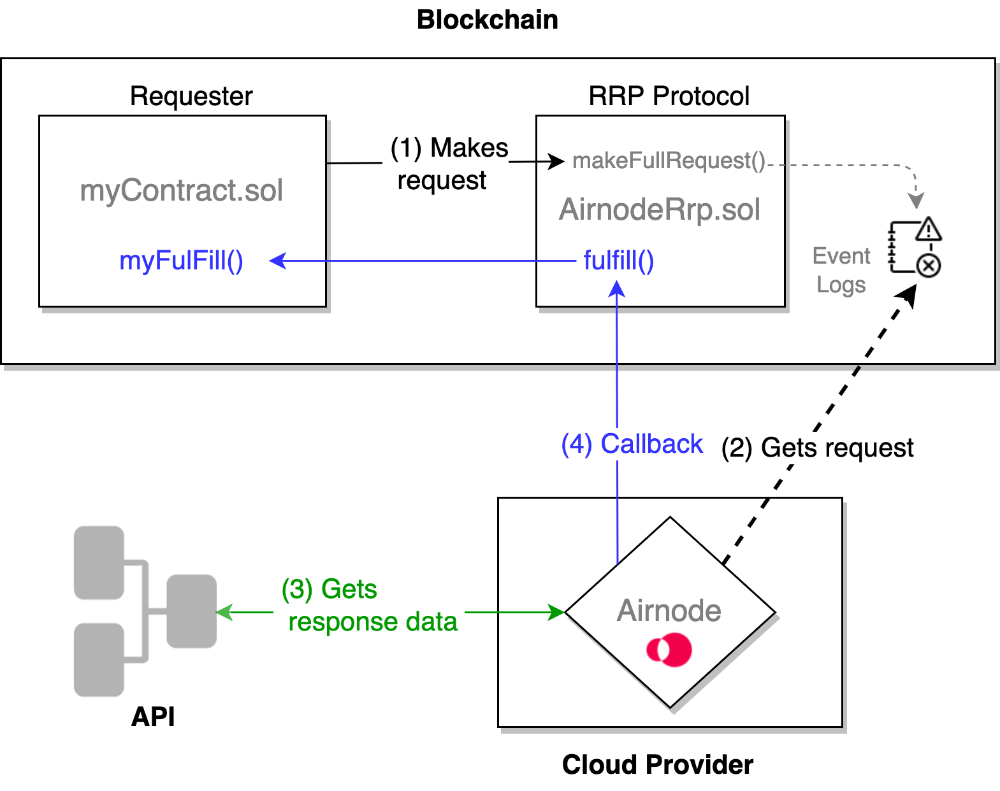

<TitleSpan>开发者</TitleSpan>

# {{$frontmatter.title}}

<VersionWarning/>

**开发者** 就是你，如果你想要消耗来自 API 的链下数据。 您需要使用Airnodes来实现。 Airnode 是一种第一方的预言机，它将它将链外API数据推送到你的链上合约。 在下面的图表中，您的合约被称为请求者。 它向链上的RRP协议合同(AirnodeRrp.sol)提出请求，将请求添加到事件日志中。 然后，链外的Airnode访问事件日志，获得API数据，并执行对请求者的回调。

总之，你只需要做两件事情。

- 调用 `makeFullRequest()` or `makeTemplateRequest()` 在 AirnodeRrp.sol 合约上返回一个 [`requestId`](../concepts/request.md#requestid).调用 `makeFullRequest()` or `makeTemplateRequest()` 在 AirnodeRrp.sol 合约上返回一个 [`requestId`](../concepts/request.md#requestid).
- 添加 `myFulfill()` 函数(所有你喜欢的) 到你的请求者(您的 合同)，在这个函数中，离开链的 Airnode 可以在准备好后发送所请求的数据。调用 `makeFullRequest()` or `makeTemplateRequest()` 在 AirnodeRrp. sol 合约上返回一个 [`requestId`](../concepts/request. md#requestid). 该数据包括与提出请求时返回的 `requestId` 相同的数据。

> 
> 
> 1. 
请求者(myContract.sol)向RRP协议合同(AirnodeRrp)提出请求。 通过调用 <code>makeFullRequest()</code> 将请求添加到事件日志，并返回 <code>requestId</code> 给请求者。

> 2. 
Airnode 从事件日志中检索链上的请求。

> 3. 
Airnode 从请求中指定的 API 收集响应数据。

> 4. 
Airnode 通过AirnodeRrp函数<code>fulfill()</code>对myContract.sol中一个命名的函数 <code>myFulfill()</code> 进行回调，并附上请求的数据和 <code>requestId</code>。

欲了解更详细的图表，请参阅 [调用Airnode](./call-an-airnode.md) 文档中的第一张图。
