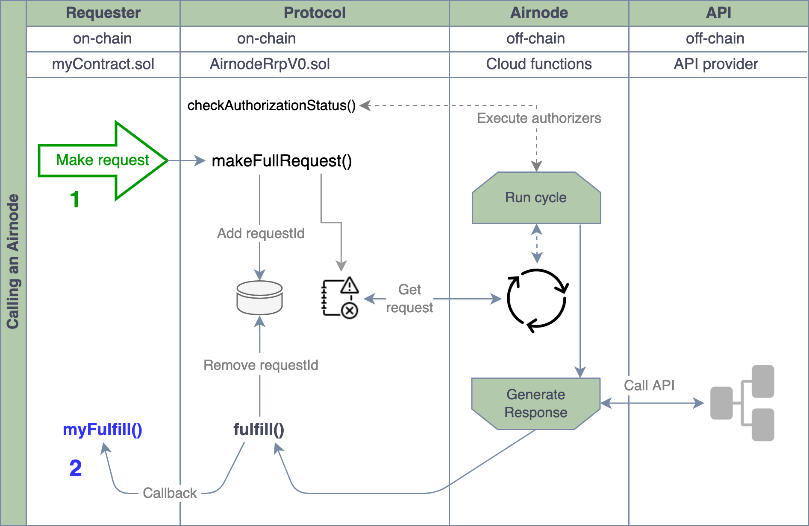

<TitleSpan>开发者</TitleSpan>

# {{$frontmatter.title}}

<VersionWarning/>

<TocHeader /> <TOC class="table-of-contents" :include-level="[2,3]" />

请求者是一个可以触发Airnode 请求的合约。 要做到这一点，请求者需要被赞助，并使用匹配的赞助者 钱包提出请求。 查看 [Requesters and Sponsors](requesters-sponsors.md)章节，了解如何赞助请求者，并获取赞助者钱包。

Airnode 由两个部分组成：链下 **Airnode**(例如 "节点")已部署为自托管或云端提供功能，例如AWS)，以及链上的 **协议合约** AirnodeRrp.sol。 请求者调用协议合约，发出带有请求参数的区块链事件。 Airnode 监听AirnodeRrp 合约释放的事件。 在下一个运行周期，Airnode从发出的事件中获得请求参数。 下图和为开发者准备的[Overview](./) 文档中的图表说明了整个过程的机制。

AirnodeRrp协议的设计是灵活的，意在为各种不同的使用案例服务。 关于潜在的设计模式，参见Airnode[requester examples](https://github.com/api3dao/airnode/tree/v0.5/packages/airnode-examples/contracts)的例子。

忽略整个过程的机制，请求者调用 Airnode 主要集中于两个任务， 以下图表中点A & B所示。

- <span style="color:green;font-weight:bold;">1</span>: 发出请求
- <span style="color:blue;font-weight:bold;">2</span>: 接受并解码 回应

> 
> 
> 1. <p class="diagram-line" style="color:green;">请求者向AirnodeRrp合同提出请求，将 <code>requestId</code> 添加到存储，将请求发送到事件日志，并将 <code>requestId</code> 退回请求者。 在下一个运行周期，Airnode 将检索这个请求。 然后，它通过检查分配给Airnode的授权者合约，验证请求者是否得到授权。</p>
> 2. <p class="diagram-line" style="color:blue;">如果请求获得授权，Airnode 开始响应。 它首先从API收集请求的数据，并调用AirnodeRrp中的<code>fulfill()</code>函数，该函数从存储中删除待定的 <code>requestId</code> ，并对<code>myFulfill()</code>进行回调。 与相应有关的gas费用>由请求者的赞助者承担。</p>

本文档以下部分讨论了请求者的实施、部署和赞助。

## 步骤 #1: 继承RrpRequestter.sol

请求者从[RrpRequester.sol](https://github.com/api3dao/airnode/blob/v0.5/packages/airnode-protocol/contracts/rrp/requesters/RrpRequester.sol)合约继承过来。 这将向请求者公开AnnodeRrp.sol协议合约，允许其提出Annode请求。

```solidity
import "@api3/airnode-protocol/contracts/rrp/requesters/RrpRequester.sol";

contract MyRequester is RrpRequester {
  ...
  constructor (address airnodeRrpAddress)
      public
      RrpRequester(airnodeRrpAddress)
  {}
  ...
}
```

注意构造函数参数`airnodeRrpAddress`，它是你想使用的区块链上AirnodeRrp.sol协议合约的公共地址。 它是RrpRequestter.sol 用于将其指向AirnodeRrp.sol的。

请参阅参考文献部分的所有[Airnode contract addresses](../reference/airnode-addresses.md)列表。

## 步骤 #2: 实现请求逻辑。

AirnodeRrp.sol合约提出了两类要求。 请参阅 [请求](../concepts/request.md) 页面获取与每个请求 类型相关的信息。

这个例子使用了一个[full request](../concepts/request.md#full-request) type类型（注意下面代码中的`airnodeRrp.makeFullRequest`函数调用），它是由请求者自己的函数`callTheAirnode`调用。 函数`makeFullRequest` 要求请求者传递 Airnode 所需的所有参数，来调用其原始API。

一旦向`airnodeRrp.makeFullRequest`提出请求，AirnodeRrp.sol合约就会返回一个`requestId`，确认该请求已被接受并正在执行中。 您的请求者很可能 会追踪所有 `requestId`。 注意下面代码中的`incomingFulfillments[requestId] = true;` 一行，它将`requestId`存储在一个映射中。 当Airnode在稍后的函数(`airnodeCallback`) 中，以`requestId` 和 `data`响应请求者时，这很有用。

```solidity
import "@api3/airnode-protocol/contracts/rrp/requesters/RrpRequester.sol";

contract MyRequester is RrpRequester {
  mapping(bytes32 => bool) public incomingFulfillments;
  mapping(bytes32 => int256) public fulfilledData;

  constructor (address airnodeRrpAddress)
      public
      RrpRequester(airnodeRrpAddress)
  {}

  function callTheAirnode(
      address airnode,
      bytes32 endpointId,
      address sponsor,
      address sponsorWallet,
      bytes calldata parameters // Inbound API parameters which may already be ABI encoded
      )
      external
  {
      bytes32 requestId = airnodeRrp.makeFullRequest( // Make the Airnode request
          airnode,                        // airnode
          endpointId,                     // endpointId
          sponsor,                        // sponsor's address
          sponsorWallet,                  // sponsorWallet
          address(this),                  // fulfillAddress
          this.airnodeCallback.selector,  // fulfillFunctionId
          parameters                      // API parameters
          );
      incomingFulfillments[requestId] = true;
  }

  function airnodeCallback(   // The AirnodeRrp.sol protocol contract will callback here.
      bytes32 requestId,
      bytes calldata data
  {
      ...
  }
}
```

### 请求参数

使用AirnodeRrp.sol合约`makeFullRequest`函数的完整请求，需要在运行时传递Airnode应用程序所需的所有参数。 这与模板请求不同，模板请求会使用部分或全部所需参数的模板。 了解更多关于使用模板[using templates](call-an-airnode.md#using-templates)的信息。

由于 `callTheAirnode` 函数提出了一个[full request](../concepts/request.md#full-request)，它必须收集以下参数来传递给`airnodeRrp.makeFullRequest`。

- **airnode** and **endpointId**: 作为一个配对, 它们独特地识别了在某个特定的 Airnode所需要的 端点。

- **赞助者**: [赞助者](requesters-sponsors.md#what-is-a-sponsor) 地址

- **sponsorWallet**：[sponsor wallet](requesters-sponsors.md#how-to-derive-a-sponsor-wallet)地址，赞助者在为被调用的Airnode派生钱包时收到的钱包。

- **fulfillAddress** 和 **fulfillFunctionId**：请求者合约的公共地址及其在返回请求时被调用的函数。

- **parameters**: 指定API参数和任何[reserved parameters](../reference/specifications/reserved-parameters.md)，这些必须被编码。 关于这些参数的编码方式，请参见[Airnode ABI specifications](../reference/specifications/airnode-abi-specifications.md)。

  在大多数情况下，参数是在链下编码外传递到 请求者，后者只是转发它们。 您可以使用 [@api3/airnode-abi](../reference/specifications/airnode-abi-specifications.md#api3-airnode-abi) 软件包来执行编码和解码。 请查看下面的 JavaScript代码片段。

  ```javascript
  // JavaScript snippet

  import { encode } from '@api3/airnode-abi';

  const parameters = [
    { type: 'string32', name: 'coin', value: 'ETH' },
    { type: 'string32', name: 'apiKey', value: 'UHHS7SRGC975E' },
  ];
  const encodedData = encode(parameters);

  console.log(encodedData);
  // '0x...'
  ```

  然而，这不是一个硬性要求，您也可以在链上编码参数。 请查看下面的 JavaScript代码片段。

  ```solidity
  // Solidity snippet

  abi.encode(
    string32("1SS"),
    string32("period"), "30d",
    string32("symbols"), "btc,eth,matic,link,uni,sushi,aave,chz,theta,rsr,grt,enj,ocean,kacy"
  )
  ```

关于调用`airnodeRrp.makeFullRequest()`时请求参数的其他信息，请参见参考文献中的[Request Parameters](../concepts/request.md#request-parameters) 。

## 步骤 #3：捕捉响应

一旦Airnode收到请求，它就会收集数据，对其进行编码，并启动一个响应请求的链上交易。 Airnode 调用AirnodeRrp合约函数 `fulfill()`， 后者又调用请求者，在本例中为 `airnodeCallback`。 为了回调的目的，回顾请求提供的请求合同地址和所需的回调函数，AirnodeRrp.sol协议合同与`requestId`一起存储。

```solidity
import "@api3/airnode-protocol/contracts/rrp/requesters/RrpRequester.sol";

contract MyRequester is RrpRequester {
    mapping(bytes32 => bool) public incomingFulfillments;
    mapping(bytes32 => int256) public fulfilledData;

    constructor (address airnodeRrpAddress)
        public
        RrpRequester(airnodeRrpAddress)
    {}

    function callTheAirnode(
        ...
    }

    function airnodeCallback(        // The AirnodeRrp.sol protocol contract will callback here.
        bytes32 requestId,
        bytes calldata data
        )
        external
        onlyAirnodeRrp
    {
        require(incomingFulfillments[requestId], "No such request made");
        delete incomingFulfillments[requestId];
        int256 decodedData = abi.decode(data, (int256));
        fulfilledData[requestId] = decodedData;
    }
}
```

### 响应参数:

对请求者的回调包含两个参数，如上面代码样本中的`airnodeCallback`函数所示。

- **requestId**: 在提出请求时首次获得，在此作为参考传递，以确定响应所针对的请求。
- **data**: 在响应成功的情况下，这就是请求的数据并且已经被编码，除了其他响应数据外，还包含一个[时间戳](/ois/v1.0.0/reserved-parameters.md#timestamp-encoded-to-uint256-on-chain)。 要使用 `abi` 对象的函数`decode()`对其进行解码。

## 步骤 #4：部署并赞助请求者

将请求者部署到有需要的区块链上，然后赞助请求者。 查看 [请求者和赞助者](requesters-sponsors.md#how-to-sponsor-a-requester)，了解更多关于赞助请求者的信息。
