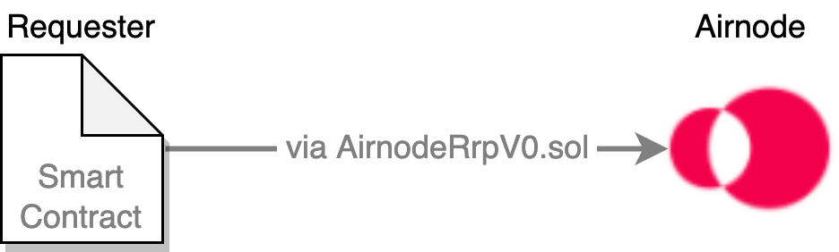

<TitleSpan>开发者</TitleSpan>

# {{$frontmatter.title}}

<VersionWarning/>

<TocHeader /> <TOC class="table-of-contents" :include-level="[2,3]" />

作为一个开发者，了解什么是请求者，什么是赞助者是有帮助的。 它们都是Airnode 生态系统的重要组成部分。 本文档将进一步定义它们，并指导您使用管理员CLI命令，完成赞助请求者和获得赞助钱包的过程。

## 什么是请求者？

记住[请求者](../concepts/requester.md) 这个术语是很重要的。 当提到请求者时，指的是调用 Airnode 的智能合约。

> 

作为例子，可以在 [概述](./) 文档中的图表中查看的 `myContract.sol` 合约，它就是请求者。

## 什么是赞助者？

同样重要的是 [赞助者](../concepts/sponsor.md) 这一术语。 赞助者可以是个实体，如您自己、一个组织等。 赞助者在请求者和 Airnodes 之间创建关系。

### 赞助商的请求者/Airnode关系

作为一个赞助商，你将使用你拥有的助记符内的账户的公共地址来 "**赞助一个请求者**" 然后使用公共地址(称为 [赞助商地址](../concepts/sponsor.md#sponsoraddress)) 来为一个Airnode "**衍生一个 [赞助商钱包](../concepts/sponsor.md#sponsorwallet)**" 。 这个行为在赞助商的请求者和一个特定的Airnode之间建立了一种关系。 你这样做是因为赞助者是为满足请求而付费的实体，即Airnode将产生的gas费用。 当请求者调用时，这些费用将从Airnode的 `sponsorWallet` of中提取。

::: tip 赞助商地址

一个 [赞助商地址](../concepts/sponsor.md#sponsoraddress) 是一个帐户的公开地址，通常是默认帐户。 可以使用助记符中的另一个账户，而不是默认账户。 `sponsorAddress`是用来唯一地识别一个赞助商的。

:::

1. 在下面的图表中，赞助者使用 `sponsorAddress` 赞助一个请求者，并使用管理者CLI。 除非指定其他账户，否则CLI将使用作为 `sponsorAddress`传递的助记词的默认地址进行赞助。

2. 下一步，赞助者将使用 `sponsorAddress` 为Airnode生成 `sponsorWallet`。
3. 请求者现在可以对 Airnode提出请求。

> 

---

在上图中，有可能使用相同的赞助商地址`(0xF4...dDyu9)`来为其他Airnode衍生出其他赞助商钱包。 而且，有可能以相同的`sponsorAddress`赞助一个以上的请求者。 而且，重要的是要记住，所有请求者现在都可以访问所有的Airnode，无论他们是否需要。 在这种情况下，没有任何伤害。

### 高级方案

- **两个请求者，一个Airnode，一个赞助钱包**:

  两个以相同的`sponsorAddress` (例如`0xF4...dDyu9`)赞助的请求者，将使用由`sponsorAddress`衍生的单一赞助商钱包访问同一个Airnode。

- **两个请求者，一个Airnode，一个赞助钱包**:

  赞助两个不同的请求者，每个请求者都有一个不同的 `sponsorAddress` (例如， `0xF4...dDyu9` 和 `0xG9...fFzc5`)。 使用独立的赞助商地址，你可以为同一个Airnode衍生出两个独立的赞助商钱包。 现在，每个请求者在使用Airnode时，将先从一个单独的Airnode赞助商钱包中耗尽资金。

- **两个请求者，一个Airnode，一个赞助钱包**:

  请求者可以从两个不同的 Airnode 提出请求。 用 `sponsorAddress`赞助请求者。 使用`sponsorAddress`，为两个Airnode各衍生出一个赞助者钱包。 尽管每个airnode的赞助商钱包，都是用相同的`sponsorAddress`衍生出来的，但赞助商钱包是不同的，因为它们是用airnode的xpub加上`sponsorAddress`衍生出来的。 赞助商必须使用两个赞助商钱包的唯一 `sponsorWalletAddress` ，分别为两个钱包提供资金。

### 要记住的内容

当你用`sponsorAddress` 赞助一个请求者时，你给了它使用赞助商钱包(与Airnode相关联) 的权限，该钱包是用同一个 `sponsorAddress`衍生出来的。

当请求者向Airnode提出请求时， Airnode 将使用来自相应赞助者钱包的来响应请求，支付gas费用。 因此，请求者为请求的完成付费。

如果赞助者希望Airnodes满足其请求者的请求，就需要保持他们的赞助者钱包满额。 然而，这并不能支付Airnote所服务的 API 数据的 费用，参见 [API 供应商费用](fees.md#api-provider-fees)。

## 管理员CLI 指令

在[管理员 CLI 命令](../reference/packages/admin-cli.md) 包中，有几个与赞助者和请求者有关的命令。 您也可以使用 `npx @api3/airnode-admin --help`， 查看可用命令的列表。

在本文档的下两节中，你将使用`@api3/airnode-admin`软件包中的两个命令， 来_来赞助请求者_ 和 _衍生出一个赞助钱包_。

1. [sponsor-requester](../reference/packages/admin-cli.md#sponsor-requester)用来赞助请求者。
2. [derive-sponsor-wallet-address](../reference/packages/admin-cli.md#derive-sponsor-wallet-address)创建一个与Airnode相关的赞助者钱包。

## 如何赞助请求者

要赞助一个请求者使用下面列表中详细列出的 参数执行 `sponsor-requester` 命令。 您的请求者应该已经在链上部署了。 这个命令有交易的gas成本。

- `providerURL`: 一个区块链供应商的URL(如Infura)，带有所需网络的供应商ID。
- `sponsor-mnemonic`: 用于资助赞助的gas费用，并用于从默认地址衍生出赞助商地址。 赞助者地址，将被用于为Airnode推导出一个赞助者钱包。
- `requester-address`: 请求者合约地址.
- `derivation-path (可选)`）(_在下面的例子中没有使用_)：从助记符中选择一个备用账户来使用，而不是默认账户。

执行[sponsor-requester](../reference/packages/admin-cli.md#sponsor-requester)命令将赞助一个请求者，并返回请求者地址和赞助者地址。

:::: tabs

::: tab Linux/Mac

```bash
npx @api3/airnode-admin sponsor-requester \
  --providerUrl https://ropsten.infura.io/v3/<KEY> \
  --sponsor-mnemonic "cricket...oppose" \
  --requester-address 0x2c...gDER7

Requester 0x2c...gDER7 sponsored using sponsorAddress 0xF4...dDyu9
```

:::

::: tab Windows

```
npx @api3/airnode-admin sponsor-requester ^
  --providerUrl https://ropsten.infura.io/v3/<KEY> ^
  --sponsor-mnemonic "cricket...oppose" ^
  --requester-address 0x2c...gDER7

Requester 0x2c...gDER7 sponsored using sponsorAddress 0xF4...dDyu9
```

:::

::::

## 如何衍生赞助者钱包

若要使用特定的 Airnode ，您必须 _获取赞助者钱包_。 一旦 赞助者钱包被创建，它必须使用`derive-sponsor-wallet-address`命令返回的公共地址(`sponsorWalletAddress`) 进行资助。 每个Airnode 都有一个单独的 个赞助者钱包列表，这些钱包可以访问 Airnode。 了解更多关于[赞助钱包](../concepts/sponsor.md#sponsorwallet) 的信息。

要为一个Airnode导出一个赞助商钱包，请使用下面列表中的参数执行[derive-sponsor-wallet-address](../reference/packages/admin-cli.md#derive-sponsor-wallet-address)命令。 这样做没有任何交易的gas成本。

- `airnode-xpub`：路径m/44'/60'/0'的Airnode的扩展公共地址。
- `airnode-address`: 所需Airnode的公共地址
- `sponsor-address`：赞助者的地址(Ethereum账户的地址)，由赞助者拥有。 通常情况下， 赞助者地址是赞助请求者时返回的地址。

命令`derive-sponsor-wallet-address` ，是用来返回由赞助者资助的赞助真钱包的公共地址(`sponsorWalletAddress`)。

:::: tabs

::: tab Linux/Mac

```bash
npx @api3/airnode-admin derive-sponsor-wallet-address \
  --airnode-xpub xpub6CUGRUo... \
  --airnode-address 0xe1...dF05s \
  --sponsor-address 0xF4...dDyu9

Sponsor wallet address: 0x14D5a34E5a370b9951Fef4f8fbab2b1016D557d9
```

:::

::: tab Windows

```bash
npx @api3/airnode-admin derive-sponsor-wallet-address ^
  --airnode-xpub xpub6CUGRUo... ^
  --airnode-address 0xe1...dF05s ^
  --sponsor-address 0xF4...dDyu9

Sponsor wallet address: 0x14D5a34E5a370b9951Fef4f8fbab2b1016D557d9
```

:::

::::

如果赞助者希望Airnode满足其请求者的请求，就需要保持他们的赞助者钱包满额。 然而，这并不能支付Airnote所服务的 API 数据的 费用，参见 [API 供应商费用](fees.md#api-provider-fees)。

如果你忘记了赞助商钱包的公共地址(`sponsorWalletAddress`)，只需再次运行 `derive-sponsor-wallet-address` 命令。 由于 airnodeAddress/sponsorAddress 的配对钱包已经存在，它将只会返回地址。

<airnode-SponsorWalletWarning/>

## 保存记录

在赞助请求者和衍生出赞助者钱包期间以及之后，有几件事情需要跟踪。

| 条目      | 说明                                                                                                                              |
| ------- | ------------------------------------------------------------------------------------------------------------------------------- |
| 赞助者的助记符 | 从 `sponsorAddress` 中提取出的助记符。                                                                                                    |
| 赞助者地址   | 赞助请求者时，从赞助者的助记符中得出的账户公共地址。 记录为每个Airnode创建赞助者钱包的 `sponsorAddress`。                                                               |
| 赞助钱包地址  | 记录为Airnode派生的赞助者钱包的地址 `sponsorWalletAddress` 。 对于派生出的每个Airnode的赞助者钱包，Airnode会保留私钥并返回公共地址(`sponsorWalletAddress`) ，该地址用于资助赞助者钱包。 |

您可以稍后获得赞助钱包 的公共地址(`sponsorWalletAddress`)。 如果你丢失了它，请通过运行命令 `derive-sponsor-wallet-address`再次运行。 由于赞助者钱包已经为 `sponsorAddress/airnodeAddress` 配对创建，命令将只返回公开的钱包地址。 然而，您必须使用第一次创建钱包时使用的 `sponsorAddress` ，否则将创建一个新的赞助者钱包。
