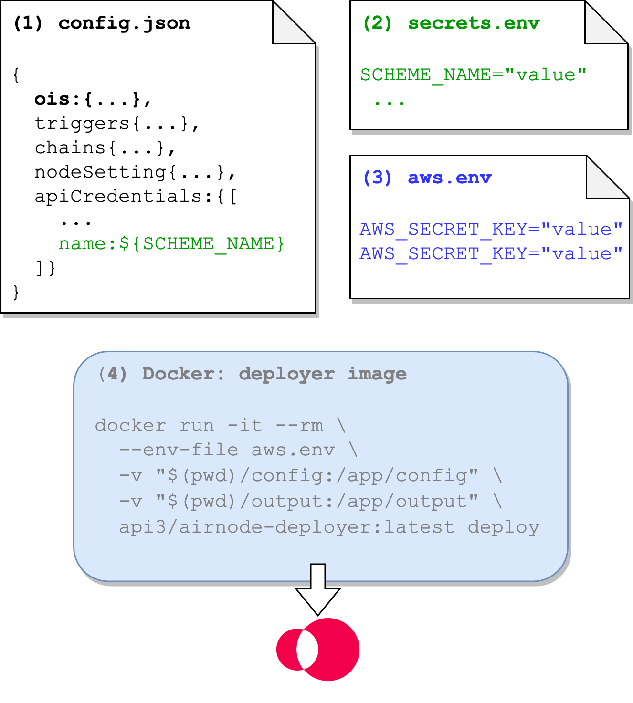
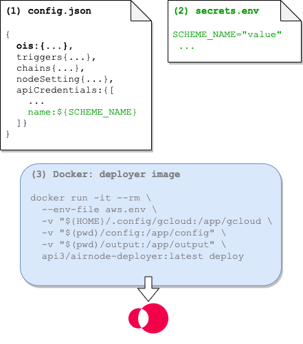
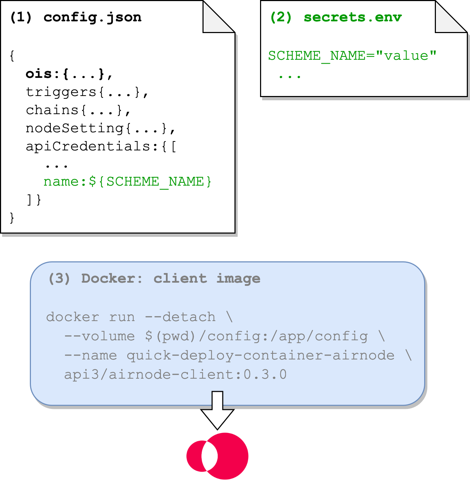

<TitleSpan>API供应商</TitleSpan>

# {{$frontmatter.title}}

<VersionWarning/>

如果你想从API中发布数据给链上的合约，也就是所谓的请求者，那么你就是一个**API供应商**。 可以通过建立一个Airnode来实现这个任务。 Airnode是一个第一方预言机，它可以把链外API数据推送给任何链上请求者。 请看[开发者](../grp-developers/)部分内容，了解更多关于开发者将如何使用Airnode。

请参阅API供应商文档中的[指南](guides/build-an-airnode/)部分，了解部署Airnode所需的必要文件。 下图说明了将Airnode成功部署到AWS、GCP或Docker容器所需的组件。

:::: tabs

::: tab AWS

1. 
<b>config.json</b>: 包含 Airnode的配置。 OIS对象很重要，因为它将API映射到Airnode端点。

2. 
<b>secrets.env</b>: 不应在 config.json中暴露的值。

3. 
aws.env: Docker部署器镜像所需的AWS凭证。

4. 
<b>Docker 部署器镜像</b>: 使用其部署命令部署Airnode。

:::

::: tab GCP

1. 
<b>config.json</b>: 包含 Airnode的配置。 OIS对象很重要，因为它将API映射到Airnode端点。

2. 
<b>secrets.env</b>: 不应在 config.json中暴露的值。

3. 
<b>Docker 部署器镜像</b>: 使用其部署命令部署Airnode。

:::

::: tab Container

1. 
<b>config.json</b>: 包含 Airnode的配置。 OIS对象很重要，因为它将API映射到Airnode端点。

2. 
<b>secrets.env</b>: 不应在 config.json中暴露的值。

3. 
<b>Docker 部署器镜像</b>: 使用其部署命令部署Airnode。

:::

::::
