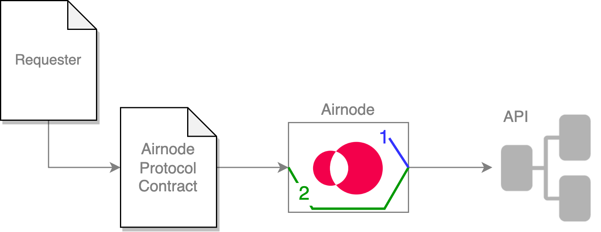

<TitleSpan>创建一个 Airnode</TitleSpan>

# {{$frontmatter.title}}

<VersionWarning/>

<TocHeader /> <TOC class="table-of-contents" :include-level="[2,3]" />

Airnode 可以在调用 API 操作时传递安全信息（方案）。 这里有两组安全方案。

- [Airnode 身份验证](../../../concepts/airnode-auth.md)
- [中继元数据身份验证](../../../concepts/relay-meta-auth.md)

<!-- prettier-ignore-->
>  <br/> 1.  <p class="diagram-line" style="color:blue;">Airnode使用<i><b>Airnode认证安全方案</b></i>，对API操作进行自我认证，其数值只有Airnode知道。</p>
  2.  <p class="diagram-line" style="color:green;">Airnode使用<i><b>中继元数据安全方案</b></i>，将请求者的请求中的已知信息转发给API操作。</p>
安全方案由安全方案定义中所需的type属性声明， 支持以下安全方案类型。

- Airnode 认证安全方案

  - apiKey
  - http

- 中继元数据安全方案
  - relayRequesterAddress
  - relayChainId
  - relayChainType
  - relaySponsorAddress
  - relaySponsorWalletAddress

## Airnode 身份验证安全方案

Airnode 可以使用以下安全方案类型来对 API 操作进行身份验证。

- [apiKey](./api-security.md#apikey)
- [http](./api-security.md#http)

### apiKey

`apiKey`安全方案类型允许你定义一个API密钥，Airnode将其发送至你的API操作中。 它作为一个对象，由以下字段组成：

- `type`必须是 `apiKey`
- `in`可以是`query`, `header` 或 `cookie`中的一个。 这个值指定了应如何将该值发送到你的API。 当使用`query`选项时，API密钥将在POST请求的请求正文中发送，在GET请求的查询字符串中发送。

- `name`是应该被发送到你的API的API密钥的名称。 例如，"X-api-Key"。

```json
{
  "requiresXApiKey": {
    "in": "header",
    "type": "apiKey",
    "name": "X-api-key"
  }
}
```

`apiKey`的值在`config.json`的`apiCredentials`字段中。 通常使用来自 `secrets.env` 文件的插值访问该值。

```json
{
  "oisTitle": "Ois Title",
  "securitySchemeName": "requiresXApiKey",
  "securitySchemeValue": "${X_API_KEY}" // interpolated from secrets.env
}
```

### http

`http` 安全方案类型允许您定义`基本`或`不记名`身份验证。 此安全方案将始终在头部中发送。 安全方案值应该是`基本`身份验证的 base64 编码值“用户名：密码”和`不记名`身份验证的编码令牌。 它作为一个对象，由以下字段组成：

- `type`必须是 `apiKey`
- `scheme` 是 `basic` 或是`bearer`

```json
{
  "requiresBasicAuth": {
    "scheme": "basic",
    "type": "http"
  }
}
```

`http`的值为(`basic or bearer`), 在 `apiCredentials` 的`config.json` 字段中。 通常使用来自 `secrets.emv` 文件的插值访问该值。

```json
{
  "oisTitle": "Ois Title",
  "securitySchemeName": "requiresBasicAuth",
  "securitySchemeValue": "${BASE_64_ENCODED_BASIC_AUTH}" // interpolated from secrets.env
}
```

## 中继元数据安全方案

除了身份验证之外，Airnode 可以“传送”关于 API 操作请求的安全信息。 。 这不同于 [授权](./apply-auth.md) 请求者访问Airnode。

- [relayRequesterAddress](./api-security.md#relayrequesteraddress)
- [relayChainId](./api-security.md#relaychainid)
- [relayChainType](./api-security.md#relaychaintype)
- [relaySponsorAddress](./api-security.md#relaysponsoraddress)
- [relaySponsorWalletAddress](./api-security.md#relaysponsorwalletaddress)

对于传输的元数据安全方案，您不需要在 [apiCredentials](../../../reference/deployment-files/config-json.md#apicredentials) 中提供任何值，因为它们是从 Airnode的请求中提取的。

::: 附加处理逻辑提示

请注意，Airnode只是将元数据转发给你的API操作，并不执行任何额外的逻辑。 你必须在API操作中实现任何需要的逻辑。 请参阅[中继元数据认证](../../../concepts/relay-meta-auth.md)以了解其使用概况。

:::

### relayRequesterAddress

`relayRequesterAddress`安全方案类型，指示Airnode转发[请求者](../../../concepts/requester.md)地址。

```json
{
  "in": "header",
  "type": "relayRequesterAddress",
  "name": "requesterAddress"
}
```

### relayChainId

`relayChainId` 安全计划类型，指示Airnode 转发链ID。

```json
{
  "in": "query",
  "type": "relayChainId",
  "name": "chainId"
}
```

### relayChainType

`relayChainType` 安全方案类型，指示Airnode 转发 链的类型。

```json
{
  "in": "query",
  "type": "relayChainType",
  "name": "chainType"
}
```

### relaySponsorAddress

The `relaySponsorAddress` 安全计划类型指示Airnode 转发 [赞助者地址](../../../concepts/sponsor.md#sponsoraddress)。

```json
{
  "in": "query",
  "type": "relaySponsorAddress",
  "name": "sponsorAddress"
}
```

### relaySponsorWalletAddress

`relaySponsorWalletAddress` 安全方案类型，指示Airnode 转发 [赞助钱包地址](../../../concepts/sponsor.md#sponsorwallet)

```json
{
  "in": "query",
  "type": "relaySponsorWalletAddress",
  "name": "sponsorWalletAddress"
}
```

## 示例

OIS的安全受到OAS安全实践的启发。 这是用安全方案和安全字段实现的。 所有支持的安全方案，在上面的[Airnode认证安全方案](./api-security.md#airnode-authentication-security-schemes)和[中继元数据安全方案](./api-security.md#relayed-meta-data-security-schemes)部分都有详细描述。 下面的例子与_Airnode认证安全方案_有关。 使用安全方案的工作可以分三个步骤描述。

1. [定义OIS的安全方案](./api-security.md#step-1-define-the-security-schemes-for-an-ois)
2. [打开已定义的安全方案](./api-security.md#step-2-turn-on-the-defined-security-schemes)
3. [指定定义安全方案的值](./api-security.md#step-3-specify-the-values-for-the-defined-security-schemes)

下面是一个局部的`config.json`的例子，演示了安全方案和安全字段的使用。

```json
{
  "ois": [
    {
      "title": "My OIS title",
      "apiSpecifications": {
        "components": {
          "securitySchemes": {
            "requiresXApiKey": {
              "in": "header",
              "type": "apiKey",
              "name": "X-api-key"
            }
          }
        },
        "security": {
          "requiresXApiKey": []
        }
      }
    }
  ],
  "apiCredentials": [
    {
      "oisTitle": "My OIS title",
      "securitySchemeName": "requiresXApiKey",
      "securitySchemeValue": "${X_API_KEY}"
    }
  ]
}
```

### 第 1 步：为OIS定义安全方案

您需要使用
<code style="overflow-wrap:break-word;">ois[n].apiSpecifications.components.securitySchemes</code>， 定义您的 API 将使用的安全方案。 考虑上面局部的`config.json` ，声明名为 "requirexApiKey" 的安全方案。 这个方案声明API需要一个 API 密钥，这个密钥必须存在于HTTP 头部，名为“X-api-key”。

### 第 2步：打开已定义的安全方案

当方案被定义时，它在默认情况下不会被打开。 你需要在位于 `ois[n].apiSpecifications.security` 对象的`security`字段中，明确列出你打算使用的安全方案。 这个对象中的键是要使用的安全方案的名称。 现在使用空数组 (`[]`) 作为值。

_请注意，这一步似乎是额外的工作，因为没有理由去定义一个不会被使用的安全方案。 然而，Airnode在未来可能会支持[更复杂的认证](https://github.com/OAI/OpenAPI-Specification/blob/main/versions/3.0.3.md#security-requirement-object)逻辑，使用`[]` 可以实现它，而不需要破坏性改变现有结构。_

### 第3步：指定定义安全方案的值

在定义并开启安全方案后，可能并不清楚谁提供了该值，以及如何设置。

认证方案旨在为整个OIS所共有，并由API提供者使用`config.json`的`apiCredentials`部分来设置。 `apiCredentials`是一个数组，它指定了所有OIS定义中所有安全方案的值。 这个数组的每个元素都包含以下字段：

- `oisTitle`是特定安全方案的OIS的标题
- `securitySchemeName`是安全方案的名称
- `securitySchemeValue`是Airnode在进行API请求时应该使用的实际值。 这个值通常是保密的，建议从`secrets.env`中插值出来。

如果你想把API认证建立在动态数据上，例如[请求者](../../../concepts/requester.md)地址，你可以利用[上面](./api-security.md#relayrequesteraddress)描述的中继元数据安全方案，它可以把元数据转发给所有API操作。

::: tip 中继元数据安全方案的值

中继元数据安全方案不需要提供值。 值将由Airnode提供（中继），这取决于特定的请求。

:::

## 使用不同的安全方案

目前，如果你想让不同的API操作使用不同的安全方案，它们必须根据其共同的安全方案，被归入不同的OIS对象。 例如，你的API有四个操作，其中三个需要HTTP头部中的API密钥，另一个（公共`/ping`端点）不需要安全性。

- 前三个API操作可能在 `ois[0]`对象中，其安全方案名为_requestXApiKey_，类型为_apiKey_，如上所示。
- /ping API操作将在`ois[1]`中，它没有任何`component.securitySchemes`，`security`将是一个空数组。

## 多重安全方案

你可以使用多个安全方案（例如，一个API密钥放在头中，一个额外的秘密放在查询中）。

```json
// inside ois[n].apiSpecifications.
"components": {
  "securitySchemes": {
    "requiresXApiKey": {
      "type": "apiKey",
      "in": "header",
      "name": "X-api-key"
    },
    "specificQuerySecret": {
      "type": "apiKey",
      "in": "query",
      "name": "secret"
    }
  }
},
"security": {
  "requiresXApiKey": [],
  "specificQuerySecret": []
}
```

## 无安全性

如果你要集成的API是公开的，你可以把`security schemes`和`security` 字段都设置为空对象。
