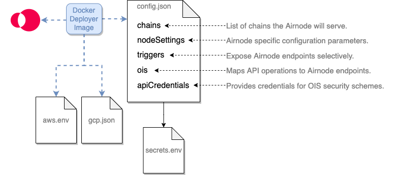

<TitleSpan>创建一个 Airnode</TitleSpan>

# {{$frontmatter.title}}

<VersionWarning/>

<TocHeader /> <TOC class="table-of-contents" :include-level=[2,5] />

::: tip 在部署Airnode之前完成以下工作。

- [API 集成](api-integration.md)
- [API 安全性](api-security.md)

[<InfoBtnGreen/>](../../../reference/deployment-files/config-json.md) 这个图标链接到参考部分的其他领域信息。

:::

Airnode的部署或重新部署使用其`config.json`和`secrets.env`文件的配置值。 `config.json`指定了[Oracle集成规范OIS](/ois/v1.0.0/ois.md)和其他具体的配置细节。 `secrets.env`文件包括秘密信息，如API密钥和链供应商的URL，它们在config.json文件中使用插值引用。

> 
> 
> - <p class="diagram-line"><b>config.json</b>文件在Airnode的部署/重新部署期间被用来配置其行为，并提供API操作的映射。</p>
> - <p class="diagram-line"><b>secrets.env</b>文件持有必须保密的config.json的值。</p>
> - <p class="diagram-line"><b>aws.env</b>文件为针对AWS的部署保存AWS凭证。</p>
> - <p class="diagram-line"><b>gcp.json</b>文件持有针对GCP的部署的GCP凭证。</p>

在阅读本文档时，下面的示例文件很有用。

- [config.json](../../../reference/examples/config-json.md)
- [secrets.env](../../../reference/examples/secrets-env.md)
- [aws.env](../../../reference/examples/aws-env.md)

## 创建`config.json`

使用[config.json](../../../reference/templates/config-json.md)模板来建立你自己的Airnode配置文件，或改变[config.json示例](../../../reference/examples/config-json.md)文件。 `config.json`中有五个根级字段。

- [chains](./configuring-airnode.md#chains)
- [nodeSettings](./configuring-airnode.md#nodesettings)
- [triggers](./configuring-airnode.md#triggers)
- [ois](./configuring-airnode.md#ois)
- [apiCredentials](./configuring-airnode.md#apicredentials)

### chains

`chains`数组中的每一行都代表Airnode将服务的以太坊区块链，由`id`标识。 目前，Airnode只支持以太坊区块链，以`type: "evm"`表示。 这几个支持的区块链，在[Airnode合约地址](../../../reference/airnode-addresses.md)文档中可以看到它们。 你可以为每条链使用多个链供应商，并声明多个链，每个链有一个或多个供应商。 请看_概念和定义_中的[链供应商](../../../concepts/chain-providers.md)。

下面是一个简单的链数组，只有一个链供应商。

```json
"chains": [
  {
    "maxConcurrency": 100,
    "authorizers": [
      "0x5Fgh48...3F6f64180acc"
    ],
    "contracts": {
      "AirnodeRrp": "0xF6d267546...BC9A384fa418"
    },
    "id": "4",
    "options": {
      "txType": "eip1559",
      "priorityFee": {
        "value": 3.12,
        "unit": "gwei"
      },
      "baseFeeMultiplier": 2
    },
    "providers": [
      "infura_rinkeby": {
        "url": "${INFURA_RINKEBY_PROVIDER_URL}"
      }
    ],
    "type": "evm",
    "blockHistoryLimit": 300,
    "minConfirmations": 0,
    "ignoreBlockedRequestsAfterBlocks": 20
  }
],
```

#### maxConcurrency

[<InfoBtnGreen/>](../../../reference/deployment-files/config-json.md#maxconcurrency) Airnode被设计成可以随着请求的数量而扩展。 为了实现这一目标，它在必要时产生了新的云函数（称为处理程序），这些处理程序并行运行。

最大并发数指定了每个单一的Airnode调用的最大并发处理程序数量。 Airnode 保留 ([AWS](https://docs.aws.amazon.com/lambda/latest/operatorguide/reserved-concurrency.html)) 并限制 ([AWS](https://docs.aws.amazon.com/lambda/latest/operatorguide/reserved-concurrency.html), [GCP](https://cloud.google.com/functions/docs/configuring/max-instances)基于此字段生成的云函数 个数。 如果你想禁用这种行为，请看一下 [cloudProvider](#cloudprovider) 部分中的 `disableConcurrencyReservations` 字段。

如果您将此字段设置为值 X，则 Airnode 将保证：

- 最多对 API 进行 X 次 api 调用
- 最多 X 笔交易（由区块链供应商进行）将由相应链的区块链供应商进行

这样做时，Airnode 将计算所有区块链供应商报告的请求总数。 如果这个数字超过了最大并发限制，它将开始丢弃来自请求数最多的区块链供应商的最新请求，直到其数量低于限制。

例如，如果`maxConcurrency`设置为5，有三个供应商（A、B和C），他们报告了以下请求：

- A1、A2、A3、A4和A5
- B1, B2 和 B3
- C1 和 C2

上述例子导致下列请求：A1、A2、B1、B2和C2。 请注意，两个供应商都没有超过2个请求，但这仍然不足以满足限制，所以C2请求也被放弃。

::: warning

请注意，这一限制只适用于在链上提出的请求。 例如，使用 HTTP 网关发起的请求不包含在这个限制中。

还要注意的是，这个限制是按链来配置的，不同链的限制是互不相关的。

:::

#### authorizers

[<InfoBtnGreen/>](../../../reference/deployment-files/config-json.md#authorizers) Airnode部署将在链上设置的授权者合同地址列表。 更多信息请参见[授权](../../../concepts/authorization.md)文档。

#### contracts

[<InfoBtnGreen/>](../../../reference/deployment-files/config-json.md#contracts) 包含执行Airnot协议的合约地址。 虽然您可以自己部署这些合约，但建议您使用 API3 部署的合约。 您可以在上面的列表中找到它们。

#### id

[<InfoBtnGreen/>](../../../reference/deployment-files/config-json.md#id) 一个 Airnode 可以同时服务多个链。 在`id`中设置所需链的ID（例如，Rinkeby测试网络为`4`）。 见[Airnode合约地址](../../../reference/airnode-addresses.md)文档中支持的链的列表。 查看 [参考章节](../../../reference/deployment-files/config-json.md#id) 中的附加定义。

#### providers

[<InfoBtnGreen/>](../../../reference/deployment-files/config-json.md#providers) Airnode 可以每个链中使用多个Ethereum 供应商。 它们可以是私有的以太节点，或者是以太为基础的服务供应商，例如Infura。 因此， `providers` 字段是一个允许多个Ethereum 供应商的列表。 输入用户定义的 `name` 来识别提供者和提供者的 URL， 通常将其保留在 `secrets.env`文件中。 名称用于日志中。

#### type

[<InfoBtnGreen/>](../../../reference/deployment-files/config-json.md#type) 链的类型。 目前只支持 `evm`。 查看 [参考章节](../../../reference/deployment-files/config-json.md#type) 中的附加定义。

#### options

[<InfoBtnGreen/>](../../../reference/deployment-files/config-json.md#options) 配置链相关选项的对象。

- txType：要使用的交易类型。
- priorityFee：配置 EIP-1559 优先费用的对象。
- baseFeeMultiplier：将 EIP-1559 基本费用配置为最大费用乘数。

#### blockHistoryLimit

[<InfoBtnGreen/>](../../../reference/deployment-files/config-json.md#blockhistorylimit) Airnode部署应搜索请求的过去区块的数量。 默认为`300`（对Ethereum来说大概是1小时）。

#### minConfirmations

[<InfoBtnGreen/>](../../../reference/deployment-files/config-json.md#minconfirmations) 请求被视为有效所需的确认数量。 默认值为：`0`。

#### ignoreBlockedRequestsAfterBlocks

[<InfoBtnGreen/>](../../../reference/deployment-files/config-json.md#ignoreblockedrequestsafterblocks) 节点需要通过的块数，以便开始忽略被阻止的请求。 默认值为：`20`。

### nodeSettings

`nodeSettings`字段持有特定于节点（Airnode）的配置参数。

```json
{
"nodeSettings": {
    "cloudProvider": {
      "type": "aws",
      "region": "us-east-1",
      "disableConcurrencyReservations": false
    },
    "airnodeWalletMnemonic": "${AIRNODE_WALLET_MNEMONIC}",
    "heartbeat": {
      "enabled": true,
      "apiKey": "${HEARTBEAT_API_KEY}",
      "id": "${HEARTBEAT_ID}",
      "url": "${HEARTBEAT_URL}"
    },
    "httpGateway": {
      "enabled": true,
      "apiKey": "${HTTP_GATEWAY_API_KEY}",
      "maxConcurrency": 20
    },
    "httpSignedDataGateway": {
      "enabled": true,
      "apiKey": "${HTTP_SIGNED_DATA_GATEWAY_API_KEY}",
      "maxConcurrency": 20
    },
    "logFormat": "plain",
    "logLevel": "INFO",
    "nodeVersion": "0.6.0",
    "stage": "dev"
  },
```

#### cloudProvider

[<InfoBtnGreen/>](../../../reference/deployment-files/config-json.md#cloudprovider) 表示Airnode应该被部署在哪个云提供商上，以及其配置。 目前有三个选项：`AWS`、`GCP`（使用[docker deployer-image](../../docker/deployer-image.md)部署）和`local`（使用[docker client-image](../../docker/client-image.md)部署）。

- type: 云供应商类型。 该值可以是 `aws`, `gcp` 或 `local`。
- region: (仅限AWS和GCP）指的是Airnode将被部署在云提供商的哪个区域。 AWS 的示例值为 `us-east-1`。 当使用GCP时，使用[**区域** 而不是位置](https://cloud.google.com/compute/docs/regions-zones)。 请注意，目前将部署从一个地区转移到另一个地区并非易事（即它不像部署那样需要一条命令，而是需要三条）。 因此，尽量选择一个地区，并为这个特定的部署坚持下去。
- disableConcurrencyReservations: (仅AWS和GCP) 禁用生成的云函数（所有这些功能，包括HTTP网关）的并发量预留。 欲了解更多信息，请参阅 [`maxConcurrency`](#maxconcurrency) 部分。
- projectId: (仅限GCP) GCP 项目的 ID, Airnode 将在 下部署。

在[云资源](../../../reference/cloud-resources.md)文档中了解更多关于Airnode使用的AWS或GCP资源。

#### airnodeWalletMnemonic

[<InfoBtnGreen/>](../../../reference/deployment-files/config-json.md#airnodewalletmnemonic) API提供者提供一个助记符，作为Airnode的BIP 44钱包，Airnode的[地址](../../../concepts/airnode.md#airnodeaddress)将从该钱包中导出。 它不需要为钱包提供资金来运行Airnode，但必须提供资金来宣布链上Airnode的[xpub](../../../concepts/airnode.md#xpub)，这是可选的。

#### heartbeat

[<InfoBtnGreen/>](../../../reference/deployment-files/config-json.md#heartbeat) 在Airnode每次运行结束时（每分钟），Airnode可以向一个指定的URL发出HTTP POST请求。 这既是一个信号，表明Airnode是活的和工作的（特别是在部署后很有用），也是为了发送其运行的一些指标。 通过设置config.json中nodeSettings.heartbeat部分的所有字段来开启heartbeat 功能。 更多信息请参阅 [Heartbeat](./heartbeat.md) 文档。

- (required) - 使用 true/false启用/禁用Airnode的heartbeat。
- url: 进行heartbeat请求的URL。
- apiKey: 用来验证heartbeat URL的API密钥。
- id: 用于核算的Airnode heartbeat ID。.

#### httpGateway

[<InfoBtnGreen/>](../../../reference/deployment-files/config-json.md#httpgateway) 该网关允许在不访问区块链的情况下请求定义的端点。 查看 [HTTP 网关](./http-gateways.md) doc 获取更多信息。

- (必须) - 使用 true/false启用/禁用Airnode访问 HTTP网关。
- apiKey: 用户定义的 API 密钥来验证网关。 密钥长度必须介于 30 - 120 个字符之间。
- maxConcurrency: （可选）一个大于零的数字，表示同时运行的为 HTTP 网关请求提供服务的无服务器函数的最大数量。 省略时，没有最大并发设置。

#### httpSignedDataGateway

[<InfoBtnGreen/>](../../../reference/deployment-files/config-json.md#httpsigneddatagateway) 该网关允许在不访问区块链的情况下请求定义的端点。 响应将被签名，可以提交到区块链。 请参阅 [HTTP 网关](./http-gateways.md) doc 获取更多信息。

- enabled: 使用 true/false启用/禁用Airnode访问 HTTP网关。
- apiKey: 用户定义的 API 密钥来验证网关。 密钥长度必须介于 30 - 120 个字符之间。
- maxConcurrency: （可选）一个大于零的数字，表示同时运行的为 HTTP 网关请求提供服务的无服务器函数的最大数量。 当省略时，没有设置最大并发数。

#### logFormat

[<InfoBtnGreen/>](../../../reference/deployment-files/config-json.md#logformat) 设置两个可能的日志格式中的一个。

- json
- plain

#### logLevel

[<InfoBtnGreen/>](../../../reference/deployment-files/config-json.md#loglevel) 设置四个可能日志级别中的一个。

- DEBUG
- INFO
- WARN
- ERROR

#### nodeVersion

[<InfoBtnGreen/>](../../../reference/deployment-files/config-json.md#nodeversion) 在表格 `#.#.#`中，此字段表示这个节点 (Airnode) 版本 `config.json` 已准备就绪。 由于`config.json`的格式会随着节点版本的变化而变化，所以在另一个Airnode版本中使用为一个Airnode版本准备的`config.json`可能会导致意外的问题。 查看 [ Airnode repo发布页面](https://github.com/api3dao/airnode/releases) 获取可用版本。

#### stage

[<InfoBtnGreen/>](../../../reference/deployment-files/config-json.md#stage) 这个字段允许以相同的提供者ID部署多个Airnode。 例如，同一个Airnode可以有多个部署，这时 `stage`设置为不同的值（dev、public、prod）。 `stage`不能超过16个字符，只能包括小写字母数字字符（`a-z`、`0-9`）和连字符（`-`）。

#### skipValidation

[<InfoBtnGreen/>](../../../reference/deployment-files/config-json.md#skipvalidation) 这是一个可选的属性，用于决定 Airnode 是在部署期间还是在运行Docker时验证 config.json 。 可以设置为 `true` 和 `false`. 默认情况下，这个标志设置为 `false`。

### triggers

`triggers` 字段允许你有选择地从OIS中为RRP协议或通过HTTP网关公开Airnode端点。 例如，你的OIS可能包括10个端点，但你可能只想为RRP提供2个端点，为网关提供全部10个端点。

列出您想要在 `triggers.rrp`下使用 request-response 协议 (RRP) 服务的端点。 列出您想要在 `triggers.http`下使用 request-response 协议 (RRP) 服务的端点。 列出可用于在 `triggers.httpSignedData` 中获取签名数据的端点。 在大多数情况下，您将为 OIS 对象中的每个端点创建一个触发器。

```json
"triggers": {
    "rrp": [
      {
        "endpointId": "0xf10f067e716dd8b9c91b818e3a933b880ecb3929c04a6cd234c171aa27c6eefe",
        "oisTitle": "CoinGecko Requests",
        "endpointName": "coinGeckoMarketData"
      }
    ],
    "http": [
      {
        "endpointId": "0xf10f067e716dd8b9c91b818e3a933b880ecb3929c04a6cd234c171aa27c6eefe",
        "oisTitle": "CoinGecko Requests",
        "endpointName": "coinGeckoMarketData"
      }
    ],
    "httpSignedData": [
      {
        "endpointId": "0xf10f067e716dd8b9c91b818e3a933b880ecb3929c04a6cd234c171aa27c6eefe",
        "oisTitle": "CoinGecko Requests",
        "endpointName": "coinGeckoMarketData"
      }
    ]
  },
```

`rrp`, `http` 和`httpSignedData` 需要一个`endpointId` ，可以从 `oisTitle` 和`endpointName`中衍生出来, 使用CLI命令 [derive-endpoint-id](../../../reference/packages/admin-cli.md#derive-endpoint-id).

#### rrp

[<InfoBtnGreen/>](../../../reference/deployment-files/config-json.md#rrp) 来自 OIS 的一组端点，Airnode 将响应 RRP 协议。 此处列出的端点只能通过RRP 协议 [AirnodeRrp.sol](../../../concepts/airnode.md) 服务。

- oisTitle & endpointName: 每个触发器都有一个 `oisTitle` 和 `endpointName`，允许你在OIS对象中引用其中一个端点。 记住 Airnode的 config.json 文件可以有一个以上的 OIS 对象。

- endpointId: 为触发器添加一个`endpointId`，这是请求者在链上请求时使用的ID，以引用一个特定的触发器。 使用管理员CLI命令[derive-endpoint-id](../../../reference/packages/admin-cli.md#derive-endpoint-id)，使用`oisTitle`和`endpointName`推导出端点ID。

#### http

[<InfoBtnGreen/>](../../../reference/deployment-files/config-json.md#http) 来自OIS的端点数组，Airnode将响应HTTP网关。 只有这里列出的端点可以通过HTTP网关测试。

- oisTitle& endpointName: 每个触发器都有一个 `oisTitle` 和 `endpointName`，允许在OIS对象中引用其中一个端点。 记住，一个Airnode的config.json文件可以有一个以上的OIS对象。

- endpointId: 给触发器添加一个`endpointId`，这是请求者在链上请求引用特定触发器时要使用的ID。 使用管理员CLI命令[derive-endpoint-id](../../../reference/packages/admin-cli.md#derive-endpoint-id)，并使用`oisTitle`和`endpointName`推导出端点ID。

#### httpSignedData

[<InfoBtnGreen/>](../../../reference/deployment-files/config-json.md#httpsigneddata) 来自OIS的端点数组，Airnode将响应签名数据请求 只有这里列出的端点可以被调用以提供签名数据。

- oisTitle & endpointName：每个触发器都有一个 `oisTitle` 和 `endpointName`，允许你在 OIS 对象中引用其中一个端点。 记住，一个Airnode的config.json文件可以有一个以上的OIS对象。

- endpointId：给触发器添加一个`endpointId`，这是请求者在链上请求时使用的ID，以引用一个特定的触发器。 使用管理员CLI命令[derive-endpoint-id](../../../reference/packages/admin-cli.md#derive-endpoint-id)，并使用`oisTitle`和`endpointName`推导出端点ID。

### ois

`ois`字段是Airnode将要服务的OIS对象列表。 这意味着一个Airnode的单一实例可以为多个API服务。 你可以简单地复制粘贴你要服务的OIS对象到`ois` 列表中。 使用之前的指南中的内容[API集成](api-integration.md)来创建一个OIS对象。

### apiCredentials

`apiCredentials`中的每个条目都映射到OIS中定义的安全方案（`ois[n].component.securitySchemes.{securitySchemeName}`和`ois[n].security`），其中`oisTitle`是相关 `title`的标题字段，`securitySchemeName`是各自安全方案的名称。 在下面的例子中，这些将变成`myOisTitle<code>和<0>mySecurityScheme`。 `securitySchemeValue`是用于安全方案认证的值（例如，API密钥）。

使用 apiCertification不是必须的，如果您不需要任何安全方案，请将其数组留空。

```json
// apiCredentials
[
  {
    "oisTitle": "myOisTitle",
    "securitySchemeName": "mySecurityScheme",
    "securitySchemeValue": "${SS_MY_API_KEY}"
  }
]

// From the OIS object apiCredentials is referencing
// using the oisTitle/securitySchemeName pair.
{
  "title": "myOisTitle",
  ...,
  "components": {
    "securitySchemes": {
      "mySecurityScheme": {
        "in": "header",
        "type": "apiKey",
        "name": "X-api-key"
      }
    }
  },
  "security":{
    "mySecurityScheme": []
  }
  ...
}
```

#### `oisTitle`

[<InfoBtnGreen/>](../../../reference/deployment-files/config-json.md#oistitle) 可以找到`securitySchemeName`的`OIS.title`。

#### `securitySchemeName`

[<InfoBtnGreen/>](../../../reference/deployment-files/config-json.md#securityschemename) 来自 `ois[n].components.securitySchemes.{securitySchemeName}` 的安全方案名称。

#### `securitySchemeValue`

[<InfoBtnGreen/>](../../../reference/deployment-files/config-json.md#securityschemevalue) 用于认证的安全方案的值（由 `ois[n].component.securitySchemes.{securitySchemeName}`定义）。 通常存储在 `secrets.env` 中。

基于上面的设置，Airnode 将使用下面的头部调用 API 操作。

```json
headers: {
  "X-api-key": "834989348HHGTDS_8754",
}
```

## 创建 `secrets.env`

`secrets.env` 文件包含的值 (秘密事项)，例如区块链供应商 urls, 链供应商urls, 等等。 这些秘密使用插值嵌入 [config.json](../../../reference/deployment-files/config-json.md) 之中。

```json
// Sample interpolation value from config.json
"httpGateway": {
  "enabled": true,
  "apiKey": "${HTTP_GATEWAY_API_KEY}"
},

// Sample variable in secrets.env
// Variable names cannot contain dashes (-).
HTTP_GATEWAY_API_KEY="FRACZKMH4F32BZ8X5uTd"
```

使用[secrets.en](../../../reference/templates/secrets-env.md)模板，并根据需要参见：<a href="../../../reference/deployment-files/secrets-env.md"参考文件>部署文件>secrets.env</a>。

## AWS 设置(仅供AWS部署)

当需要将Airnode部署到AWS时，Docker[部署镜像](../../docker/deployer-image.md)将需要AWS凭证，在AWS Lambda上建立节点。

### 创建 `aws.env` (仅适用于 AWS)

如果需要，关注 [此视频](https://www.youtube.com/watch?v=KngM5bfpttA)。 将向您展示如何创建 IAM 用户并获取安全凭证。 将它们放入下面显示的 `aws.env` 文件中。 在引用 部分中查看 [示例文件](../../../reference/templates/aws-env.md)

- 不要在每个变量的值上放置双引号 (")
- 变量名称不能包含破折号 (-)。

```bash
AWS_ACCESS_KEY_ID=XYZ...123
AWS_SECRET_ACCESS_KEY=ABC7...89
```

## AWS 设置(仅供AWS部署)

当需要将Airnode部署到GCP时，Docker[部署镜像](../../docker/deployer-image.md)将需要GCP项目ID来构建Airnode。

### 创建GCP项目

首先，你需要[创建一个GCP项目](https://cloud.google.com/resource-manager/docs/creating-managing-projects)，将Airnode部署在该项目下。 一旦创建了项目，就把它的[projectId](./configuring-airnode.md#cloudprovider)插入到`config.json`中。

### 启用必要的 API

为了让Airnode成功部署，你需要为你的GCP项目启用[App Engine Admin API](https://console.cloud.google.com/apis/library/appengine.googleapis.com)。 启用后，在部署前等待几分钟，这样就会发生变化。

### 创建服务帐户

从[服务帐户](https://console.cloud.google.com/iam-admin/serviceaccounts)菜单中创建一个新的服务帐户。 通过在创建过程中添加角色 `Owner`，授予此服务账户对项目的访问权。

一旦帐户被创建，为该帐户添加新的 JSON 类型的访问密钥。 将密钥文件下载为 `gcp.json` ，下载到您的项目根目录中。

## 总结

在本指南中，创建了`config.json`、`secrets.env`并获得了将Airnode部署到云供应商所需的云供应商凭证。 注意`config.json` 是针对用户的，因此它对其他人没有多大用处。

`secrets.env`, `aws.env` 和 `gcp. son` 文件包含密钥、链供应商urls 和安全凭证，因此它们应该是保密的。 确保你不要把凭证推送到存储库或以其他方式暴露出来，因为这些凭证可以用来访问你的Airnode的私钥、AWS账户或GCP账户。

本指南下面的三个步骤是可选的。

- [使用授权者](./apply-auth.md) 可选
- [Heartbeat](./heartbeat.md) 可选
- [HTTP 网关](./http-gateways.md) 可选
