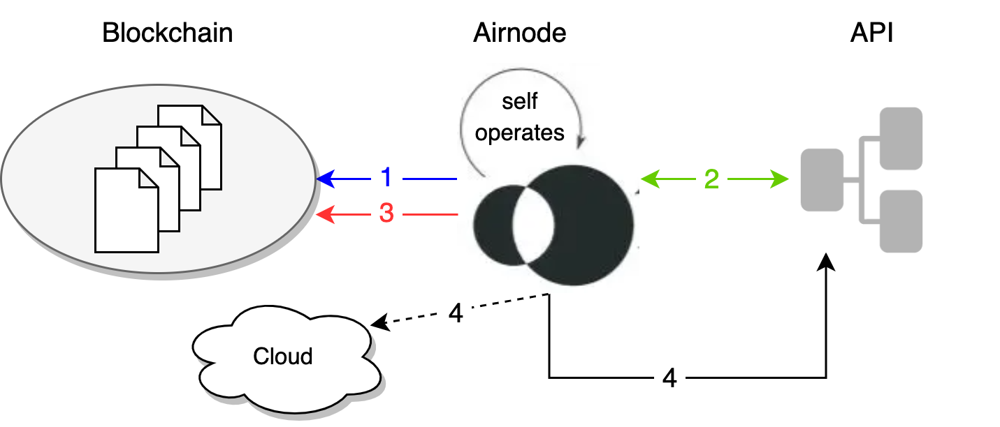

<TitleSpan>创建一个 Airnode</TitleSpan>

# {{$frontmatter.title}}

<VersionWarning/>

在Airnode运行结束时（每分钟），Airnode可以向一个指定的URL发出HTTP POST请求。 这既是Airnode存活并在工作的信号（特别是在部署后很有用），也是它每次运行（自我操作）的通知。

> 
> 
> 1. <p class="diagram-line" style="color:blue;">Airnode 收集针对其支持的 API 的链上请求。</p>
> 2. <p class="diagram-line" style="color:green;">调用每个请求所需的 API 端点。</p>
> 3. <p class="diagram-line" style="color:red;">对每项请求都作出答复。</p>
> 4. <p class="diagram-line" style="color:black;">最后，Airnode 向heartbeat的URL (HTTP POST) 提出请求。 这可以是Airnode支持的API中的一个端点，或任何云端REST端点，如监控服务。</p>

通过设置`nodeSettings.heartbeat`的`config.json`部分的所有字段，打开可选的heartbeat功能。

```json
{
  ois:{...},
  triggers:{...},
  chains:{...},
  environment:{...},
  nodeSettings:{
      "airnodeWalletMnemonic": "<FILL_*>",
      "cloudProvider": {
        "type": "aws",
        "region": "us-east-1"
      },
      "heartbeat": {
        "enabled": true,
        "url": "${HEARTBEAT_URL}",
        "apiKey": "${HEARTBEAT_API_KEY}",
        "id": "${HEARTBEAT_ID}"
      },
      "httpGateway": {
        "enabled": true,
        "apiKey": "${HTTP_GATEWAY_API_KEY}",
        "maxConcurrency": 20
      },
      "httpSignedDataGateway": {
        "enabled": true,
        "apiKey": "${HTTP_SIGNED_DATA_GATEWAY_API_KEY}",
        "maxConcurrency": 20
      },
      "logFormat": "json",
      "logLevel": "INFO",
      "nodeVersion": "0.6.0",
      "stage": "testnet",
  }
}
```

- `enabled`: 启用/禁用Airnode的 heartbeat。
- `url`: 进行heartbeat请求的URL。
- `apiKey`: 用来验证heartbeat URL的API密钥。
- `id`: 用于核算的Airnode heartbeat ID。.

## Heartbeat 端点

下表说明了传递给 Heartbeat URL 的参数。

| name                             | in | type   |
| -------------------------------- | -- | ------ |
| airnode-heartbeat-api-key        | 头部 | 字符串    |
| deployment_id                    | 主体 | 字符串    |
| http_gateway_url               | 主体 | string |
| http_signed_data_gateway_url | 主体 | 字符串    |

下面是一个示例，其中包含在 `heartbeat.url`的请求正文中。

```json
{
  "deployment_id": "916d3ec80fda",
  "http_gateway_url": "https://some.aws.http.gateway.url/v1",
  "http_signed_data_gateway_url": "https://some.aws.http.signed.data.gateway.url/v1"
}
```

<table>
  <tr>
    <td>airnode-hebbeat-api-key</td><td>在nodeSettings.heartbeat.apiKey中配置的用于heartbeat调用的API密钥。 用于对运行在nodeSettings.heartbeat.url上的heartbeat服务进行认证。</td>
  </tr>
  <tr>
    <td>deployment_id:</td><td>一个用于核算的ID，对已部署的Airnode来说是唯一的。</td>
  </tr>
  <tr>
    <td>http_gateway_url:</td><td>如果HTTP网关被启用，这就是网关的URL，可以进行测试HTTP调用。</td>
  </tr>
    <tr>
    <td>http_signed_data_gateway_url:</td><td>如果启用了HTTP签名数据网关，这是你可以进行HTTP调用的网关的URL。</td>
  </tr>
</table>
