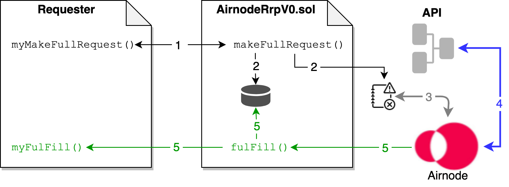
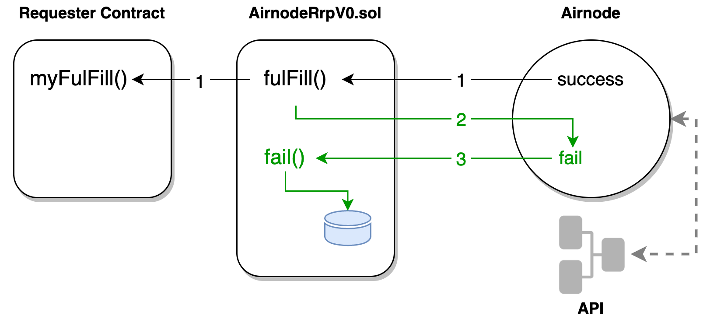

<TitleSpan>{{$frontmatter.folder}}</TitleSpan>

# {{$frontmatter.title}}

<VersionWarning/>

<TocHeader />
<TOC class="table-of-contents" :include-level="[2,3,4]" />

A request is made, by a [requester](requester.md), to either the
`makeFullRequest()` or `makeTemplateRequest()` functions of the
[AirnodeRrpV0.sol](README.md#airnoderrpv0-sol) protocol contract which adds the
request to its storage. The targeted off-chain [Airnode](airnode.md) gathers the
request from AirnodeRrpV0.sol's storage and responds using the `fulFill()`
function of AirnodeRrpV0.sol.

> 
>
> 1.  <p class="diagram-line">The requester calls makeFullRequest() on the AirnodeRrpV0 protocol contract.</p>
> 2.  <p class="diagram-line">makeFullRequest() assigns a requestId to the request for tracking purposes, adds the requestId to storage, emits the request to the event logs and returns the requestId to the requester.</p>
> 3.  <p class="diagram-line" style="color:gray;">Airnode, during its run cycle, picks the request from the event logs.</p>
> 4.  <p class="diagram-line" style="color:blue;">Airnode gets data from the API and encodes it. The encoded response must have length at most 1024 bytes. (This is negligible in practice, since large responses are costly to store)</p>
> 5.  <p class="diagram-line" style="color:green;">Airnode sends the response to fulFill() in AirnodeRrpV0 which in turn removes the pending requestId from storage and forwards the response to myFulFill(). The requestId is included as part of the response.</p>

Learn more on how to [Call an Airnode](../grp-developers/call-an-airnode.md).

## `requestId`

The `requestId` uniquely identifies a request. When a requester makes a request
using AirnodeRrpV0.sol, a `requestId` is generated before the request is added
to the event logs and the requestId is returned to the requester. This
`requestId` is a hash of certain data members depending on which type of request
is made, `makeFullRequest()` or `makeTemplateRequest()`. They only differ in
that one uses `endpointId` plus `airnode` address and the other `templateId`
(since template already contains the `airnode` address).

| makeFullRequest()                             | makeTemplateRequest()                         |
| :-------------------------------------------- | :-------------------------------------------- |
| block.chainid                                 | block.chainid                                 |
| address(this)                                 | address(this)                                 |
| msg.sender                                    | msg.sender                                    |
| requesterRequestCount                         | requesterRequestCount                         |
|                                               | airnode                                       |
| <span style="color:purple;">endpointId</span> | <span style="color:purple;">templateId</span> |
| sponsor                                       | sponsor                                       |
| sponsorWallet                                 | sponsorWallet                                 |
| fulfillAddress                                | fulfillAddress                                |
| fulfillFunctionId                             | fulfillFunctionId                             |
| parameters                                    | parameters                                    |

After the request (with `requestId`) is added to the event logs, Airnode gathers
the request and verifies the `requestId` by re-computing its hash before
responding to the request. This verifies the parameters have not been tampered
with.

## Request Parameters

The following list summarizes the values expected for the parameters of a
request.

- `templateId` the id of a template to use, _(only used for
  `makeTemplateRequest`)_

- `airnode` (address) and `endpointId` specify the endpoint, _(only used for
  `makeFullRequest`)_

- `sponsor` and `sponsorWallet` (addresses) specify which wallet will be used to
  fulfill the request

- `fulfillAddress` and `fulfillFunctionId` specify which contract/function will
  be called to fulfill the request

- `parameters` specify the API and
  [reserved](/ois/v1.0/ois.md#_5-4-reservedparameters) parameters (see
  [Airnode ABI specifications](../reference/specifications/airnode-abi-specifications.md)
  for how these are encoded)

## Full Request

A full request does not refer to a template at all. Full requests are useful if
the requester will not make a similar request ever again (e.g., in a prediction
market context).

```solidity
function makeFullRequest(
    address airnode,
    bytes32 endpointId,
    address sponsor,
    address sponsorWallet,
    address fulfillAddress,
    bytes4 fulfillFunctionId,
    bytes calldata parameters
){...}
```

## Template Request

A template request refers to a template for the `airnode` address, `endpointId`
and `parameters`.

```solidity
struct Template {
  address airnode;
  bytes32 endpointId;
  bytes parameters;
}
```

The requester can refer to the `templateId` of a template while making a
request, and the Airnode will fetch these and use them in the request.

```solidity
function makeTemplateRequest(
    bytes32 templateId,
    address sponsor,
    address sponsorWallet,
    address fulfillAddress,
    bytes4 fulfillFunctionId,
    bytes calldata parameters
)
```

When a template is used to make a request, both the parameters encoded in
`parameters` of the template and `parameters` provided at request-time by the
requester will be used by the Airnode. In case the two include a parameter with
the same name, the one provided at request-time will be used.

## Request Outcomes

A request made to an Airnode has three possible outcomes:

- [Fulfill](./request.md#fulfill)
- [Fail](./request.md#fail)
- [Ignore](./request.md#ignore)

### Fulfill

`fulfill()` is the desired outcome and it will only be called if Airnode
received a successful response from the API provider.

> 
>
> 1.  <p class="diagram-line">Airnode calls AirnodeRrpV0.fulFill() with a response only if the API has not responded with an error. AirnodeRrpV0.fulfill() performs a call back to myFulFill() which in turn receives the response.</p>
> 2.  <p class="diagram-line" style="color:green;">If AirnodeRrpV0.fulFill() fails internally or the underlying low level call to myFulFill() reverts then Airnode will start the process in step #3 to fail the request.</p>
> 3.  <p class="diagram-line" style="color:green;">If Airnode errors, or is told by AirnodeRrpV0.fulFill() to error, it calls AirnodeRrpV0.fail() which removes the request from the pending list of requestIds on-chain.</p>

::: tip Important to Note

Fulfill is the only outcome that returns results to a requester contract.

:::

For a successful request, Airnode calls the `fulfill()` function in
AirnodeRrpV0.sol that will in turn call back the requester contract at
`fulfillAddress` using function `fulfillFunctionId` to deliver `data`.

`fulfill()` also receives a signature to validate on-chain that the response
data was submitted by the Airnode. This is to prevent requesters from fulfilling
their own requests in order to manipulate data submitted by AirnodeRrpV0.sol.

`fulfill()` will not revert if the `fulfillFunctionId` external call reverts.
However, it will return `false` in this case or if there is no function with a
matching signature at `fulfillAddress`. On the other hand, it will return `true`
if the external call returns successfully or if there is no contract deployed at
`fulfillAddress`. In the case `false` is returned then an error message will
also be returned in a variable which can be decoded to retrieve the revert
string. For example Airnode will decode this variable when this function returns
`false` and call `fail()` on AirnodeRrpV0.sol with the revert string as the
error message.

### Fail

As noted in the diagram above, if the transaction that calls `fulfill()` returns
`false`, the Airnode decodes the revert string and calls the `fail()` method to
report the failure. For privacy and security reasons, API error messages are not
sent on-chain. Also note that the node will not attempt to fulfill a failed
request afterwards.

Airnode is stateless, which means that there is no database storing which
requests have been fulfilled or failed, which are waiting on confirmations and
which are still pending. This information is retrieved from the chain on each
request-response cycle (roughly every minute). During each cycle, retrieved
requests need to be ordered in the same way to ensure they are submitted using
the same nonce. This is important because it's possible for a transaction to not
have been confirmed by the time the next cycle runs. If this happens, the
transaction is re-submitted with a "faster" transaction fee, overwriting the
previous transaction.

## Check if request is awaiting fulfillment

There is a convenience method in AirnodeRrpV0.sol called
`requestIsAwaitingFulfillment()` that can be called to check if a request was
made but not yet fulfilled/failed. If a requester has made a request, received a
`requestId` but did not hear back, it can call this method to check if the
Airnode has called back `fail()` instead.Returns `true` if the request is
awaiting fulfillment (i.e., `true` if `fulfill()` or `fail()` is not called back
yet), `false` otherwise.
