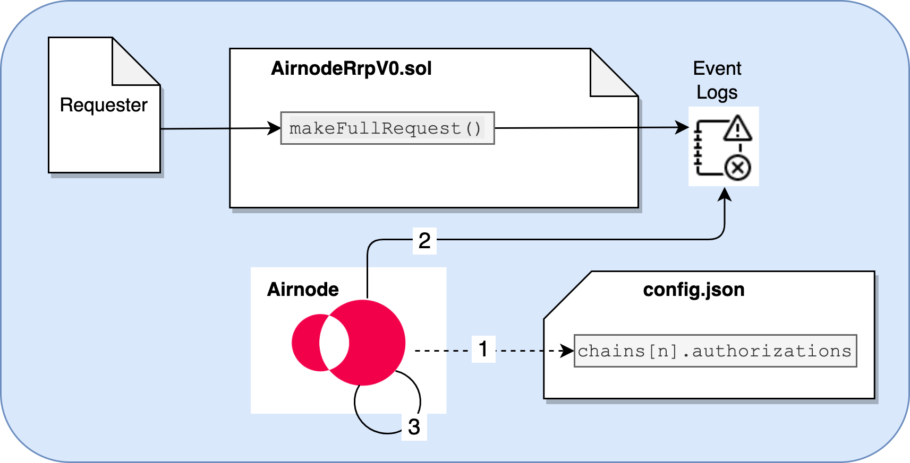

<TitleSpan>{{$frontmatter.folder}}</TitleSpan>

# {{$frontmatter.title}}

<VersionWarning/>

<TocHeader />
<TOC class="table-of-contents" :include-level="[2,5]" />

Authorizations use scheme types that map values that in turn provide access to
an Airnode's endpoints These are stored in the same file that defines the
Airnode, its `config.json` file. These values are endpointId/address pairs that
Airnode uses to allow access to its endpoints by requesters (smart contracts).
Blockchain experience is not needed to use authorizations as Airnode performs
these validations internally (off-chain). Nothing in
[Authorizers](./authorizers.md) can supersede permissions granted by
_authorizations_ as the latter takes precedence.

The diagram below illustrates how Airnode utilizes authorizations.

> 
>
> 1. <p class="diagram-line">When Airnode starts it reads its list of authorizations (endpointId/address pairs) declared in <code>config.json</code>.</p>
> 2. <p class="diagram-line">Airnode validates each request, checking that the requested endpoint and address of the requester is in fact in authorizations as a valid endpointId/address pair. For requests that are validated, Airnode proceeds to fulfill the request.</p>

## Are authorizations required?

Authorizations are not required. An Airnode operator could use
[Authorizers](./authorizers.md) or [Relayed Meta Data](./relay-meta-auth.md). It
is possible to use both authorizers and relay security schemes together.

## Why is an authorizations scheme needed?

Airnodes need the ability to fulfill requests selectively. This is required for
two main reasons:

1. The Airnode only fulfills requests made by requesters who have made payment
   to the Airnode owner wishes, which allows them to monetize their services.
2. The Airnode owner only allows requester contracts it owns access to certain
   endpoints.
3. The services of the Airnode are sensitive and can only be accessed by certain
   requesters, e.g., who have gone through KYC.

A protocol that does not have the `authorizations` scheme or equivalent
functionality cannot be considered as permissionless, and will not be able to
achieve wide-spread adoption.

Currently there is only one authorization scheme type, see
[requesterEndpointAuthorizations](https://github.com/api3dao/airnode/blob/master/packages/airnode-validator/src/config/config.ts#L162).
The authorizations scheme type is set in
`chains[n].authorizations.{<authorizationsSchemeType>}` of `config.json`.

```json
chains[n].authorizations:{requesterEndpointAuthorizations:{}},
```

## requesterEndpointAuthorizations

Currently `requesterEndpointAuthorizations` is the only scheme type available
for authorizations. It defines a list of endpointIds each with an array of
requester addresses that can access them.

```json
{
 ...
 "chains":[
    {
        "id": "1",
        ...
        "authorizers": {     The scheme type requesterEndpointAuthorizations
        },                   grants access to endpointId/address pairs
        "authorizations": {  ⬇︎
            "requesterEndpointAuthorizations": {
                "0x6db9...7af6": ["0xdhrt...A498"],
                "0x8dd9...5ad7": ["0xdhrt...A498", "0xcse0...D236"],
                       ⬆︎                 ⬆︎                ⬆︎
                       endpointId         requester addresses
            }
        },
    },
}
```

## More reading...

Other docs related to authorizations and relayed meta data:

- Reference ➙ Deployment Files ➙
  [config.json](../reference/deployment-files/config-json.md)
- API Providers ➙ Build an Airnode ➙
  [Using Authorizations](../grp-providers/guides/build-an-airnode/using-authorizations.md)
- API Providers ➙ Build an Airnode ➙ API Security ➙
  [Relayed Meta Data Security Schemes](../grp-providers/guides/build-an-airnode/api-security.md#relayed-meta-data-security-schemes)
