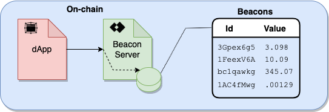
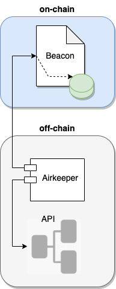

<TitleSpan>Beacon</TitleSpan>

# {{$frontmatter.title}}

<BeaconWarning/>

<TocHeader />
<TOC class="table-of-contents" :include-level="[2,3]" />

The Beacon is an on-chain contract that maintains a cache of off-chain data
readily available for smart contracts to retrieve instantly as illustrated in
figure B1 below. The data cache is updated when a change in data value exceeds a
pre-defined variance tolerance.

> Figure B1
>
> 

In figure B2 an off-chain node called AirKeeper tracks the on-chain data of the
Beacon's cache to determine if it should be updated. The AirKeeper's owner can
configure the AirKeeper data variance tolerances and time between Beacon data
cache checks.

> Figure B2
>
> 
