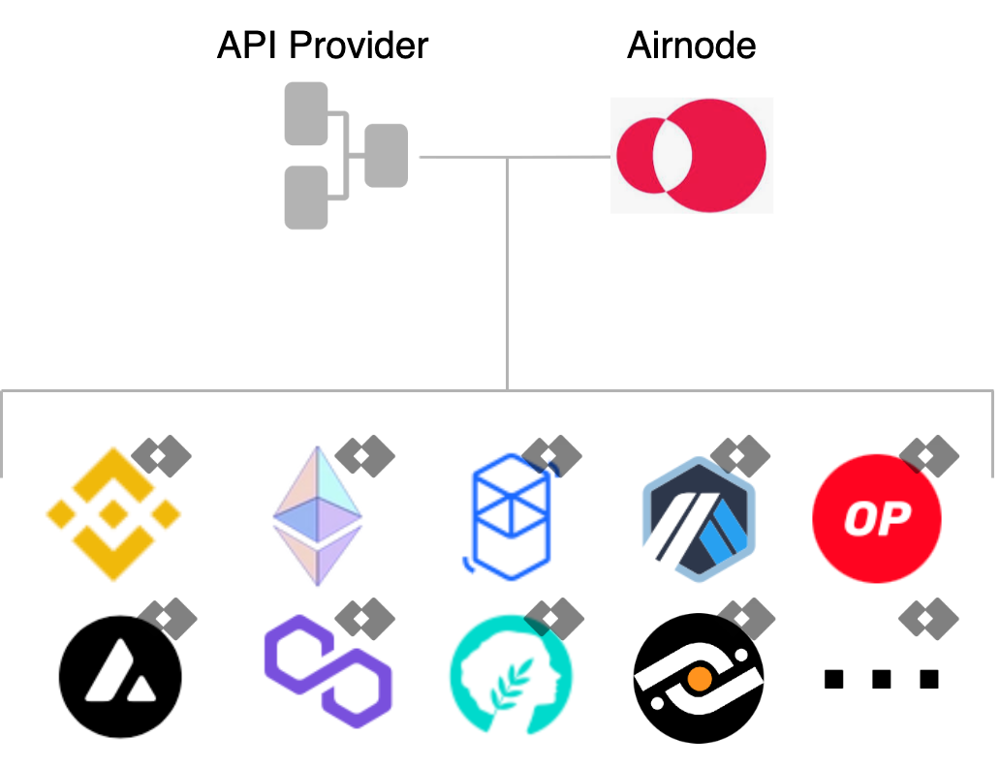

<TitleSpan>Introduction</TitleSpan>

# {{$frontmatter.title}}

<VersionWarning/>

<TocHeader />
<TOC class="table-of-contents" :include-level="[2,3]" />

Beacons are lightweight, first-party data feeds that increase transparency,
reduce cost, and scale data access for Web3. They allow smart contract
developers to connect Web3 applications to continuously updated streams of
off-chain data, such as the latest cryptocurrency, stock, and commodities
prices.

> 
>
> Provider operated. Data source transparent.

Why should API providers power Beacons? Beacons unlock a novel data monetization
channel targeting the growing market of smart contract developers building the
next generation of games, applications, and services.

## Reasons to power Beacons

Beacons enable API providers of all sizes the ability to transparently,
securely, and cost-efficiently monetize their data on Web3.

### Monetization

Innovative decentralized applications (dApps) are increasingly demanding access
to off-chain data. API providers that utilize Beacons to satisfy this need will
tap into a novel and growing revenue stream.

### Security

Other oracle implementations that provide Web3 data rely on networks of
3rd-party oracle nodes acting as middlemen. Beacons, on the other hand, feed
data from API provider directly to the blockchain and thereby avoid security
risks and fees introduced by third parties. Moreover, developers leveraging
Beacons for their dApps are provided with security guarantees associated with
knowing exactly where their data comes from.

### Pricing

Another benefit of the first-party design of Beacons is that API providers can
price data attractively for developers thanks to the absence of hefty fees
charged by middlemen.

### Exposure

By engaging the emerging Web3 market for Beacons, API providers gain exposure
for their organizations. API providers that power Beacons on multiple
blockchains will further establish a reputation as premier data providers.

### Reputation

When data comes directly from a source, as is the case with Beacons, the
provider’s off-chain reputation comes with it. API providers can therefore
leverage the off-chain reputation they have built to attract developers
demanding high quality data.

### Transparency

Beacons bring transparency to on-chain data delivery. API providers benefit from
control over how their data are handled, while dApp developers benefit from
knowing the provenance of the data they receive. Beacon development also
embodies transparency: API providers and dApp developers trust the API3 DAO for
its public governance and open source development practices.

### Scalability

Beacons are lightweight and capable of meeting the demands of popular dApps and
high performance blockchains. At the same time, the cost-efficiency of Beacons
enable a wide range of use cases that aren’t feasible with traditional data
feeds.

## Get started with Beacons!

Join the growing number of Beacons operated by the market’s most trusted and
reliable data providers. The simple design and implementation makes it easy to
deploy Beacons on EVM-compatible chains and API3 is always here to help!

Sound appealing? API3 is ready to help onboard your organization to Web3 data
provision.
