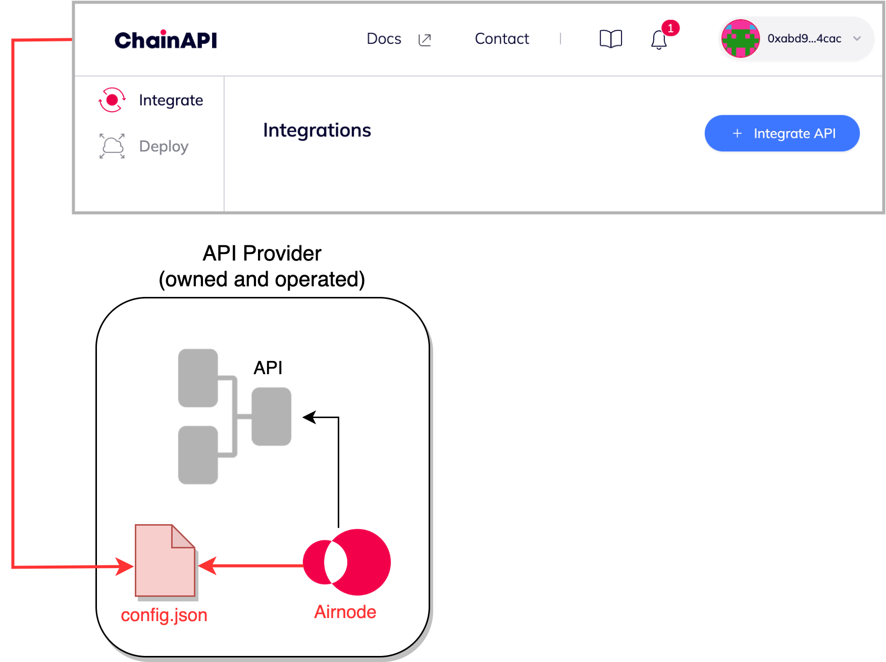

<TitleSpan>{{$frontmatter.folder}}</TitleSpan>

# {{$frontmatter.title}}

<!--TocHeader />
<TOC class="table-of-contents" :include-level="[2,3]" /-->

[ChainAPI](https://chainapi.com) enables you to integrate and deploy the open
source [Airnode](../airnode/v0.7/) for free with ChainAPI’s intuitive
step-by-step integration and deployment tools.

The ChainAPI platform streamlines "API provider data to blockchain" integrations
. Using the ChainAPI web based app, API providers configure and deploy an
Airnode which can link your API data to several blockchains. Airnode is designed
with mechanisms that eliminate both on-chain and off-chain concerns of API
providers. The set-and-forget framework of Airnode is all about its ease of
implementation.

ChainAPI can connect almost any API, whether open or authenticated, to Airnode.
Airnode then queries your API operations to be consumed by EVM on-chain smart
contracts, either by using the request/response protocol or the more popular
on-chain [dAPI](../dapis/reference/dapi-browser.md) sets.

Use the ChainAPI web based app to get started. The app will step you through the
process. If needed, there are helpful hints in the
[User Guides](./user-guides/integrations.md) of the ChainAPI documents. There
are two primary functions of the app:

- Integrate: Creates and maintain a `config.json` file that defines an Airnode.
- Deploy: Deploys the Airnode to a cloud provider, AWS or GCP.

> 

The ChainAPI web based app creates an Airnode configuration file that is used to
deploy an Airnode to either AWS or GCP. The deployment process uses
`config.json` parameters to build the Airnode. Airnode bootstraps itself using
attributes from `config.json`.
