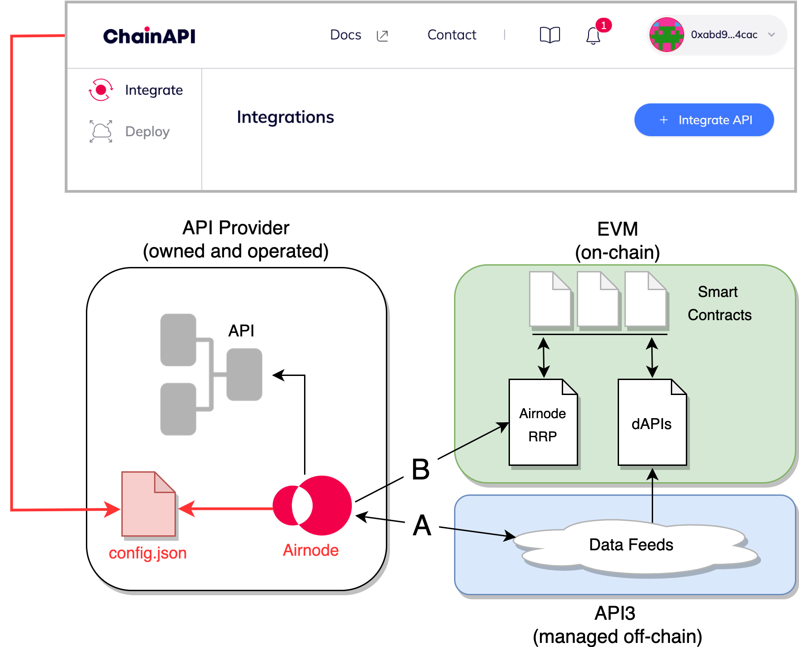

<TitleSpan>{{$frontmatter.folder}}</TitleSpan>

# {{$frontmatter.title}}

<!--TocHeader />
<TOC class="table-of-contents" :include-level="[2,3]" /-->

The simple answer is ChainAPI makes deploying an Airnode easier in comparison to
building and deploying without, see
[Build an Airnode](/airnode/v0.7/grp-providers/guides/build-an-airnode/).
Additionally, ChainAPI gets you to monetization faster and makes Airnode updates
effortless. Once built, Airnode connects your API data to an entire universe of
decentralized applications through its light, secure, and effortless Web3 API
gateway. See
[Why use Airnode?](../../airnode/v0.7/introduction/why-use-airnode.md) for more
reasons to use an Airnode.

> 

The deployed Airnode can serve API provider data to smart contracts using dAPIs
and the request/response protocol contract (Airnode RRP).

- **A)** Airnode supports on-chain dAPI values via the off-chain data feeds
  service managed by API3. The data feeds maintains dAPI values by checking the
  deviation between a dAPI's on-chain value and the API provider's value sourced
  by Airnode.
- **B)** Airnode can respond to requests made by smart contracts using the
  Airnode RRP contract.
