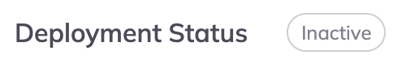
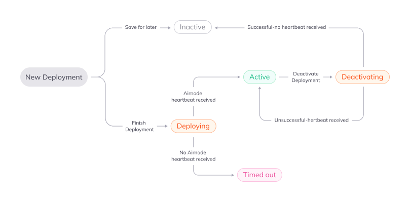

<TitleSpan>{{$frontmatter.folder}}</TitleSpan>

# {{$frontmatter.title}}

<TocHeader />
<TOC class="table-of-contents" :include-level="[2,3,4]" />

<!-- If you change the following paragraph, change it in the README. -->

This section will step you through deploying an Airnode using a configuration
that was built when creating an integration. An integration can be used for
multiple deployments if desired. Deployments can be made on AWS or GCP.

There are a few things needed before creating a deployment:

- Acquire cloud provider account such as AWS or GCP.
- Acquire a blockchain provider account for the networks required.
- Install Docker.

Select the **Deploy** menu in the navigation bar on the left side of the page.
Then select the **New Deployment** button. ChainAPI will step-you-through the
deployment process. <br/> 

## Integrations

The deployment will use an [integration](./integrations.md) you have already
created to define and deploy an Airnode to a cloud provider of your choice.

### Name

Name the deployment. **You won’t be able to change this after saving the
deployment.**

### Integration

This is where you will select which integration(s) that you want to use, the
version of the integration and the notes you captured during the integration
associated with that version.

## Cloud Provider Settings

Select the desired cloud provider and the region the Airnode should be deployed
to.

### Cloud provider

Select the desired cloud provider.

### Region

Select the desired region for your cloud provider.

### Airnode version

The latest Airnode version will be selected by default and we recommend you
leave it on the latest version unless you have a specific reason to select an
older version.

## Networks

Here you will define which networks (chains) the Airnode will respond to.

### Mainnets

These are actual chains that process actual transactions.

### Testnets

These are test networks that can be used for testing your deployment and
integrations.

### Network

Here you will see all the networks (chains) that are supported and your Airnode
will respond to.

### Public Providers

These are publicly available RPC URLs that provide access to the blockchain
network. There is no cost while using them.

### User Provided

These are private RPC URLs, controlled either by yourself or a blockchain
provider, that provide access to the blockchain network.

## Authorizers

Authorizer contracts allow you to specify which smart contracts can make
requests to your Airnode’s endpoints.

**Public** authorizers allow any smart contract to make requests to your
Airnode’s endpoints.

**Restricted** authorizers only allow smart contract addresses that have been
granted access to make requests to your Airnode’s endpoints.

To learn more about authorizers,
[check out these docs](https://docs.api3.org/airnode/v0.9/concepts/authorizers).

## Review Configuration

Review the deployment configuration before continuing. Go back to make changes
if needed.

## Download and Deploy

Here you will download the required deployment files to perform final editing of
the required secrets.

### Download files

These files are needed to deploy your Airnode. Inside the zip file, you will
find a README, a file based on your cloud provider selection, config folder, and
output folder.

### Edit your downloaded files

Use the instruction in the README and comments in the other files to add secrets
that the `config.json` file will read.

### Use Docker container to deploy your Airnode

Copy and paste the commands below to your terminal at the directory with your
config.json and secrets.env files.

:::warning Please note

Complete one deployment at a time. Starting multiple, simultaneous deployments
will fail and need to be removed manually through your cloud provider’s web
interface.

:::

:::: tabs

::: tab Linux/Mac/WSL2

```sh
docker run -it --rm \
      --env-file aws.env \
      -e USER_ID=$(id -u) -e GROUP_ID=$(id -g) \
      -v "$(pwd)/config:/app/config" \
      -v "$(pwd)/output:/app/output" \
      api3/airnode-deployer:0.6.4 deploy
```

:::

::: tab Windows

```sh
docker run -it --rm ^
      --env-file aws.env ^
      -v "%cd%/config:/app/config" ^
      -v "%cd%/output:/app/output" ^
      api3/airnode-deployer:0.6.4 deploy
```

:::

::::

## Finish Deployment

Click on the **Finish Deployment** button after you have completed the
deployment. This will take you to your list of deployments and display their
statuses.

<!-- Still need: Downloading and editing files (folder structure) The readme (display
the actual readme in the documents page Add explanation for what a blockchain
provider does Recommend multiple blockchain providers and explain what happens
when one goes down (the why)

Managing an existing deployment How adding / removing / changing APIs version
will impact your Airnode How will adding or changing your network impact your
Airnode How to delete a deployment (use docker) Deployment ReadMe (generalized
readme)-->

### Check deployment status

Once your deployment is completed, its status will change to either Active or
Timed Out. If your deployment is Active, that means that we have received the
Airnode heartbeat and your Airnode is active. If it’s Timed Out, something went
wrong and you should start by checking the Deployment Checklist below, and check
docker for any errors during deployment.

<span style="margin-left:40px;border:solid 1px gray;"></span>

<!--If successfully completed, your deployment’s status will become Active within 1
minute. If your deployment is not active after clicking "Finish deployment",
check your cloud provider logs and configuration details before redeploying.-->

### Deployment Statuses

<span style="margin-left:0px;border:solid 1px gray;"></span>

<br/>

### Description of each deployment status

| Status       | Description                                                                                                                                                                                                                                                                             |
| ------------ | --------------------------------------------------------------------------------------------------------------------------------------------------------------------------------------------------------------------------------------------------------------------------------------- |
| Deploying    | You have finished a new deployment and we are now waiting to receive a heartbeat from your Airnode                                                                                                                                                                                      |
| Active       | We are receiving a heartbeat from your Airnode                                                                                                                                                                                                                                          |
| Deactivating | You clicked **Deactivate** on your active deployment. Once you have run the command to deactivate your Airnode then: <br/>1. **If successful** your deployment becomes **Inactive** <br/> 2. **If unsuccessful** we will receive a heartbeat which will make your deployment **Active** |
| Inactive     | There are two scenarios for this status: <br/>1. You started a deployment and clicked **Save for later** <br/> 2. You clicked Deactivate on your active deployment, ran the command to deactivate your Airnode and we stopped receiving heartbeats                                      |
| Timed out    | We have not received a heartbeat for a **Deploying** or **Active** deployment                                                                                                                                                                                                           |

### Sub-deployments

Editing an active deployment will create a sub-deployment with a new heartbeat
ID. This sub-deployment will replace your main deployment once it’s status is
**Active**.

## Troubleshooting

Please check if you have met all these prerequisites for your deployment:

1.  You have [Docker](https://docs.docker.com/get-started/overview/) installed
2.  You have a cloud provider account ([AWS](https://aws.amazon.com/account/) or
    [GCP](https://cloud.google.com/)) with the provider you selected under the
    Cloud Provider Settings on the Settings and Networks page
3.  You have
    [blockchain provider account(s)](../../airnode/v0.7/concepts/chain-providers.md)
    for each of the number of providers you selected under the Networks section
    on the Settings and Networks page
4.  You have populated the secrets.env file with all the requested variables

If you have met all the above, and you still have problems, please reach out to
[support@chainapi.com](mailto:support@chainapi.com) with a description of the
problem you are facing and any error messages you are seeing in the command.
