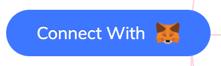
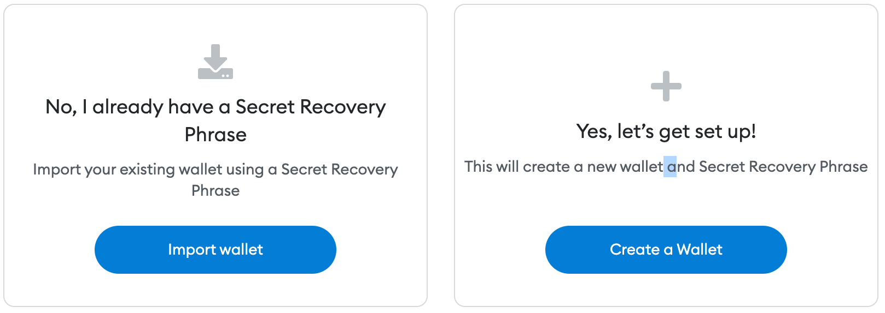

<TitleSpan>How to Guides</TitleSpan>

# {{$frontmatter.title}}

<TocHeader />
<TOC class="table-of-contents" :include-level="[2,3]" />

<!-- If you change the following paragraph, change it in the README. -->

ChainAPI identifies you through a wallet you own by way of
[MetaMask](https://metamask.io). Other wallets will be supported in the future.
ChainAPI will ask you to sign a message (from within MetaMask) for a particular
wallet account proving your ownership of the account. For the first time you
connect, you will be prompted for your email address which will be linked to a
ChainAPI account. Each time you return to ChainAPI you will connect again, using
MetaMask, to identify yourself by signing a message for the same account.

## Connecting

If you are an existing MetaMask user, it is recommended that you create a
separate (dedicated) MetaMask wallet specifically for ChainAPI using a new seed
phrase known in MetaMask as a "Secret Recovery Phrase". In the future ChainAPI
will offer services allowing control of your Airnode via the ChainAPI UI. A
separate dedicated wallet will help streamline these features.

1. **Connect:** Click on the **Connect With MetaMask** button (or alternatively
   use _Log In Using MetaMask_) to create a new account and register and email
   address. If you do not have MetaMask installed you will be prompted to do so.
      

---

2. **Create Wallet**: (new MetaMask installations only) - If you have just
   installed MaskMask, it will open a web page to create or open an existing
   wallet.  
    Once the new wallet is created, return to the ChainAPI landing page,
   refresh it and select the **Connect With Metamask** button again.

---

3. **Signature Request**: When MetaMask opens you may be asked to select an
   account before the signature request prompt appears. For newly created
   wallets there will only be one account, the default account though others can
   be added. For existing wallets select which account you would like to use.
   Remember the account you select.

   You will be prompted to authorize a signature request which does not require
   any cryptocurrency. By signing this request, you prove ownership of the
   wallet account.

---

4. **Register Email**: (first time connecting) After the MetaMask popup closes
   you may be prompted for your email address if the MetaMask account you
   selected is not recognized by ChainAPI. ChainAPI associates your email
   address with your MetaMask wallet account for future communications. Enter
   your email, wait a moment for it verification, then select the _Confirm
   Email_ button.

   An email will be sent to you asking you to confirm ownership of the email
   address. After performing the confirmation ChainAPI should show its **Getting
   Started** page.

## Subsequent Connecting

Be sure to use same account each time you use the _Connect With MetaMask_
button. Opening MetaMask will show you the account currently selected.
