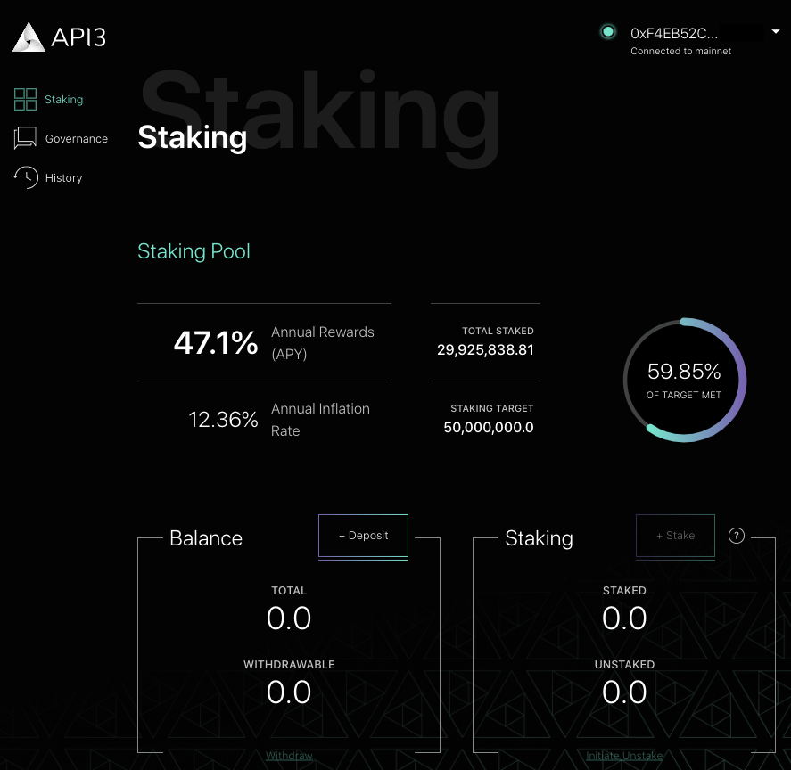

# {{$frontmatter.title}}

<TocHeader />
<TOC class="table-of-contents" :include-level="[2,3]" />

The DAO dashboard is the portal to participate in the API3 DAO. It is aimed at
API3 members and others that want to understand how to interact with the DAO or
modify/reuse any of its infrastructure.

The DAO dashboard focuses on your interaction with the DAO:

- [Staking Tokens](staking.md) - Stake API3 tokens into the DAO pool to gain
  governance rights (proposals and voting) and earn rewards.
- [Working with Proposals](proposals.md) - View and create proposals.
- [How to Vote](voting.md) - Vote on proposals directly or through delegation.

## Access the Dashboard

- Access the [DAO Dashboard](https://api3.eth.link/) on **Mainnet**.

- Access the [Stage DAO Dashboard](https://staging.api3.eth.link/#/) on Rinkeby.
  This is a staging area for beta and other testing but may not be available at
  certain times.

Connect your wallet by clicking the **Connect Wallet** button in the upper right
hand corner. Select your wallet from the popup. Once connected you can view the
DAO dashboard showing stake and reward status.

<blockquote> 

</blockquote>

## Navigation

The DAO dashboard has three simple views as seen in the navigation menu in the
upper left hand corner. Each of these are covered in the
[Staking Tokens](staking.md), [Working with Proposals](proposals.md) and
[How to Vote](voting.md) pages.

- Staking
- Governance
- History

## Dashboard Attributes

Some attributes that determine values displayed on the DAO dashboard (such as
the STAKING TARGET) can be changed by creating a proposal and calling the
appropriate function on the DAO pool contract. See
[Dashboard Attributes](../contract-architecture/dashboard-attributes.md) on the
**DAO Contracts** page in the reference section for more details on the
available function calls.
