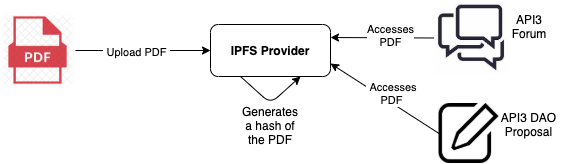

# {{$frontmatter.title}}

<TocHeader /> <TOC class="table-of-contents" :include-level="[2,3]" />

在 DAO 池中质押代币将赋予您创建和投票 提案的治理权限。

要创建一个提案，您必须在7 天内没有创建过一个提案，您必须至少持有池中总质押代币0.1% 的质押代币数量。 这个需要的百分比，以及其他 DAO 参数可以由 [控制面板属性](../contract-architecture/dashboard-attributes.md) 中所述的 DAO 来调整。 要查看 地址质押代币在池中的百分比，请访问 [DAO 追踪器 钱包地址页面](https://enormous.cloud/dao/api3/tracker/wallets)。

您可以对所有提案投票，而不论您所质押代币占 池中代币的百分比是多少。 请参阅 [如何投票](voting.md) 中的说明。 或者， 你可以将你的投票权委托其他人。 查看 API3 论坛的 [delegation pitch 版块](https://forum.api3.org/c/delegation-pitch/7) 查阅社区成员的帖子或 发表您自己的观点。

## 开始

1. 访问 [DAO 控制面板](https://api3.eth.link/)
2. 点击右上角的 **连接钱包** 按钮，并 使用 Ethereum 主网连接到您的钱包地址。

<!-------------------------->

## 提案及历史记录

**Governance** 页面显示活跃提案列表，而 **历史记录** 页面显示已执行或被否决的提案。

:::: tabs

::: tab 阅读 & 学习

1. 浏览 **Governance** 页面。

   > 您可以在这里浏览和创建提案，查看国库，和授权 您的投票。 **Active proposals**栏列出了所有开放投票的提案。

   > 有两类提案，主要和次要提案。 主要提案 需要绝对多数票，而次要提案需要15% 票就能通过。 对于列表中的每个提案，你可以看到标题、提议 类型、投票截止日期和投票状态。

   > 要查看更多详情，请单击相应提案。 详细视图 显示您的投票授权状态， **Summary** 部分则展示提案的 细节。

2. 要查看先前的治理提案，请浏览 **History** 页面。

   > 历史记录中的提案已被执行或被否决。

:::

::: tab 观看和学习

<Video src="https://www.youtube.com/embed/k0XEkJtWAGk">

:::

::::

<!-------------------------->

## 创建提案

提案是DAO治理的一个重要部分，可用来资助DAO 项目或批准DAO级别的决定，如更新质押目标的决定。

创建提案的步骤是：

1. (推荐）在API3论坛发表观点检查帖子（[sentiment check post](https://forum.api3.org/t/sentiment-check-template/56)）宣传你的观点并收集反馈意见。 一般来说，在论坛上得到社区参与的观点更有可能在成为正式提案后通过。
2. 在 API3 论坛上创建正式提案帖子（[official proposal post](https://forum.api3.org/t/api3-dao-example-proposal-template/52)）。 这里面应该包含一个[托管在IPFS的提案描述](#using-ipfs-for-proposals)的链接。
3. 在收到上述步骤的反馈后，使用下面描述的 DAO控制面板创建一个正式提案。
4. 在正式提案论坛中提供一个与此提案相关的链接， 让社区成员能直接通过链接投票。

  <!--**Proposal Types**

  In general, a proposal type of _Primary_ has a larger treasury and more permissions but has more stringent voting settings than a _Secondary_ type. For a technical breakdown of the different permissions granted to the DAO's proposal types (and corresponding Agents) see this [README](https://github.com/api3dao/api3-dao/blob/develop/packages/dao/README.md#permissions).
  -->

#### 重要提示

::: tip 公开地址和ENS名称

对于公开地址，使用一些 字母大写的地址校验和版本。 将您的地址复制到etherscan获取 其校验和值。 ENS名称是允许的。 查看 [使用ENS名称](proposals.md#using-ens-names) 部分.

:::

::: tip USDC精度

USDC 使用小数点后6位精度，而其他许多ERC20 代币使用的精度为小数点后18位。 在相应金额之后乘以1000000。

:::

使用 DAO 控制面板创建一个新提案：

:::: tabs

::: tab 阅读 & 学习

1. 点击Governance页面上的**New Proposal** （新建提案）按钮。

2. 在提案表单上选择 **Proposal Type** （提案类型）。

   > 提案可以分为 _主要Primary_ 或 _次要Secondary_ 表决 类型。 这两种类型可以访问单独的国库，拥有不同的 投票设置，并且有不同的权限更改合约 设置。 对于授予DAO的提案类型(和对应的代理) 的不同权限的技术分类，请查看 [README](https://github.com/api3dao/api3-dao/blob/develop/packages/dao/README.md#permissions)部分。

3. 输入描述性的 **标题**.。

   > 标题将出现在 Governance页面上，用于标识 提案。 一个很好的描述性标题将有助于他人浏览提案 列表。

4. 详细**描述**提案细节

   > 描述可以输入文字，也可以考虑使用托管 在IPFS 上的 PDF 文件。 查看 [使用IPFS 提案](proposals.md#using-ipfs-for-proposals) 部分。 还可以考虑在论坛上添加一个链接，链接到您在论坛供社区讨论的帖子。

5. 输入 **目标合约**地址。

   > 这是合约要调用的地址。 例如，通常使用 的 USDC 合约地址是
   <code style="overflow-wrap: break-word;">0xA0b86991c6218b36c1d19D4a2e9Eb0cE3606eB48</code>。

6. 输入 **合约签名**。

   > 定义合约调用函数的签名。 对于上面提到的 USDC合约地址，使用 `transfer(address,uint256)`函数。 <span style="color:orange">不要在签名中使用任何 空格、上标、下标或其他。</span>

7. 输入 **ETH 值**。

   > 如果目标函数不是 `可支付的` ，您可以使用0。

8. 输入参数 **Parameters**  用于满足目标合约函数的 签名。

   > 参数必须以 JSON 数组格式提供，值为 stringied。 
   > 
   > ```json
   >    ["0xF4EB52Cf9D31a...d1663d78dDE9", "4999990000"]
   > ```

   在上面的例子中， 代理(主要或次要)将 调用USDC 合约(`0xA0b86991c6218b36c1d19D4a2e9Eb0cE3606eB48`)发送499, 99 USDC 到 地址`0xF4EB52Cf9D31a...d1663d78dDEE9`。 请注意， `transfer(address,uint256)` 将代币从发送者转到指定的 地址，其中要求USDC由代理的账户提供。

9. 准备就绪后，点击页面底部的**Create** 按钮进行创建。

   > 然后将该提案列入提案清单就可付诸投票表决。

:::

::: tab 观看 & 学习

<Video src="https://www.youtube.com/embed/XO1iA3wSYMQ">

:::

::::

## 执行提案

<!-- The following is the older version of execution rules. This was not
very accurate, see PR: AN384 proposals #516.

A proposal is ready for execution if:

1. The proposal hasn't already been executed, and
2. greater than 50% of all voting power has voted "yes" on the proposal,

OR

1. The proposal hasn't already been executed, and
2. the proposal's voting period has ended, and
3. the total "yes" vote exceeds the "no" vote, and
4. at least 50% (for Primary voting app proposals) or 15% (for Secondary voting
   app proposals) of all voting power has voted "yes" on the proposal.

Once a proposal has satisfied either set of criteria, anyone can send a
transaction executing it using the Execute button that appears on its details
page, as shown below:
-->

提案可以执行的条件是：

1. 该提案尚未被执行，并且
2. 该提案的投票期已经结束，并且
3. "yes"的总票数超过"no"的票数；和
4. (对于次要提案)至少15%的投票权对提案投了 "yes"。

主要类型的提案通过需要50%以上的投票权投“yes”。 一旦 50%的投票权投了"赞成"，主要和次要类型提案就都会立即执行。
> <p align="left">
>  
> </p>
## 使用ENS名称

鼓励使用 [ENS 应用程序](https://app.ens.domains/) 注册一个 名称并将其关联到您的 Ethereum 账户。 然后，在输入您的 提案参数时，您可以使用此 ENS 名称而不是钱包地址。 在进行交互创建提案之前。 DAO 控制面板 将查找ENS 名称指向的地址，并在提案使用原始的 地址。 因此，在这个查找操作之后，改变 ENS 名称所指向的地址 **不会**对该提案产生影响。

为了让投票人在提案详情页上看到你的ENS名称而不是原始地址，你必须使用 [ENS应用程序](https://app.ens.domains/)设置一个指向你的ENS名称的反向记录（也就是说，你需要让你的原始地址指向ENS名称）。 如果您的提案通过 `transfer(address,uint256)`   调用ERC20 代币合约，其中 `address` 为 一个 _多重签名_ 钱包地址, 您可以 [通过多重签名设置反向记录](https://medium.com/the-ethereum-name-service/you-can-now-manage-ens-names-with-gnosis-safe-9ddcb7e6c4ac) 。 请查阅[this proposal](https://api3.eth.link/#/history/secondary-6) 中的示例。

## 使用IPFS处理提案

考虑这个用例：您在 [API3 论坛](https://forum.api3.org/) 上发布一个可能的提案。 你收到积极的反馈，然后决定使用DAO控制面板正式创建提案。 在提案 描述的文字中，您需要提供一个回到论坛的链接，这样人们可以再次看到 这个提案细节。 投票者如何知道提案跟他们先前在论坛上读过的同一提案 内容完全相同？ 使用IPFS可以很方便通过哈希值对内容进行寻址，因为你对你的提案所做的任何改变都会改变它的哈希值。



在 IPFS 上托管一个提案描述：

1. 创建 PDF 版本的提案。
2. 将 PDF 上传到 [Fleek](https://fleek.co) 或您首选的 IPFS 主机 提供商。 要使用Fleek，创建一个免费的基本帐户，并在存储（Storage）页面上使用 上传（Upload ）工具。 Fleek将提供PDF文件的 IPFS哈希值, 例如:
   <code style="overflow-wrap: break-word;">bafybeifl4prxv75fgumtjh4ovklfkp7zzt7dwkl4xmndv37gtcalwpam2u</code>.
3. 如果使用 Fleek，则将哈希值添加到 `https://ipfs.fleek.co/ipfs/`。 然后上述哈希值的 URL：

   > <a style="overflow-wrap: break-word;" target="_blank"
   >  href="https://ipfs.fleek.co/ipfs/bafybeifl4prxv75fgumtjh4ovklfkp7zzzt7dwkl4xmndv37gtcalwpam2u">
   > https://ipfs.flek.co/ipfs/bafybeifl4prxv75fgumtjh4ovklfkp7zpt7dwkl4xmndv37gtcalwpam2u
> </a>
4. 将URL添加到您的论坛帖子中，然后添加到您的 DAO 控制面板的提案描述栏。

请记住，投票人在 DAO 控制面板提案描述 中看到的 URL 是最终版的，应该与论坛上的 URL 匹配。

**更新PDF**

在使用 DAO 控制面板创建正式提案之前，您可以更新您的 PDF 文件。 首先，将新版本上传到您的 IPFS 提供商；既然 内容已经改变，它将得到一个新的哈希值。 接下来，在你的论坛 帖子中更新链接。 最后，使用 DAO 控制面板创建一个新提案： 由于该提案描述栏中包含了IPFS的哈希值链接，该PDF应该被认为是最终的，此时在论坛中改变哈希值链接会给投票人提醒作用。
