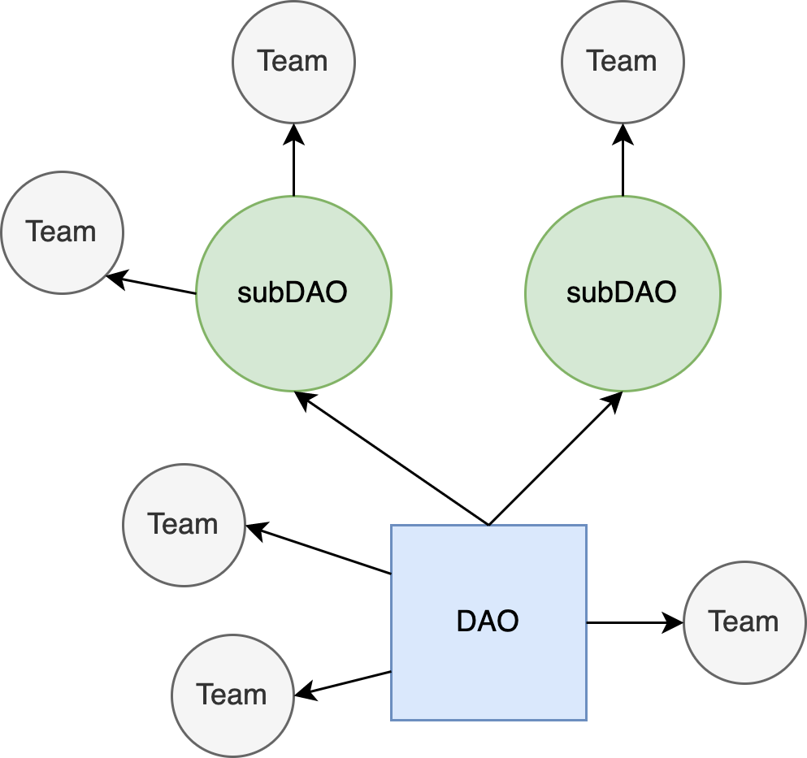

# {{$frontmatter.title}}

<TocHeader /> <TOC class="table-of-contents" :include-level="[2,3]" />

API3由去中心化匿名组织（DAO）治理。 DAO是一个 的协作创建、管理和货币化的大型dAPI。 为了以完全去中心化的方式实现 这个目标，参与者的激励措施包括治理调节 、安全保证和 [实现](dao-pool.md#token-utilities) API3 代币价值。

API3项目有一套完全开放、去中心化和直接的治理 模式。 任何API3 代币持有者都可以在DAO池质押并获得投票权，以此直接参与项目的治理 。 此外，标记员可以获得 [通胀奖励](dao-pool.md#inflationary-rewards) 以及DAO今后可能决定的任何附加奖励。 质押的 API3 代币将 返回一个在链上 [保险服务](dao-pool.md#coverage-service) 作为担保， 为 dAPI 用户提供可量化和可靠的安全担保。

DAO对重要事项进行投票，如质押激励、抵押担保以及向支持DAO的团队提供DAO国库奖励的提案。

> 

## DAO 结构

DAO组织结构由分层小组和子DAO 组成，两者都参与治理、改进DAO和确保DAO的成功。

### 分级小组

更多的细化任务是通过分层小组结构进行规模化治理。

设计的工作流程是组建线下团队，并以执行 一次性项目或持续性业务名义申请基金，这些项目或业务将使DAO受益。 该团队 拨款申请以多签形式提交，并将团队成员指定为资金用户。 如果拨款提案通过了，DAO就会将资金拨给多签用户。

这种以基于团队的治理计划在gas成本方面是可接受的，因为 在DAO一级很少有提案进行投票。 从实际情况来看，它也更具有可操作性，因为它不需要所有管理方持续关注各种各样的微小细节。 此外，它允许关键的操作，如dAPI管理，并基于专家的意见迅速执行。 随着API3业务的扩展，这种治理层次可能需要以子DAO的形式增加层次。

了解更多关于分层结构的信息，
<a href="/api3-whitepaper-v1.0.2.pdf#API3%20DAO" target="_api3-whitepaper">见
API3 白皮书第5.3节</a>。

### 子DAO

DAO通过有选择地分配资金和授权来管理。 当一个 任务超出团队能力范围时，它被分配给一 个子DAO。

> 

## 原 则

DAO有效治理的两项原则：

- 权限最小化
- 透明

### 权限最小化

为了限制恶意或不称职的团队可能造成的损害，每个团队的权力必须被限制在最低限度，这也被称为 "权限最小化"。 例如，一个dAPI管理团队不应该能够完全重构一个正在使用的dAPI，而只应该在有足够长的冷却期的情况下切换不同预言机，以阻止权力的滥用。 同样，应该利用任务节点和可交付成果，只授予团队履行其特定职责所需的资金。

### 透明

每个团队都要提交足够详细的进度报告， 使得DAO能够评估团队在达成提案目标产生的业绩。 这些公开报告还有增加问责制的好处，因为 dAPI 用户和一般公众都可以审计API3 运作。
