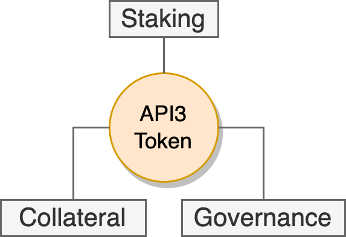
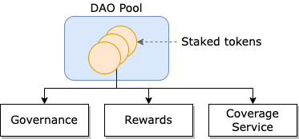
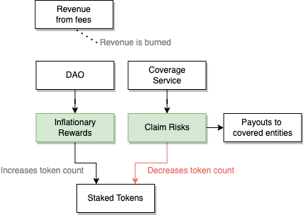

# {{$frontmatter.title}}

<TocHeader /> <TOC class="table-of-contents" :include-level="[2,3]" />

API3 DAO 有一个单独的质押池，称为 **DAO 池**。 在池中质押 API3 代币将授予代表权和质押奖励，但同时为 质押代币将被用作担保品，用于支付所需的 保险服务索偿。 为了做到这一点，该池设置三个代币工具，并实施保险服务，通过责任治理来平衡奖励和风险。

## 代币

API3 是 API3 项目的原生代币。 API3 生态系统是单币模式。 查看Medium帖子 [API3 Tokenomics Update](https://medium.com/api3/api3-tokenomics-update-f032d6e49b30) 以获取关于API3 代币经济的深入描述。

### 未质押代币

未质押的代币只是个人拥有所有权，不产生收入或 拥有投票权。 它们由市场定价并会有通货膨胀。

### 质押代币

质押的API3代币将用作链上保险服务的抵押品，该链上保险服务将为dAPI用户提供可量化、信任最小化的安全保证。 这些机制将消除在生态系统层面的中心化权威机构的需求。

质押就是指您将 API3代币存入DAO 池。 当向DAO池质押代币时，你可以获得每周的质押奖励，但也需要承担保险服务的风险。 你也被授予对活跃的DAO提案的投票权和通胀奖励。

若要质押代币，请参阅 [StakingTokens](../dashboard/staking.md)。 您可以质押任意次数。 您在 DAO 池中的质押代币的百分比 直接与您的奖励和风险中的百分比相关。 如果您 持有10%的质押代币，您将获得10%的总奖励，同时也将支付10%的保险 服务索偿。

## 代币工具

去中心化治理需要均衡的激励机制，恰当地反应积极和消极的结果。 换句话说， 治理应该因为良好的结果而得到奖励，因为不好的 结果而受到惩罚。 API3 代币旨在通过以下三个主要工具来实现这一点：

_API3 代币的主要工具。_

> 

1. [质押](dao-pool.md#staking): 授予API3 DAO的成员资格和[通胀奖励](dao-pool.md#inflationary-rewards).
1. [担保](dao-pool.md#collateral): 用于保护 用户免受dAPI 故障损失的保险服务。
1. [治理](dao-pool.md#governance): 在 API3 DAO中给予直接代表权。

请注意，必须配合使用这三个工具。 所有治理 方通必须获得质押奖励，才能治理中最大限度地增加 收益。 所有治理费方必须将其资金用作担保，以最大限度地减少 **_安全_** 风险。 _安全_" 指的是 "保证dAPI服务的可靠性"

参考API3白皮书
<a href="/api3-whitepaper-v1.0.2.pdf#API3%20tokenomics" target="_api3-whitepaper">
5.4章节 _"API3 代币经济学"_</a>。

### 质押

质押工具实现参与DAO的激励和调整 奖励措施。 将您的 API3 代币质押进入DAO 池， 您会获得 治理投票权，并参与为 API3 用户提供可量化 _安全性_ 的保险服务。 DAO池也给您 通胀奖励，并使您面临投保服务索偿的风险。

> 
> 
> 
在 DAO 池中质押授予 
> 治理投票权 通胀奖励，用于为保险 
> 服务提供资金，这种服务使质押代币面临投保服务索偿风险。

**收益：**

- 通过保险 服务费的收入分配，从DAO中获得配额(代币)。
- 通过燃烧保险费减少API3 代币的流通供应量，获得通胀奖励。
- 与未质押代币相比，代币通货膨胀保护得到改进。
- DAO提案的投票权。

**风险：**

- DAO 池中的相关代币用于偿付dAPI 用户可能由于 dAPI 故障造成的潜在资金损失。

若要质押代币，请参阅 [Dashboard](../dashboard/staking.md)。 您可以质押任意次数。 您在 DAO 池中的质押代币的百分比 直接与您的奖励和风险中的百分比相关。 如果您 持有10%的质押代币，您将获得10%的总奖励，同时也将支付10%的保险 服务索偿。

### 担保

担保工具使参与者分担DAO的运作风险， 促使他们将DAO运作降低到最低限度。

如果质押代币只产生收益，唯一的治理激励就是 最大限度地增加收入。 要做到这一点，就必须积极增加dAPI 用户的数量以及使用 dAPI 的保额。 这样做 会给一个 dAPI 带来过大的压力，让它更可能因为 一次攻击而发生故障。 因此，这在 去中心化数据传送中是不可持续的治理战略。

将治理方暴露在风险中会使他们的利益与DAO的利益一致。 当使用 dAPI 发生故障时，治理方需要通过链上保险服务受到惩罚，它提供了 dAPI 用户 的可量化和可信赖的安全保证。 [保险服务](dao-pool.md#coverage-service) 使用 DAO 的 质押代币 作为担保， 这意味着当通过争端解决协议确认了 dAPI 故障时， 用户损失将从 池的质押代币中得到补偿。

参考API3白皮书
<a href="/api3-whitepaper-v1.0.2.pdf#Collateral" target="_api3-whitepaper">
5.4.2章节 _"担保"_</a> 。

### 治理

治理工具使参与者有能力执行和管理 质押和担保操作。

在API3 DAO上获得代表权的唯一方法是将API3代币质押到池中。 质押代币给持有者通过DAO参与API3生态治理的权限。 代币持有者必须将他们的API3代币质押进入池中才能投票，这让他们可以获得每周的质押奖励，但也需要承担保险服务的风险。

所有治理方都将承担API3的所有风险和收益，并将 通过治理优化。 通胀奖励和被质押的代币作为担保 将在治理 质量方面产生积极的反馈循环。 初始代币持有者如果不想因通货膨胀而失去价值，就必须质押并承担风险 。 如果他们治理不善，则会因保险服务索赔而损失 担保代币， 这些代币将被返回到公开市场，并在那里被新的治理方购买。 相反，如果代币持有者治理得当，并带来代币市场稀缺性，则奖励分配将受到保护。 换言之， 治理代币被用作担保品，形成了健壮的Darwinian 结构，这种结构能够改善自己，并从故障中恢复过来。

## 变现

一般来说，API提供商订阅费的行业标准通常是 每月或每年支付。 因为这个方案既适合API提供商又适合他们的 客户。 API3 遵循同样的 dAPI 方案。

### dAPI 变现

若要访问 dAPI，dApp 将支付定期订阅费， 费用 可以根据特定的使用情况为dApp 固定或定制。 这些价格将由代表团队决定，dApp如果希望获得 [保险服务](dao-pool.md#coverage-service)还将包含保险费。 这笔付款可以用任何加密货币支付，它将通过一个基于流动池的去中心化交易所以 API3 代币形式被DAO 接收。

### API提供商补偿

API提供商将定期获得固定补偿，这也将适合他们现有的定价策略。 尽可能使用 稳定币来进行补偿，一些API 提供商明确拒绝处理 加密货币付款。 在这种情况下， DAO将提供一笔支付资金，为API提供商提供法币形式补偿。

## 奖励

API3 旨在规模化建立、维护 dAPI，并让其 [变现](dao-pool.md#monetization)。 它在这方面的成功可以通过其总收入来估计，因为这将随着dAPI的数量和它们所保护的资金数额而增加。 API3通过订阅费和保险服务费产生收入。 这些费用可以用任何加密货币支付，DAO将通过基于流动性池的去中心化交易所收到API3代币。 为了使治理激励与API3的成功保持一致，再加上通胀奖励，DAO的净收入的产生表现为API3代币的燃烧。 相比收入分配，这种机制通过通胀奖励和索赔风险将产生更加积极的质押激励。

> 
> 
> 
收入费用被燃烧销毁。 通胀奖励通过DAO分配。 保险服务索赔是通过池子中的质押代币付给dAPI服务的用户。

### 赚取奖励

赚取奖励很简单：拥有DAO池份额的每个人(所有 已经将 API3 代币质押到DAO池合约的人) 都会获得奖励，奖励也会 被添加到DAO池。 当您解除质押代币时，您将不会再 通过 这些代币赚取奖励。

请记住，当您质押时，您会收到不可转让的池子份额，池子份额即当前已质押代币的数量除以池子中质押代币总数。 因为奖励为池中添加了额外的代币，所以一个份额的“价值”并不一定是指一个代币。

### 通胀奖励

从本质上讲，通胀奖励促使代币持有人质押其代币并使代币保值。 然而，由于质押代币被用作 [保险服务](dao-pool.md#coverage-service)的 担保，存在一定风险。同时，促使 质押者参与治理，以确保将风险降到最低程度。 因为 两者的结合，一个用作担保的通胀治理代币 促使所有代币持有人参与治理。 它之所以很理想，是因为它 最大限度地实现去中心化治理。 每周会在链上通过合约默认和自动支付通胀奖励。 此外，通货膨胀奖励周期一年，让 治理方可以跟随项目成长长期获益。

<!--
> 

As a result the change in the total supply of API3 tokens is illustrated below.

> 
> -->

### 奖励计算和分配

质押奖励是浮动的，以使质押代币数量与质押目标量达成平衡。 换言之，如果质押数量低于目标，那么相关的奖励将会增加，反之亦然。 奖励不会有预定的 计划。

奖励数额按APR（年度百分比）计算。 您可以使用 [在线计算器](https://www.aprtoapy.com/) 得出APY (年收益百分比)。 每周APR将根据一个可调节的“APR 调整步骤”来调整。 此外，还有可调节的最低和最高APR值，但这些（尤其是最高APR）是作为安全措施存在的，不应该影响日常运作的奖励。 一般来说，调整质押目标将是奖励调节的主要工具。

每次调用 `mintRward` 函数后，奖励会以质押API3代币形式添加到DAO 池中。 `mintReward` 可以由任何人调用，每 "周期" 一次(单个周期 长度为1周)。 当它被调用时，一定量的 API3 代币被添加到 DAO 池中：

> `rewardAmount = totalStakedTokens * APR * epochLengthInSeconds / yearInSeconds / 100`
> 
> 了解更多信息请参阅 [智能合约源](https://github.com/api3dao/api3-dao/blob/main/packages/pool/contracts/RewardUtils.sol#L24)

此外，每次调用 `mintReward` 时， 年度百分比(奖励 率)根据 质押代币的总数量是否高于或低于目标，按APR 更新步骤大小(1%)调整更新 。 初步目标是50%， 如果质押代币的总数量少于代币总供应量的50%， `mintReward` 被调用， 下次奖励增加1% (反之亦然)。 这样，APR 将不断调整 ，但始终处于指定的最大值和最小值之间。

:::tip 示例

奖励分发用户 X 质押代币数量为 600 ，用户 Y 质押代币数量为 400， 所以在 1000 代币的 DAO 池中分别有60% (X) 和40% (Y) 的所有权。 在某 个星期内，奖励回报为1% (总共令牌10个)，池中现在是 1010 个令牌。 用户X的60%份额就变成了606个代币，而用户Y是404个。 请记住，10个奖励代币 不会在一年内解锁。

:::

### 奖励提取

奖励默认是可以提取的，除非奖励在 赚取后被锁定一年。 作为一个质押者，您在质押池的份额将始终 与权利成正比，包括赚取的奖励 。 当您解除质押并提取代币时，您将会收到 ：

- 您的代币，
- 加上您赚取的奖励份额，
- 减去一年内添加到池子中的奖励，这些奖励代币将继续质押 。

_总结奖励提取：_ 您将无法提取您一年时间内获得的奖励。 既然每周都能获得奖励，所以您可以认为这是一个 滚动解锁(您本周收到的奖励将在一年后解锁， 您下周将得到的奖励将在 1 年1 周 之后解锁，等等）。 一年锁定期是优秀去中心化治理的秘诀，它本质上是将质押者/治理者的激励与DAO/项目/代币的利益绑定，为期一年。

## 保险服务

::: warning 请注意保险服务还未上线.

在保险服务上线之前，必须通过一项要求达到50%法定人数的提案 才能激活

:::

API3 为 dAPI 用户提供了一个可量化的 _安全_ 的在线保险服务。 DAO 池中的质押代币用于偿付dAPI 用户可能由于 dAPI 故障造成的潜在资金损失。 这实现两个目标：

- 在dAPI发生故障的情形下，保险服务提供一个明确的、去信任的安全网络。
- 让治理方对dAPI 故障负责，因此 促使他们通过治理推动dAPI越来越安全。

API3 与 Kleros 共同开发了一个链上保险服务，为 dAPI 用户提供 可量化、去信任的 _安全_保障。 这保险服务将 保护dAPI 用户免受某些dAPI 故障造成损失，赔付以用户支出为限。 注意，即使API3没有提供这种服务， dAPI 用户可以使用第三方 解决方案获得链上保险服务。 第三方解决方案很可能会收取非常高的保费， 因为他们无法获得足够信息和专业知识来 准确评估dAPI风险。

准备推出的保险服务的特殊之处在于，它是由API3 DAO的治理方押入DAO池的资金来担保的。 因此，它不仅为dAPI用户提供了 _安全保障_ ，而且还为dAPI的治理创造了一个非常强大的激励机制，使dAPI的 _安全性_ 得到最大化，这将进一步降低保险服务成本。

### 索偿风险

池中的质押代币被用作保险服务 的担保。 任何赔付支出都会减少 池中的总代币数量。 减少的代币将从每个质押者在代币池中的份额按百分比中支出。

::: tip 示例

索偿用户X和用户Y的风险均质押了500 个API3代币，所以每个用户在1000个代币的池中各拥有50%的所有权 。 某个保险服务赔付支出为3.4个代币 ，池还剩996.6个代币。 用户X 和用户 Y 根据各自50%的所有权，现在每人拥有498.3个代币。

:::

### 索偿管理器

为了防止潜在的系统故障，DAO池可以部署特殊的 `ClaimsManager` 合约，直接提取质押的代币。 通过调用在 DAO 池合约中 `payOutClaim(address recipient, uint256 amount)` 命令，批准 `ClaimsManager` 合约 从 DAO 池向指定地址转账代币。 当这种情况发生时，质押代币 的数量下降了，同时相应的池份额值下降。 参考API3白皮书
<a href="/api3-whitepaper-v1.0.2.pdf#Insurance process" target="_api3-whitepaper">
6.3章节 _"保险服务流程"_</a> 。
