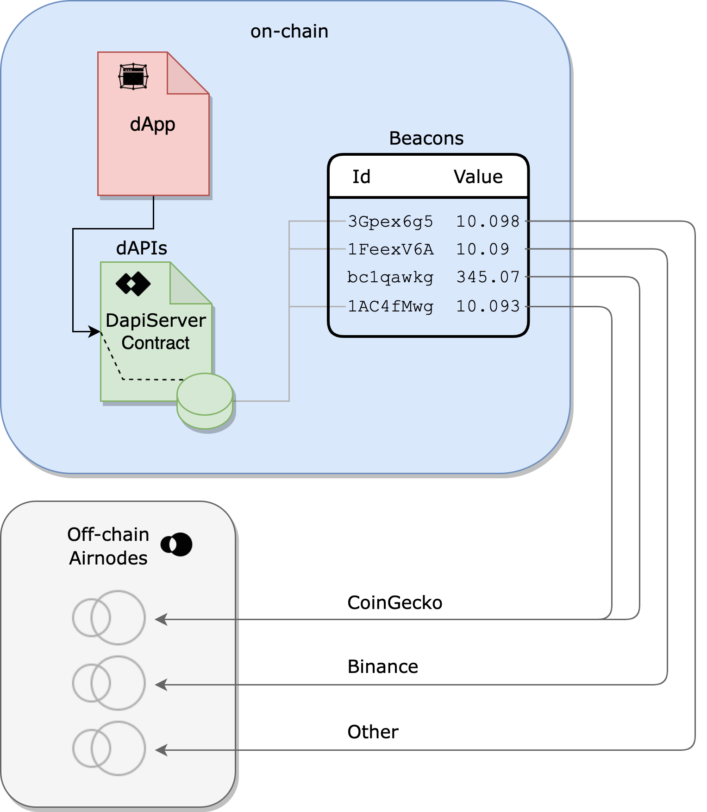

<TitleSpan>{{$frontmatter.folder}}</TitleSpan>

# {{$frontmatter.title}}

<VersionWarning/>

<TocHeader />
<TOC class="table-of-contents" :include-level="[2,3]" />

_See our article,
[dAPIs: APIs for dApps](https://medium.com/api3/dapis-apis-for-dapps-53b83f8d2493)
for an overview of dAPIs, and how they relate to
[Beacons](https://medium.com/api3/beacons-building-blocks-for-web3-data-connectivity-df6ad3eb5763)._

**dAPIs** are continuously updated streams of off-chain data, such as the latest
cryptocurrency, stock and commodities prices. They can power various
decentralized applications, such as DeFi lending, synthetic assets, stable
coins, derivatives, quality assurance, NFTs and more.

dAPIs are composed out of **Beacons**, which are _first-party data feeds_. A
Beacon is a first-party data feed because it is directly powered by the owner of
the data, the API provider. Compared to third-party oracle solutions, which
involve middlemen node operators, this approach is secure, transparent,
cost-efficient and scalable. API3 composes dAPIs out of individual Beacons or
Beacon sets, and provides tham as turn-key data feed solutions to projects
across many chains.

## DapiServer.sol

Developers use the
[DapiServer.sol](https://github.com/api3dao/airnode-protocol-v1/blob/main/contracts/dapis/DapiServer.sol)
contract to access dAPIs. The `DapiServer.sol` reads directly from its data
store of Beacons, which are powered by API provider-owned and operated Airnodes.

> 

Each dAPI has a human-readable name (e.g., `ETH/USD`) that makes them easily
accessible using the `DapiServer.sol` contract.

```solidity
// Calling a dAPI, such as ETH/USD, using the DapiServer contract
(value, timestamp) =
  IDapiServer(_dapiServerContractAddress).readDataFeedWithDapiName("ETH/USD");
```

See the [dApp Developers](./developers/) section to learn more about accessing
dAPIs.

## Advantages of dAPIs

**Security**: Data used to update a first-party data feed is cryptographically
signed by the owner of the data. This means that the data that will update a
feed cannot be tampered with once it leaves the source. Furthermore, the API
providers host our first-party oracle node, [Airnode](../airnode/), to push the
data to the chain themselves. This makes denial of service attacks by relayers
impossible.

**Transparency**: The cryptographic signatures can be used to verify that the
data that updates a feed comes directly comes from a specific API provider.
Furthermore, Beacons that underlie dAPIs allow the user to inspect what exact
API endpoint is being called, and with which parameters. Bringing this level of
transparency to the source of data in smart contracts gives dApp developers
confidence rather than relying on a pseudonymous selection of third parties.

**Cost-efficiency**: dAPIs are cost efficient compared to third-party data
feeds, as the user does not need to pay middlemen node operators for their
services. Furthermore, first-party data feeds do not require redundancy against
middlemen attacks. This makes single Beacon dAPIs feasible, and allow API3 to
provide a wide variety of data feeds in a cost-efficient way.

**Scalability**: An inherently secure and cost-efficient data feed design allows
API3 to build a lot of them, across many chains. This is supplemented by
purpose-designed Airnode protocols and relayer schemes to improve efficiency
while not degrading the security guarantees of a first-party data feed.

## Aggregated Values

dAPIs return aggregated values from underlying Beacons that live on-chain within
the storage of the `DapiSever.sol` contract. A dAPI can read from one or more
Beacons.

> 

dAPIs source Beacons in response to all dAPI requests. Beacons are stored
on-chain by API provider owned and operated Airnodes within the storage of the
`DapiServer.sol` contract. Beacon values are updated by first-party Airnodes run
by the API data providers themselves. This means that when calling a dAPI for
the latest price of an asset, a smart contract receives a value directly from
the Web3-enabled API data provider - not a third-party or a network of third
party middlemen.

Updating a Beacon is a simple and efficient system. When a Beacon's value falls
outside a pre-defined tolerance it self-updates by calling its associated
Airnode. To do so, the Airnode's owner (an API provider) configures the
pre-defined tolerance of a Beacon's value as well as the frequency to check for
tolerance deviation.
