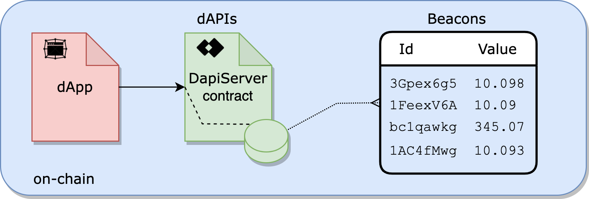

<TitleSpan>{{$frontmatter.folder}}</TitleSpan>

# {{$frontmatter.title}}

<VersionWarning/>

<TocHeader />
<TOC class="table-of-contents" :include-level="[2,3]" />

**dAPIs** are continuously updated streams of off-chain data, such as the latest
cryptocurrency, stock and commodities prices. They can power various
decentralized applications, such as DeFi lending, synthetic assets, stable
coins, derivatives, quality assurance, NFTs and more. Operated by the market’s
most trusted and reliable data providers, dAPIs are a transparent, cost
efficient and scalable way for smart contracts to connect to the data they need.

## Transparency

The implementation of dAPIs was designed to be both transparent and secure and
allow any dApp to consider the off-chain reputation of the data provider and
their suitability for any use case. Bringing this level of transparency to the
source of data in smart contracts gives dApp developers confidence rather than
relying on a pseudonymous selection of third parties.

## Aggregated Values

dAPIs return aggregated values from underlying Beacons that live on-chain within
the storage of the `DapiSever.sol` contract. A dAPI can read from one or more
Beacons.

> 

<!--img src="./assets/images/beacon-airnode.png" width="500px"/-->

<!--
- [Beacons](./#beacons): A single sourced value from an API provider operating a
  first-party Airnode oracle.
- [dAPIs](./#dapis): A virtual definition for a single Beacon or a set of
  Beacons.


- [Beacons](./#beacons): A single sourced value from an API provider operating a
  first-party Airnode oracle. A Beacon is addressed by its ID which is the hash
  of its parameters.
- [Beacon Sets](./#beacon-sets): An aggregation of Beacon values. A Beacon sets
  is addressed by its ID which is the hash of the underlying Beacon IDs.
- [dAPIs](./#dapis): A managed data feed that points to a Beacon or a Beacon
set. A dAPI is addressed by its human-readable name which is used to easily
acquire a single Beacon or Beacon set on-chain. -->
<!--
::: tip Coverage Policies

<span style="color:red;font-weight:bold">TODO: Need link to policies.</span>
Each type of data feed shown above has different [coverage policies]() with
different security guarantees.

:::-->

dAPIs source Beacons in response to all dAPI requests. Beacons are stored
on-chain by API provider owned and operated Airnodes within the storage of the
`DapiServer.sol` contract. Beacon values are updated by first-party Airnodes run
by the API data providers themselves. This means that when calling a dAPI for
the latest price of an asset, a smart contract receives a value directly from
the Web3-enabled API data provider - not a third-party or a network of third
party middlemen.

Updating a Beacon is a simple and efficient system. When a Beacon's value falls
outside a pre-defined tolerance it self-updates by calling its associated
Airnode. To do so, the Airnode's owner (an API provider) configures the
pre-defined tolerance of a Beacon's value as well as the frequency to check for
tolerance deviation.

<!--
> 

The entire implementation of Beacons was designed to be both transparent and
secure. The provider-operated nature of Beacons allows any dApp to consider the
off-chain reputation of the data provider and their suitability for any use
case. Bringing this level of transparency to the source of data in smart
contracts gives dApp developers confidence rather than relying on a pseudonymous
selection of third parties.

## Beacon Sets

A Beacon set is the aggregation of multiple Beacon values. The `DapiServer.sol`
contract aggregates the associated Beacon values when a request is made.

> 
>
> <p class="diagram-line" style="color:gray;margin-top:6px;">The DapiServer contract can return the aggregated value of multiple Beacons. </p>

In the diagram above a Beacon set, which defines an ETH/USD price, aggregates
values from multiple Beacons such as the CoinGecko ETH/USD value (3Gpex6g5), the
Binance ETH/USD value (1FeexV6A) and so on.
-->

<!--

## dAPIs

To exploit the benefit of Beacons and Beacon sets, dAPIs enable dApp developers
a powerful tool to quickly acquire single or aggregated Beacon values on-chain.
dAPI data feeds add a simplicity layer atop Beacons and Beacons sets by
providing an "ENS like" name that points to either. Think of a dAPI as a virtual
definition (alias) that points to a Beacon or Beacon set.

All data feeds that API3 serves on-chain can be read from a single
[DapiServer.sol](https://github.com/api3dao/airnode-protocol-v1/blob/main/contracts/dapis/DapiServer.sol)
contract. When using a dAPI, a dAPI _name_ is required using the functions
[readDataFeedWithDapiName()](./developers/read-data-feed-with-dapi-name.md) or
[readDataFeedValueWithDapiName()](./developers/read-data-feed-value-with-dapi-name.md).
-->

## DapiServer.sol

Developers use the
[DapiServer.sol](https://github.com/api3dao/airnode-protocol-v1/blob/main/contracts/dapis/DapiServer.sol)
contract to access dAPIs. The `DapiServer.sol` reads directly from its data
store of Beacons which are powered by API providers owned and operated Airnodes.

> 

Each dAPI has a human readable name (e.g. AVAX/USD) that makes access easy using
the `DapiServer.sol` contract.

```solidity
// Calling a dAPI, such as AVAX/USD, using the DapiServer contract.
(value, timestamp) =
  IDapiServer(_dapiServerContractAddress).readDataFeedWithDapiName('AVAX/USD');
```

See the [dApp Developers](./developers/) section to learn more about accessing
dAPIs.
