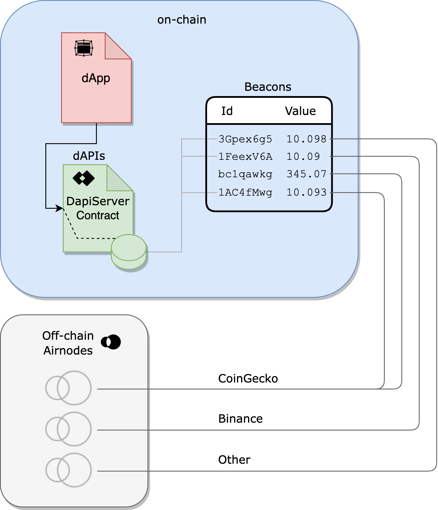

<TitleSpan>{{$frontmatter.folder}}</TitleSpan>

# {{$frontmatter.title}}

<VersionWarning/>

<TocHeader />
<TOC class="table-of-contents" :include-level="[2,3]" />

_See our article,
[dAPIs: APIs for dApps](https://medium.com/api3/dapis-apis-for-dapps-53b83f8d2493)
for an overview of dAPIs, and how they relate to
[Beacons](https://medium.com/api3/beacons-building-blocks-for-web3-data-connectivity-df6ad3eb5763)._

**dAPIs** are continuously updated streams of off-chain data, such as the latest
cryptocurrency, stock and commodities prices. They can power various
decentralized applications, such as DeFi lending, synthetic assets, stable
coins, derivatives, quality assurance, NFTs and more. Operated by the market’s
most trusted and reliable data providers, dAPIs are a transparent, cost
efficient and scalable way for smart contracts to connect to the data they need.

## Transparency

The implementation of dAPIs was designed to be both transparent and secure and
allow any dApp to consider the off-chain reputation of the data provider and
their suitability for any use case. Bringing this level of transparency to the
source of data in smart contracts gives dApp developers confidence rather than
relying on a pseudonymous selection of third parties.

## Aggregated Values

dAPIs return aggregated values from underlying Beacons that live on-chain within
the storage of the `DapiSever.sol` contract. A dAPI can read from one or more
Beacons.

> 

dAPIs source Beacons in response to all dAPI requests. Beacons are stored
on-chain by API provider owned and operated Airnodes within the storage of the
`DapiServer.sol` contract. Beacon values are updated by first-party Airnodes run
by the API data providers themselves. This means that when calling a dAPI for
the latest price of an asset, a smart contract receives a value directly from
the Web3-enabled API data provider - not a third-party or a network of third
party middlemen.

Updating a Beacon is a simple and efficient system. When a Beacon's value falls
outside a pre-defined tolerance it self-updates by calling its associated
Airnode. To do so, the Airnode's owner (an API provider) configures the
pre-defined tolerance of a Beacon's value as well as the frequency to check for
tolerance deviation.

## DapiServer.sol

Developers use the
[DapiServer.sol](https://github.com/api3dao/airnode-protocol-v1/blob/main/contracts/dapis/DapiServer.sol)
contract to access dAPIs. The `DapiServer.sol` reads directly from its data
store of Beacons which are powered by API providers owned and operated Airnodes.

> 

Each dAPI has a human readable name (e.g. AVAX/USD) that makes access easy using
the `DapiServer.sol` contract.

```solidity
// Calling a dAPI, such as AVAX/USD, using the DapiServer contract.
(value, timestamp) =
  IDapiServer(_dapiServerContractAddress).readDataFeedWithDapiName('AVAX/USD');
```

See the [dApp Developers](./developers/) section to learn more about accessing
dAPIs.
