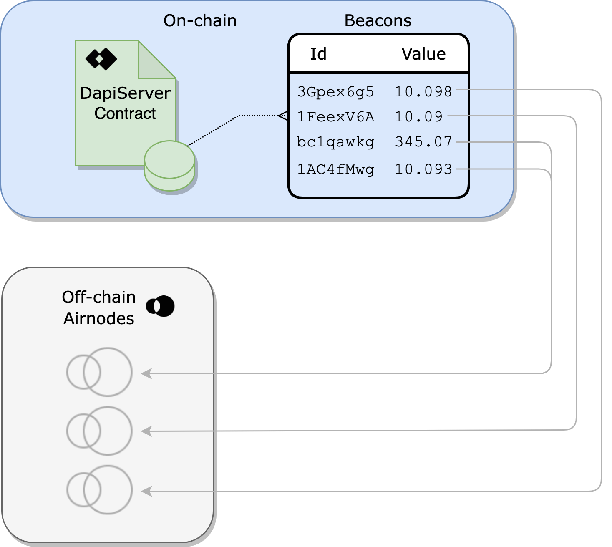
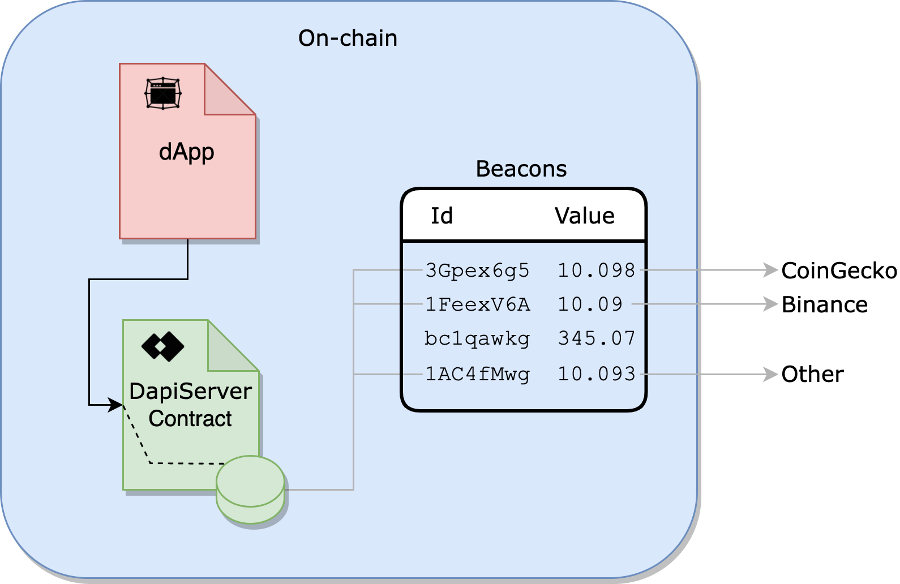
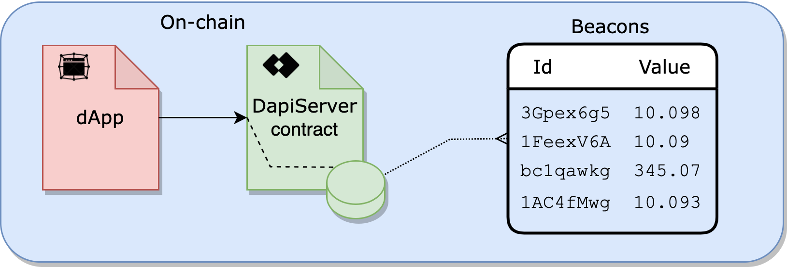

<TitleSpan>{{$frontmatter.folder}}</TitleSpan>

# {{$frontmatter.title}}

<VersionWarning/>

<TocHeader />
<TOC class="table-of-contents" :include-level="[2,3]" />

Data feeds are continuously updated streams of off-chain data, such as the
latest cryptocurrency, stock and commodities prices. They can power various
decentralized applications, such as DeFi lending, synthetic assets, stable
coins, derivatives, quality assurance, NFTs and more. Operated by the market’s
most trusted and reliable data providers, data feeds are a transparent, cost
efficient and scalable way for smart contracts to connect to the data they need.

Data feeds have two major components:

- [Beacons](./#beacons): A single sourced value from an API provider operating a
  first-party Airnode oracle.
- [dAPIs](./#dapis): A virtual definition for a single Beacon or a set of
  Beacons.

## Beacons

Behind all Beacons are first-party oracles run by the API data providers
themselves. This means that when calling a data feed for the latest price of an
asset, a smart contract receives a value directly from the Web3-enabled API data
provider behind the Beacon - not a third-party or a network of third party
middlemen.

Updating a Beacon is a simple and efficient system that leverages first-party
Airnodes to keep individual Beacon values up-to-date. When a Beacon's value
falls outside a pre-defined tolerance it self-updates by calling its associated
Airnode.

In the figure below, on-chain Beacons request updates from their off-chain
Airnode. The Airnode's owner (an API provider) configures the pre-defined
tolerance of a Beacon's value as well as the frequency to check for tolerance
deviation. The Beacon's value is updated when the off-chain value falls outside
the Beacons value's defined tolerance. Note that an Airnode can be related to
more than one Beacon.

> 

The entire implementation of Beacons was designed to be both transparent and
secure. The provider-operated nature of Beacons allows any dApp to consider the
off-chain reputation of the data provider and their suitability for any use
case. Bringing this level of transparency to the source of data in smart
contracts gives dApp developers confidence rather than relying on a pseudonymous
selection of third parties.

## dAPIs

To exploit the benefit of Beacons, dAPIs enable dApp developers a powerful tool
to quickly acquire single or aggregated Beacon values on-chain. A dAPI is a
virtual definition (alias) that points to a single Beacon or a set of Beacons,
the latter returning an aggregated value from a set of Beacons that utilize a
common data schema. A dAPI has a name which is used to get its value, see
[readDataFeedWithDapiName()](./developers/read-data-feed-value-with-dapi-name.md)
but can also be read using the dAPI's ID, see
[readDataFeedWithId()](./developers/read-data-feed-value-with-dapi-name.md).

> 
>
> 
A dAPI can return the aggregated value of multiple Beacons. 

In the diagram above a dAPI, which defines an ETH/USD price, aggregates values
from multiple Beacons such as the CoinGecko ETH/USD value (3Gpex6g5), the
Binance ETH/USD value (1FeexV6A) and so on. This is just one use case for a dAPI
from endless possibilities.

## DapiServer.sol

Developers use the on-chain data feed server contract (`DapiServer.sol`) to get
a Beacon value or the value of an aggregated Beacon set . See the
[dApp Developers](./developers/) section to learn more.

The data feed contract
([DapiServer.sol](https://github.com/api3dao/airnode-protocol-v1/blob/main/contracts/dapis/DapiServer.sol))
maintains a cache of on-chain Beacon values readily available for smart
contracts to retrieve instantly as illustrated in figure below. A Beacon is
updated when a pre-defined tolerance of the Beacon's value is detected. Each
Beacon has its own configuration parameters that define when and how it updates.

> 
>
> 
<code>DapiServer</code> can return a single Beacon value or the  aggregated value of a  Beacon set. 

