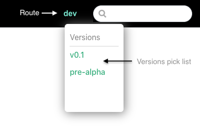

# {{$frontmatter.title}}

<TocHeader />
<TOC class="table-of-contents" :include-level="[2,3]" />

All versions of the docs are inside the api3-docs repo. Versioning of the docs is not implemented using traditional tags in a GitHub repo. This allows all versions to be available while using the docs. It also allows older versions to be updated independently of any other version.

## Redirects

The routes in the `redirects` file should never be changed unless the owner approves. 
It may be necessary to update the paths as it is likely to contain changes to the paths. Change `/next` to the proper release if needed.

```
/latest /pre-alpha
/latest/members /pre-alpha/members
/airnode-starter /pre-alpha/tutorials/airnode-starter.html
/pre-alpha/airnode-starter /pre-alpha/tutorials/airnode-starter.html
...
/r/reserved-parameters /next/reference/specifications/reserved-parameters.html
```

Also check that the directory path to a file has not changed.

For example if:<code>/r/reserved-parameters /next/reference/specifications/reserved-parameters.html</code>
was changed to:
<code>/r/reserved-parameters /next/reference/<span style="color:red;">specs</span>/reserved-parameters.html</code>

## Base Routes

All sub-folders in _/docs_ are base routes except for `/.vuepress`. Each represents a logical group or set of documentation. The `/airnode` folder contains versions of the Airnode docs.

```text
docs/
 |- airnode/
    |- v0.2/
    |- next/
    |- pre-alpha/
 |- dev/
 |- dev-airnode/
 |- dao-members
 
```

## Versions

A route in the `/airnode` folder becomes a version of the Airnode docs when declared as a version in _.vuepress/config.json_.

- **name:** The name of the version to display in the pick-list and as the current route in the navbar.
- **url:** The entry path to the version, usually an airnode route.

```json
versions:[
  {name:'v0.2', url:'/airnode/v0.2/'},
  {name:'pre-alpha', url:'/airnode/pre-alpha/'},
],
```
  > 

## Create a Version

It is assumed that the `/next` folder is the work in progress that will become the new (next) version.

1. Change the name of the `/next` folder (e.g. `/v0.2`).

2. Changes to `config.js`. 
 
     - Update the `versions` key in .vuepress/config.json. Provide the version name and url. The url is the first markdown file to show when a version is selected in the navbar. A url without a file will load the root README.md file of the base route by default.
     - Set the `latestVersion` to the start path of the latest version.
     - Set the `themeConfig.startPath` to the start path of the latest version.

    ```json
    versions:[
      {name:'v0.2', url:'/airnode/v0.2/'},
      {name:'pre-alpha', url:'/airnode/pre-alpha/'},
      ...
    ],
    latestVersion: '/airnode/v0.2/',
    ...
    themeConfig:{
      startPath:'/airnode/v0.2/',
    }
    ```

3. The re-named `/next` version will probably contained hyperlinks to remote GitHub repos. More than likely these links will need updating in the version just created.

4. Point all [redirects](versioning.md#redirects), when relevant, to the new version in the `docs/.vuepress.redirects` file. Usually this is related to redirects for items such as `/latest/members` that want to display docs for the latest version. Be mindful of any redirects with `/next` in the path.

    ```bash
    /latest /airnode/pre-alpha
    /latest/members /airnode/pre-alpha/members
    ...
    /r/reserved-parameters /airnode/next/reference/specifications/reserved-parameters.html
    ```

## Update Older Versions

Older versions and non-version base routes can be updated at any time, even while work progresses on the **/next** base route. It should be noted that such updates will not be reflected in any other base route, if needed they must be managed separately.
