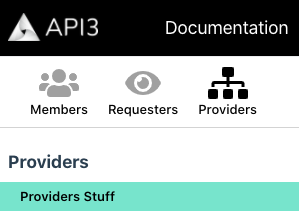

# {{$frontmatter.title}}

<TocHeader />
[[toc]]

All versions of the docs are inside the api3-docs repo. Versioning of the docs is not implemented using traditional tags in a GitHub repo.
## Understand Versions

Different versions of the docs live in the project's api3-docs/docs folder.

```text
docs/
 |- 0.1.0/
 |- pre-alpha/
 |- next/
```

### next

The **next** folder is a working/future version. It is never shown in the production website on gh-pages. The next release can be accessed in production by changing the browser URL to **.../api3-doc/next/**.

### Declare a Version

A folder in /docs is declared as a version in the .vuepress/config.json file along with its *url* (entry path).

```json
versions:[
  {name:'next', url:'/next/grp-providers/'},
  {name:'0.1.0', url:'/0.1.0/grp-providers/'},
  {name:'pre-alpha', url:'/pre-alpha/'},
],
```

### Version Sidebars

Each version has 1-N sidebars. For example, **pre-alpha** has only *one* sidebar.js file in its root /docs/pre-alpha along with its markdown files and sub-folders. The folders inside /docs/pre-alpha are groups of documents.

```text
docs/
|- 0.1.0/
|- pre-alpha/
   |- ...folders
   | README.md
   |- sidebar.js
|- next/
```

**0.1.0** has *four* sidebar.js files along with the markdown files for each. These folders split the version into categories. The sidebar in the root of the version is known as the *Info* category. There can only be one *Info* category. Sidebars in the sub-folders are known as *Role* categories.

- /docs/0.1.0
- /docs/0.1.0/grp-members
- /docs/0.1.0/grp-requesters
- /docs/0.1.0/grp-providers

```text
docs/
|- 0.1.0/
   |- grp-members
      |- ...folders
      | README.md
      |- sidebar.js
   |- grp-requesters
      |- ...folders
      | README.md
      |- sidebar.js
   |- grp-providers
      |- ...folders
      | README.md
      |- sidebar.js
   |- README.md
   |- sidebar.js
|- pre-alpha/
|- next/
```

These categories are represented in the sidebar header as buttons the user can use to switch between sidebars. The *Info* category is represented with the smaller info icon. The *Role* categories are represented as larger icons with a label. 

The **SidebarHeader** is a custom Vue Component. It maintains an array of the header definitions for the version.



Like versions, sidebarHeaders are declared in the .vuepress/config.json file. Note that there is a implied mapping between versions and sidebarHeaders: version.name = sidebarHeaders.vrs. There can only be one **Info button** for each header and it is declared using the *info* key.

```json{1,6}
versions:[
  {name:'next', url:'/next/grp-providers/'},
  {name:'0.1.0', url:'/next/grp-providers/'},
  {name:'pre-alpha', url:'/pre-alpha/'},
],
sidebarHeaders:[
  {vrs:'pre-alpha', current:true, buttons:[]},
  {vrs:'0.1.0', buttons:[
    {isActive: false, info:true,          baseUrl:'/next/', img:'info-circle'},
    {isActive: false, label:'Members',    baseUrl:'/next/grp-members/', img:'users'},
    {isActive: false, label:'Requesters', baseUrl:'/next/grp-requesters/', img:'eye'},
    {isActive: true,  label:'Providers',  baseUrl:'/next/grp-providers/', img:'sitemap'}
  ]}
  {vrs:'next', buttons:[
    {isActive: false, info:true,          baseUrl:'/next/', img:'info-circle'},
    {isActive: false, label:'Members',    baseUrl:'/next/grp-members/', img:'users'},
    {isActive: false, label:'Requesters', baseUrl:'/next/grp-requesters/', img:'eye'},
    {isActive: true,  label:'Providers',  baseUrl:'/next/grp-providers/', img:'sitemap'}
  ]}
],,
```

## Create a Version

It is assumed that the **next** folder is the work in progress that will become the new version.

1. Make a copy of the **next** folder and name it (e.g. 0.2.0).

1. Update the **versions** key in .vuepress/config.json. Provide the version name and url. The url is the first markdown file to show when a version is selected in the navbar. A url without a file will load the README.md by default.

1. Update the **sidebarHeaders key** in .vuepress/config.json.
    - Leave the **btn key** as an empty array for versions that only have one sidebar. 
    - For versions with multiple sidebars, add each folder that contains a sidebar into the **btn** key array.
        - The **btn.info key** declares the *Info btn* which is the files in hte rott of the version folder.
        - The **btn.baseUrl** is the first markdown file to show when a button is selected in the sidebar header. A btn.url without a file will load the README.md by default. 
        - The **btn.label** key is the button text. 
        - The **btn.isActive** key is the default (highlighted) button and sidebar to load by default.
        - The **btn.img** key defines the image associated with the button.

## Update Older Versions

Older versions can be updated at any time, even will work progresses on the **next** version. It should be noted that such updates will not be reflected in the next version, if needed they must be added separately.

## Hidden Versions

A version can be add to the **sidebarHeaders** key in .vuepress/config.json and not the **versions** key. Doing so will make the version available to users that type the proper path into the browser URL bar. The version will not be available to select from the versions hyperlink in the navbar. (e.g. The **/api3-docs/dev/** documents are are implemented using this technique.)
