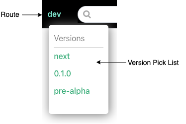

# {{$frontmatter.title}}

<TocHeader />
[[toc]]

All versions of the docs are inside the api3-docs repo. Versioning of the docs is not implemented using traditional tags in a GitHub repo. This allows all versions to be available while using the docs. It also allows older versions to be updated independently of any other version.

## Base Routes

All sub-folders in _/docs_ are base routes.

```text
docs/
 |- 0.1.0/
 |- dev
 |- next/
 |- pre-alpha/
```

## Versions

A base route becomes a version of the docs when declared as a version in _.vuepress/config.json_.

- **name:** the name of the version to display in the pick-list
- **url:** the entry path to the version, usually the root of the base route

```json
versions:[
  {name:'0.1.0', url:'/0.1.0/'},
  {name:'pre-alpha', url:'/pre-alpha/'},
],
```
  > 

### /next and /dev

The **/next** and **/dev** folders are base routes that are not listed in the versions array. They are never shown in the version pick list, production or development. Access them by manually entering their base route name into the browser's URL bar.

## Create a Version

It is assumed that the **/next** folder is the work in progress that will become the new version.

1. Make a copy of the **/next** folder and name it (e.g. 0.2.0).

1. Update the **versions** key in .vuepress/config.json. Provide the version name and url. The url is the first markdown file to show when a version is selected in the navbar. A url without a file will load the root README.md by default.

    ```json
    versions:[
      {name:'0.2.0', url:'/0.2.0/'},
      {name:'0.1.0', url:'/0.1.0/'},
      {name:'pre-alpha', url:'/pre-alpha/'},
      ...
    ],
    ```

2. The **/next** version probably contained hyperlinks to remote GitHub repos. More than likely these links will need updating in the version just created.

## Update Older Versions

Older versions and non-version base routes can be updated at any time, even while work progresses on the **/next** base route. It should be noted that such updates will not be reflected in any other base route, if needed they must be added separately.
