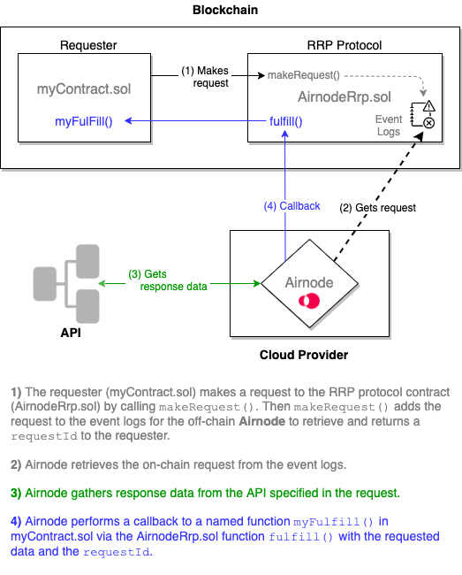

# {{$frontmatter.title}}

A **Developer** is you, if you wish to consume off-chain data from APIs. You do so using Airnodes. An Airnode is a first-party oracle that will push off-chain API data to your on-chain contract. In the diagram below your contract is called a requester. It will make a request to the on-chain RRP protocol contract (AirnodeRrp.sol) that will queue the request. The off-chain Airnode will access the queue, get the API data and perform a callback to the requester.

In summary you only need to do two things.

- Call `makeRequest()` on the AirnodeRrp.sol contract which returns a `requestId`.
- Add a `myFulfill()` function (call it what you like) to your requester (your contract) where the off-chain Airnode can send the requested data when ready. The data includes the same `requestId` returned when the request was made.

  > 

For a more detailed diagram see the first image in the [Calling an Airnode](./call-an-airnode.md) doc.