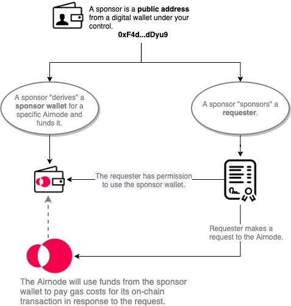

# {{$frontmatter.title}}

<TocHeader />
<TOC class="table-of-contents" :include-level="[2,3]" />

As a developer it helps to understand what a **requester** is and what a **sponsor** does. They are both important parts of the Airnode ecosystem. This doc will further define them and walk you through the process to derive a sponsor wallet and to sponsor a requester using the admin CLI commands. 

## What is a Requester?

The term **requester** is important to remember. It is mentioned in these docs and in the GitHub code. When requester is mentioned, the reference is to your smart contract that calls an Airnode. 

> 

As an example see the `myContract.sol` contract in the diagram within the [Overview](./) doc, it is a requester.

## What is a Sponsor?

Equally important is the term **sponsor** also found thought the docs and code. A sponsor is the public address of a wallet (Ethereum account) you control. Usually you would have just one but can have multiples if desired. You will use the sponsor to derive a separate "sponsor wallet" for each Airnode you use and also to sponsor requesters. 

In the diagram below, a _sponsor_ derives a "sponsor wallet" for a specific Airnode. Then the _sponsor_ sponsors a "requester".

>

When you sponsor a requester you are giving it permission to use the sponsor wallet
associated with the Airnode. When the requester makes a request to the Airnode, the Airnode will use funds from the sponsor wallet to pay its on-chain gas cost to make a transaction.


A developer decides to build a requester contract that makes requests to a specific Airnode. Using a sponsor the developer derives a "sponsor wallet" for the Airnode. The developer funds the sponsor wallet, then calls setSponsorshipStatus() in AirnodeRrp with the address of their requester contract to sponsor it. This means the developer is now the sponsor of their requester contract, i.e., the requester contract can make Airnode requests that will be fulfilled by their sponsor wallet.

## Admin CLI Commands

There are several requester related commands in the [@api3/airnode-admin](../reference/cli-commands.md#create-requester) package. Here we will use three commands to create a requester record, endorse client contracts and fund Airnodes.

1. Create a Requester Record:[`create-requester`](../reference/cli-commands.md#create-requester)creates a requester record.
2. Endorse Client Contracts:[`endorse-client`](../reference/cli-commands.md#endorse-client)endorses a client contract.
3. Fund Airnodes:[`derive-designated-wallet`](../reference/cli-commands.md#derive-designated-wallet)creates a requester specific wallet associated with an Airnode.

## Part 1: Create a Requester Record

Each requester needs to create a requester record and get assigned a requester index. To create a new requester record you will need the following.

- A blockchain providerURL such as the URL with your Infura providerID on the Ropsten network.
- A mnemonic for gas to fund the record creation.
- An address that will be used to administer the requester record (requesterAdmin) in the future, use the default public address of the mnemonic. 

::: tip mnemonic
This wallet pays the transaction gas costs to write the requester record. This is not the wallet(s) that will pay gas costs to actually execute any Airnode, for that the Airnode themselves will create sponsor wallets on behalf of your sponsor record. [Part 3](sponsorship.md#part-3-funding-airnodes) will explain more about sponsor wallets.
:::

[@api3/airnode-admin create-requester](../reference/cli-commands.md#create-requester)

```bash
npx @api3/airnode-admin create-requester \
  --providerUrl https://ropsten.infura.io/v3/<KEY> \
  --mnemonic "cricket oppose ..." \ # Used to pay the gas costs for this transaction.
  --requesterAdmin 0xaBd9daAdf...   # The admin address, mnemonic public key.

  # Returns
  Created requester with index 6 
  and admin address 0xaBd9daAdf...
```

The command `create-requester` will return a `requester index` and the `requesterAdmin` address that were passed to execute the command. It is important to remember the requester index for future use.

## Part 2: Endorse Client Contracts

A requester endorses a client contract allowing it make Airnode requests on behave of the requester. Your client contract should already be deployed. 

Endorsing a client contract means it can make Airnode requests, paid for by a designated wallet associated with the Airnode and the requesterIndex from your requester record. [Part 3](sponsorship.md#part-3-funding-airnodes) will explain more about designated wallets.

To endorse a client contract you will need the following.

- A blockchain providerURL such as the URL with your Infura providerID on the Ropsten network.
- A mnemonic for gas to fund the endorsement.
- The `requesterIndex` returned from the call to create-requester. (Part #1 above)
- The `clientAddress` which is the public address of the client contract.

[@api3/airnode-admin endorse-client](../reference/cli-commands.md#endorse-client)

```bash
npx @api3/airnode-admin endorse-client \
  --providerUrl https://ropsten.infura.io/v3/<KEY> \
  --mnemonic "cricket oppose ...." \ # Used to pay the gas costs for this transaction.
  --requesterIndex 6 \                 # The requesterIndex of the requester record.
  --clientAddress 0x2c2e12...          # The public address of the contract to endorse.

  # Returns
  Endorsed 0x2c2e12... 
  by requester with index 6
```

The command `endorse-client` will return the client contract address and the requester index that were passed to execute the command. 

## Part 3: Funding Airnodes

To fund a particular Airnode, a requester instructs the Airnode to derive a _designated wallet_ on behave of the requester  using the Airnode's ID and the requester's requesterIndex. Once the wallet is created it must be funded using the public address returned by the command`derive-designated-wallet`. Each Airnode keeps a list of requester designated wallets that can access the Airnode. Learn more about [designated wallets](../reference/protocols/request-response/designated-wallet.md).

Client contracts endorsed by a requester will have access to all Airnodes the requester has funded using the designated wallet. This allows the requester to cover the gas cost when executing an Airnode. However this does not cover the cost of API data that the Airnode serves, see [API Provider Fees](fees.md#api-provider-fees). Requesters need to keep their designated wallets topped off if they want the Airnodes to fulfill requests made by their endorsed client contracts.

Since the designated wallet is recorded in the cloud provider (i.g., AWS) where Airnode functions live, there are no on-chain transaction gas costs when deriving a designated wallet.

<SponsorWalletWarning/>

Learn more about [sponsor wallets](../reference/protocols/request-response/sponsor-wallet.md) in the reference section.

To fund an Airnode simply tell any Airnode to derive a _designated wallet_ for your requesterIndex. This will return the public address of the designated wallet so you can fund it.

To derive a designated wallet for an Airnode and fund it, you will need the following.

- A blockchain providerURL such as the URL with your Infura providerID on the Ropsten network.
- The `airnodeId` of the desired Airnode.
- The requester's `requesterIndex` that was generated when creating a requester record.

[@api3/airnode-admin derive-designated-wallet](../reference/cli-commands.md#derive-designated-wallet)

```bash
npx @api3/airnode-admin derive-designated-wallet \
  --providerUrl https://ropsten.infura.io/v3/<KEY> \
  --airnodeId 0xe1e0dd... \ # The ID of the Airnode the requester wants access to.
  --requesterIndex 6        # The requesterIndex identifies the requester record.

  # Returns
  Derived the address of the wallet designated for requester with index 6 
  by Airnode with ID 0xaebd88bf458dfc4899d... 
  to be 0xa5C073E31fAb1F8acf... # Here is the wallet's public address.
```

The command derive-designated-wallet will return the public address of the designated wallet to be funded.

## Record Keeping

During and after creating/managing your requester record there are some items you should write down for future use.

|Item|Description|
|-|-|
|Maintenance wallet (mnemonic)|A minimally funded mnemonic used to change your requester record, client contract endorsements, etc. in the future.|
|requesterIndex|* An identifer (number) you received when creating a requester record.|
|requesterAdmin|Usually the default public address of the mnemonic you used when creating a requester record.|
|Airnode designated wallets|** For each Airnode you have funded a custodial designated wallet was created. The Airnode keeps the private key and returns you the public address which you use to add funds. |


\* Do not loose your requesterIndex, it cannot be recovered.

\** You can acquire the public address of a designated wallet later, if you loose it, by running the command`derive-designated-wallet`again. Since the designated wallet was already created for the requesterIndex/airnodeId pair, the command will only return the known public address for the wallet.