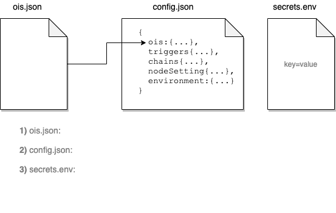

# {{$frontmatter.title}}

<TocHeader />
<TOC class="table-of-contents" :include-level="[2,3]" />

A **API Provider** is you, if you wish to publish data from your API to on-chain contracts which are called requesters. You can do so by building an Airnode. An Airnode is a first-party oracle that will push off-chain API data to any on-chain requester. See the [Developer](../grp-developers/) section to learn more about how developers will use your Airnode.

> 

In summary you only need to do a few things.

- Create cloud provider account if you do not have one.
- Get a blockchain provider URL for the chain you wish to use (mainnet and/or testnet).
- Create a config.json and secrets.env file that defines your Airnode.
- Call the required CLI commands to deploy your Airnode.

## The Term Requester

The term requester is important to remember. It is mentioned in these docs and in the code. When _requester_ is mentioned, the reference is to a contract that calls your Airnode.