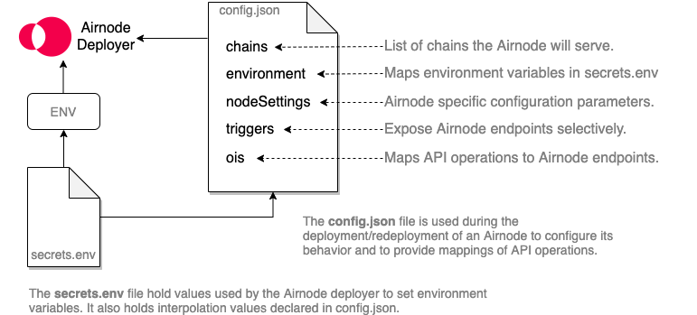

# {{$frontmatter.title}}

<TocHeader />
<TOC class="table-of-contents" :include-level=[2,5] />

An Airnode is deployed or redeployed using configuration values from its `config.json` and `secrets.env` files. The  `config.json` specifies the [OIS](../../../reference/specifications/ois.md) (Oracle Integration Specifications) and other specific configuration details. The `secrets.env` file includes security credentials such as API keys and chain provider URLs.

> 

---

It is assumed that you have already read the guide [API Integration](api-integration.md) and created an OIS json object. The [ois.json](../../../reference/templates/ois-json.md), [config.json](../../../reference/templates/config-json.md) and [secrets.env](../../../reference/templates/secrets-env.md) templates are useful for this guide.

<details class="collapse-box">
  <summary class="collapse-box-summary">
  Other tips while using this guide.
  </summary>

  - Refer to the [config.json](../../../reference/deployment-files/config-json.md) and [secrets.env](../../../reference/deployment-files/secrets-env.md) _reference_ while using this guide.

  - Open the _template_ [config.json](../../../reference/templates/config-json.md) in another browser window to follow along. 

  - View the _example_ [config.json](../../../reference/templates/config-json.md) file from the [Airnode Starter tutorial](../../tutorial/airnode-starter.md).

</details>

---

## Creating `config.json`

Use the [config.json template](../../guides/templates/config-json.html) to build your own Airnode configuration file. In the template, `config.json` has 6 fields:

- `ois`
- `triggers`
- `chains`
- `nodeSettings`
- `environment`

### ois

The `ois` field is a list OIS objects that Airnode will be serving. This means that a single instance of an Airnode can serve multiple APIs. You can simply copy paste OIS objects that you will be serving into the `ois` list. Use the previous guide [API Integration](api-integration.md) to create an OIS object.

### triggers

The `triggers` field allows you to expose Airnode endpoints from an OIS selectively. For example, your OIS may include 10 endpoints, but you may only want to serve 2. Instead of modifying the OIS, you would simply create triggers for the 2. Similarly, you may want to serve an endpoint through the request–response protocol, but not the pub–sub protocol. In that case, you would only create the trigger for the request–response protocol.

Note that currently only the request–response protocol is implemented. You can list the endpoints that you want to serve with the request–response protocol under `triggers.request`. In most cases, you would create a trigger for each endpoint in your OIS object.

Each trigger has an `oisTitle` and `endpointName` that allow you to refer to one of the endpoints in an OIS object. Remember that an Airnode's config.json file can have more than one OIS object. Fill these in accordingly. 

Next add an `endpointId` to the trigger which is the ID that the requester will use in their on-chain requests to refer to this specific trigger. There are three ways to create an `endpointId`.

1. As a convention, we recommend this to be chosen as the Keccak256
2. hash of `{oisTitle}/{endpointName}`. In JS (using ethers.js):

    ```js
    endpointId = ethers.utils.keccak256(ethers.utils.defaultAbiCoder.encode(['string'], [`${oisTitle}/${endpointName}`]));
    ```

3. You can also use [`@api3/airnode-admin`](https://github.com/api3dao/airnode/tree/pre-alpha/packages/admin#derive-endpoint-id) to derive endpoint IDs using the `oisTitle` and `endpointName`.

    ```bash
    Derives the endpoint ID using the OIS title and the endpoint name using the convention described here.

    npx @api3/airnode-admin derive-endpoint-id \
      --oisTitle "My OIS title..." \
      --endpointName "My endpoint name..."
    ```

### chains

The `chains` field (array) lists the blockchains the Airnode deployment will serve on and specifies respective parameters. Currently Airnode only supports Ethereum blockchains as denoted by `type: "evm"`. Each row in the `chains` represents an Ethereum blockchain the Airnode will serve as identified by the `id`. There are several supported blockchains.

> <ChainsSupported :version="'0.1.0'" />

For additional information about chain parameters see the [Technology > Deployment Files > config.json](../../../reference/deployment-files/config-json.html#chains).

```json
  "chains": [
    {
      "id": "3",
      "type": "evm",
      "providerNames": [
        "infura_ropsten"
      ],
      "contracts": {
        "AirnodeRrp": "0xF6d2675468989387e96127546e0CBC9A384fa418"
      },
      "airnodeAdmin": "{FILL_AIRNODE_ADMIN}",
      "authorizers": [
        "0x0000000000000000000000000000000000000000"
      ],
      "blockHistoryLimit": 300,
      "minConfirmations": 0,
      "ignoreBlockedRequestsAfterBlocks": 20
    }
  ],
```

#### id

An Airnode can serve multiple chains simultaneously. Set the ID of the desired chain in `id` (e.g., `3` for Ropsten testnet). See the list of supported chains above for each chain's ID.

#### type

`type` is the type of the chain, and only `evm` is supported at this time.

#### providerNames

Airnode can use multiple Ethereum providers per chain. These could be a private Ethereum node, or an Ethereum service provider such as Infura. Accordingly, the `providers` field is a list which allows for multiple Ethereum providers. Enter the `name` which identifies the provider. The name is used in the `environment` object to get its secret _provider URL_ and is used in logs.

#### contracts

`contracts` contains the addresses of the contracts that implement the Airnode protocols. Although you can deploy these contracts yourself, you are recommended to use the ones that were deployed by API3. You can find them in the list above.

#### airnodeAdmin

`airnodeAdmin` is the address that your Airnode will set as the [airnodeAdmin](../../../reference/protocols/request-response/airnode.md#airnodeAdmin) while creating the Airnode record on the respective chain. You should set this field to an address that only you control.

#### authorizers

The list of authorizer contract addresses the Airnode deployment will set on-chain. See the [protocol docs](../../../reference/protocols/request-response/airnode.md#setting-endpoint-authorizers) for more information. Note that the Airnode master wallet has to be funded (on the respective chain) to be able to make the transaction that will set or update this value.

#### blockHistoryLimit

`blockHistoryLimit` (optional) - the number of blocks in the past that the Airnode deployment should search for requests. Defaults to `300` (roughly 1 hour for Ethereum).

#### minConfirmations

`minConfirmations` (optional) - the number of confirmations required for a request to be considered valid. Defaults to `0`.

#### ignoreBlockedRequestsAfterBlocks

`ignoreBlockedRequestsAfterBlocks` (optional) - the number of blocks that need to pass for the node to start ignoring blocked requests. Defaults to `20`.

### nodeSettings


The `nodeSettings` field holds node-specific (Airnode) configuration parameters. 

#### airnodeIdShort

The first of these is `airnodeIdShort`, which is used as a label by the deployer to detect previous deployments. Therefore, you must not have the `airnodeIdShort` field in your `config.json` during the first deployment as it will be created for you. On the other hand, you must have it for the following redeployments. You can find your `airnodeIdShort` in the receipt file outputted after deployment. This guide assumes that you have not deployed Airnode yet, so the `airnodeIdShort` field is not present in the `config.json` template.

```json
{
  // The airnodeIdShort is ommitted for new deployments
  "nodeVersion": "0.1.0",
  "cloudProvider": "aws",
  "region": "us-east-1",
  "stage": "testnet",
  "logFormat": "json",
  "logLevel": "INFO"
}
```


#### nodeVersion

The `nodeSettings.nodeVersion` field indicates which node version this `config.json` is prepared for. Since the `config.json` format can be expected to change with node versions, using a `config.json` prepared for one Airnode version with another may result in unexpected issues. The current node version is `0.1.0`, so you can leave it as such.

#### cloudProvider

The `nodeSettings.cloudProvider` field indicates to the deployer which cloud provider Airnode should be deployed at. The deployer currently supports AWS, so leave this value as `aws`. We are planning to extend the deployer to support a wide variety of cloud providers. If you would like to contribute, please join the conversation in [this issue](https://github.com/api3dao/airnode/issues/154).

#### region

The `nodeSettings.region` field can be seen as an extension of `cloudProvider`, it refers to which region of the cloud provider Airnode will be deployed at. An example value for AWS would be `us-east-1`. Note that transferring a deployment from one region to the other is not trivial at this moment (i.e., it does not take one command like deployment, but rather three). Therefore, try to pick a region and stick to it for this specific deployment. If you would like to contribute to related tooling, please join the conversation in [this issue](https://github.com/api3dao/airnode/issues/155).

#### stage

The `nodeSettings.stage` field allows you to deploy multiple Airnodes with the same provider ID. For example, the provider may deploy one Airnode with the stage `api3` to serve API3 dAPIs, and one with the stage `public` that serves the public. A regular user will have a single deployment, so feel free to set any descriptive name as your `stage`.

#### logFormat

Set one of two possible log formats. 

- json
- plain

#### logLevel

Set one of four possible log levels. 

- DEBUG
- INFO
- WARN
- ERROR

### environment

Airnode deployments need secrets such as security scheme values (i.e., API keys) and blockchain provider URLs. The secrets.env file stores these secrets which are used to set the environment variables. The `environment` field is used by Airnode to access the environment variables (secrets) for securitySchemes and blockchain provider URLs. These variables have arbitrary names and need to be declared. See the reference [Technology > Deployment Files > config.json > environment](../../../reference/deployment-files/config-json.md#environment) for additional input.

Note the following steps Airnode takes related to environment variables during deployment and redeployment.

1. Airnode creates environment variables from the secrets.env file.

2. Airnode utilizes the `environment` object in config.json to look-up the environment variables related to securitySchemes and chainProviders that are stored in secrets.env. 

#### chainProviders

Each entry in `environment.chainProviders[n]` maps to an `entry in chains[n]`. Note that the value of envName is the name of the environment variable (from secrets.env) which holds the respective blockchain provider URL. See the section [One Chain: One Provider](configuring-airnode.md#one-chain-one-provider) below to understand and setup a chainProvider along with an environment variable that points to its provider URL in `secrets.env`. 

> - chainId - blockchain ID 
> - chainType - only evm supported at this time
> - name - arbitrary name of the blockchain provider
> - envName - name of the environment variable found in secrets.env

##### One Chain: One Provider

This example creates a `chains` record with one blockchain provider and a corresponding `environment.chainProviders ` record which in turn has a secret, a provider URL stored in the secrets.env file.

1. For the purpose of this example the `chains` field declares its use of blockchain 3, _Ropsten_. The `type` is set to _evm_ which is the only type currently supported by Airnode. It then applies an arbitrary name for the blockchain provider "infura_ropsten" in the `providerNames` array.

    > See the above [chains](configuring-airnode.md#chains) section of this page for information on the remaining fields within the `chains` object.

    ```json
    "chains": [
      {
        "id": "3",
        "type": "evm",
        "providerNames": [
          "infura_ropsten"
        ],
        ...
      }
    ]
    ```

2. The Airnode deployer will use three keys from `chains` to get the appropriate environment variable name from `environment` which in this case is "CP_EVM_3_INFURA_ROPSTEN". 

    - `chains[0].id`
    - `chains[0].type`
    - `chains[0].providerNames[0]` 
  
3. Using the three keys from step #2 above, Airnode will look for a match using three keys in `environment`. The resulting match yields the value  of `envName` which is the name of the environment variable in secrets.env.
  
    - `environment.chainProviders[0].chainId` 
    - `environment.chainProviders[0].chainType`
    - `environment.chainProviders[0].name` 

    ```json
    "environment": {
      "chainProviders": [
        {
          "chainType": "evm",
          "chainId": "3",
          "name": "infura_ropsten",
          "envName": "CP_EVM_3_INFURA_ROPSTEN"
        }
      ],
      "securitySchemes": []
    },

    # secrets.env
    ...
    CP_EVM_3_INFURA_ROPSTEN="https://ropsten.infura.io/v3/7545745CVDG834834"
    ```

##### One Chain: Multiple Providers

Multiple providers can be used per chain. Simply add another `chains.providerName` and a new object to `environment.chainProviders`. In this case both blockchain providers will have the same `chainId` and `chainType`. As a result there will be an environment variable for each blockchain provider in secrets.env with a URL as its value.

##### Multiple Chains: Multiple Providers

Not as complicated as it sounds. First create two or more chain objects were each has a unique `id` and `type` and a list of `providerNames`. Then add each blockchain provider to the `environment.chainProviders` array much like the example above for [One Chain: One Provider](configuring-airnode.md#one-chain-one-provider)

#### securitySchemes

Each entry in `environment.securitySchemes` maps to a securityScheme defined in an OIS object, where `oisTitle` is the title field of the related OIS, and `name` is the name of the respective securityScheme. These would be myOisTitle and mySecurityScheme in the code example below. The `envName` field's value is the environment variable name used in secrets.env. 

 that in turn holds the securityScheme value (e.g., the API key).

Previously in [API Integrations](api-integration.md#security-schemes) you learned how to set up an API's securityScheme(s). Here we simply add them to `environment.securitySchemes` along with their `envName` (environment variable name).

```json
"ois": [
  {
    "title":"myOisTitle", // Used below in securitySchemes[0].oisTitle
    ...,
    "apiSpecifications": {
      "components": {
          "securitySchemes": {
            "mySecurityScheme": {
              "in": "header",  
              "type": "apiKey",
              "name": "X-api-key"
            }
          }
        },
      "security": [
        {
          "mySecurityScheme": []
        }
      ],
    ...
    }
  }
],
"environment": {
  ...,
  "securitySchemes":[
    {
      "oisTitle": "myOisTitle", // ois[n].title
      "name": "mySecurityScheme", // ois[n].apiSpecifications.security[n]
      "envName": "SS_MYOISTITLE_MY_SECURITY_SCHEME" // ENV name in secrets.env
    }
  ]
}
--------------
# secrets.env
...
SS_MYOISTITLE_MY_SECURITY_SCHEME="834989348HHGTDS_8754"
```

Based on the setup above Airnode will call the API operation with the following header.

```json
headers: {
  "X-api-key": "834989348HHGTDS_8754",
}
```


## Creating secrets.env

The `secrets.env` file contains environment variables (secrets) such as blockchain provider urls, cloud provider keys, etc. Make sure to download the [secrets.env](../../../reference/templates/secrets-env.md) template and refer to [Technology > Deployment Files > secrets.env](../../../reference/deployment-files/secrets-env.md) as needed.

**There are four categories of secrets.**

|||
|-|-|
|AWS_ACCESS_KEY_ID - AWS_SECRET_KEY|AWS account credentials|
|MASTER_KEY_MNEMONIC|The wallet MNEMONIC that will be used by the Airnode|
|CP_${chainType}\_${chainId}_${name}|blockchain provider urls|
|SS_${oisTitle}_${name}|securitySchemes|

The wallet mnemonic and AWS credentials are known values you can add directly to secrets.env.

The last two categories above (CP_ and  SS_) are environment variable names that are declared in the [`environment.chainProviders`](configuring-airnode.md#chainproviders) or [`environment.securitySchemes`](configuring-airnode.md#securityschemes) objects from the config.json file. Use the values of the fields `envName` for the environment variable names.

  > The  (CP_, SS_) environment variable names have formatting requirements. Correct them here and in the `environment` object if needed. Replace any unsupported characters (whitespace, dash, etc.) with underscores. All characters are uppercase. Supported characters; (A-Z, 0-9, _). While not required consider using the following naming conventions for better readability in logs.
  > - `CP_${chainType}_${chainId}_${name}`
  > - `SS_${oisTitle}_${name}`

```bash
AWS_ACCESS_KEY_ID="XYZ...123"
AWS_SECRET_KEY="ABC7...89"
MASTER_KEY_MNEMONIC="achieve climb ... reduce foil echo"
SS_MYOISTITLE_MY_SECURITY_SCHEME="FRACZKMH4F32BZ8X5uTd"
CP_EVM_3_INFURA_ROPSTEN="https://ropsten.infura.io/v3/75745CVDG834834"
```

## Conclusion

In this guide, we created the `config.json` and `secrets.env` files required to deploy an Airnode. Note that `config.json` is user-specific, so the `config.json` file is probably of not much use to others. The `secrets.env` file contains API keys and blockchain provider urls, so it should definitely be kept secret.

Now that we have our Airnode configuration files, the next step is [Deploying Airnode](deploying-airnode.md).
