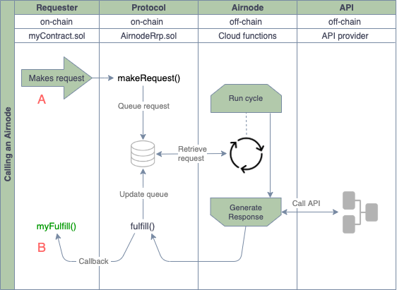

# {{$frontmatter.title}}

<TocHeader />
<TOC class="table-of-contents" :include-level="[2,3]" />


Client contracts that have been endorsed by a requester can call an Airnode. See [Become a Requester](become-a-requester.md) to set up a requester record, endorse a client contract and fund an Airnode.

Airnode is composed of two parts: the on-chain **AirnodeRrp.sol** protocol contract and the off-chain **Airnode Application** (cloud provider functions, e.g., AWS).

---
  >

  In the above diagram a client contract makes a request to the AirnodeRrp contract. When the request has been filled by the Airnode application it performs a  callback to the  **fulfill** function in the client contract via the AirnodeRrp contract.

The AirnodeRrp protocol is designed to be flexible and is meant to serve a variety of use cases. See the Airnode [client examples](https://github.com/api3dao/airnode-starter/blob/main/contracts/ExampleClient.sol) for some potential design patterns. Requesters need to create a client contract that builds on the following items.

1. Make a request to the AirnodeRrp contract
2. Capture the response from the Airnode application
3. Deploy the client contract
4. [Endorse](become-a-requester.md#part-2-endorse-client-contracts) the client contract

This document focuses on making a request and capturing the response in  your client contract.

## Step #1: Inherit AirnodeRrpClient.sol

To get started a client contract inherits from the [AirnodeRrpClient](https://github.com/api3dao/airnode/blob/master/packages/protocol/contracts/AirnodeRrpClient.sol) contract. This will expose the AirnodeRrp contract to the client contract.

```solidity
import "@api3/airnode-protocol/contracts/AirnodeRrpClient.sol";

contract ExampleClient is AirnodeRrpClient {
  ...
  constructor (address airnodeAddress)
      public
      AirnodeClient(airnodeAddress)
  {}
  ...
}
```
Note the constructor parameter `airnodeAddress` which is the public address of the AirnodeRrp contract on the blockchain you wish to use. It is used by AirnodeRrpClient to point itself to the AirnodeRrp contract on-chain.


## Step #2: Make a Request

There are three types of requests provided by the AirnodeRrp contract for use by a client contract to make a request. See [Request Types](../technology/protocols/request-response/request.html#request-types) in the Technology section for information related to each request type. 

This example will use a _full request_ type (note the `makeFullRequest` function in the code below) which is called from the client contract's own function `callTheAirnode`. The function `makeFullRequest` requires the client contract pass all parameters needed by the Airnode application to call its underlying API.

Once the request has been made the AirnodeRrp contract will return a `requestId` confirming the request has been accepted and is in process of being executed. Your contract would most likely wish to track all requestIds. Note the line `incomingFulfillments[requestId] = true;` in the code below that stores the requestIds in a mapping.

```solidity
import "@api3/airnode-protocol/contracts/AirnodeRrpClient.sol";

contract ExampleClient is AirnodeRrpClient {
  mapping(bytes32 => bool) public incomingFulfillments;
  mapping(bytes32 => int256) public fulfilledData;

  constructor (address airnodeAddress)
      public
      AirnodeClient(airnodeAddress)
  {}

  function callTheAirnode(
      bytes32 airnodeId,
      bytes32 endpointId,
      uint256 requesterInd,
      address designatedWallet,
      bytes calldata parameters
      )
      external
  {
      bytes32 requestId = airnode.makeFullRequest( // Make the request 
          airnodeId,              // airnodeId
          endpointId,             // endpointId
          requesterInd,           // requesterIndex
          designatedWallet,       // designatedWallet
          address(this),          // fulfillAddress
          this.fulfill.selector,  // fulfillFunctionId
          parameters              // API parameters
          );
      incomingFulfillments[requestId] = true;
  }
  ...
}
```

### Request Parameters

<Todo>

Needs work here. Focus on callTheAirnode function.

</Todo>

A _full request_ using the AirnodeRrp contract `makeFullRequest` function requires all parameters needed by the Airnode application be passed at runtime. This is in contrast to a _regular or short request_ type that would use a template for some or all of the required parameters. See more about [Using Templates](call-an-airnode.md#using-templates) below.

Since the `callAnAirnode` function is going to make a full request it must gather the follwoing parameters to pass on to `airnode.makeFullRequest`.

For a _full request_ the following parameters are required.

<Todo>

Need to expand on the parameters. Need to set the link.

</Todo>

- **airnodeId** and **endpointId**: As a pair uniquely specify the endpoint.
- **requesterIndex** and **designatedWallet**: Specifies the requester and the [designated wallet](become-a-requester.md#part-3-funding-airnodes) that will be used to fulfill the request. You must use the correct pair for the Airnode called.
- **fulfillAddress** and **fulfillFunctionId**: Specifies the contract and which function will be called to fulfill the request.
- **parameters**: Specify and the API and reserved parameters, these must be encoded. See [Airnode ABI specifications]() for how these are encoded.

For additional information on request parameters see [Request Parameters](../technology/protocols/request-response/request.html#request-parameters) in the Technology section.

## Step #3: Capture the Response

When the request has been fulfilled by the Airnode application it will return the response to the client contract via the AirnodeRrp contract to the client's `fulfill` function. Most likely the `fulfill` function holds logic to create a transaction based on the need for the data in the response.

```solidity
import "@api3/airnode-protocol/contracts/AirnodeClient.sol";

contract ExampleClient is AirnodeClient {
    mapping(bytes32 => bool) public incomingFulfillments;
    mapping(bytes32 => int256) public fulfilledData;

    constructor (address airnodeAddress)
        public
        AirnodeClient(airnodeAddress)
    {}

    function callTheAirnode(
        ...
    }

    function fulfill(
        bytes32 requestId,
        uint256 statusCode,
        bytes calldata data
        )
        external
        onlyAirnode()
    {
        require(incomingFulfillments[requestId], "No such request made");
        delete incomingFulfillments[requestId];
        if (statusCode == 0)
        {
            int256 decodedData = abi.decode(data, (int256));
            fulfilledData[requestId] = decodedData;
        }
    }
}
```

### Response Parameters

<Todo>

Point to a list of status codes.

</Todo>

- **requestId**: First acquired when making the request and passed here as a reference to identify which request the response is for.
- **statusCode**: A status code of `0` indicates a successful response. See [codes]() for a list of otherstatus codes.
- **calldata**: For a successful response the requested data which has been encoded. Decode it using the function `decode()` from the `abi` object .


## Using Templates


