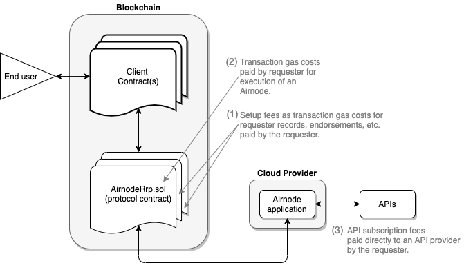

# {{$frontmatter.title}}

<TocHeader />
<TOC class="table-of-contents" :include-level="[2,3]" />

A requester will have three types of fees to consider.

1. Setup fees: transaction gas costs to maintain a requester record, its endorsements, etc.
2. Airnode execution fees: transaction gas costs when calling an Airnode.
3. API provider fees: subscriptions with an API provider.

## Setup Fees

Setup fees are encountered when setting up or changing a requester's record and endorsements. These are per call transaction gas costs and are relatively small. The funds will come from the wallet mnemonic that the requester supplied when [creating a requester record](become-a-requester.md#part-1-create-a-requester-record).

- [Creating or updating](become-a-requester.md#part-1-create-a-requester-record) a requester record.
- Adding or removing [endorsements](become-a-requester.md#part-2-endorse-client-contracts) of client contracts.
- Adding or removing [endorsements](become-a-requester.md#part-3-endorse-airnodes) of Airnodes.

## Airnode Execution Fees

When a client contract calls an Airnode there will be transaction gas costs that the requester usually covers. These funds will come from the designated wallet that was created for the requester when it endorsed the Airnode being called. There is a separate designated wallet for each Airnode that the requester has [endorsed](become-a-requester.md#part-3-endorse-airnodes).

The requester should keep in mind that a designated wallet is custodial, i.e., the Airnode keeps the private key, and the funds are trusted with the Airnode. Therefore, a requester should not fund a designated wallet with more then they can trust the Airnode with. This risk becomes negligible when:

- The Airnode is a first-party oracle, because first-party oracles are trustworthy.
- The Airnode is being used for a high value use-case, which already implies a high level of trust.

If the requester does not trust the Airnode at all, they can fund the designated just enough to cover a single fulfillment for each request. Therefore, this scheme both supports the traditional per-call payments, but also allows the protocol to leverage the trustworthiness of Airnodes to reduce unnecessary gas costs caused by microtransactions.

Although the designated wallet scheme allows the requester to cover the fulfillment gas costs, it is just as easy to have the API provider cover the gas costs. The only thing that needs to be done in this case is for the API provider to top up the designated wallet, instead of the requester. Furthermore, this scheme allows hybrid use-cases where the API provider covers the fulfillment gas costs for one requester (e.g., because they have made a special service agreement with them, while requires others to cover their own fulfillment gas costs.

## API Provider Fees

Some API providers charge a subscription fee to access their data. This is a typical practice and usually requires the requester to create an account on a website and then subscribe to a level of service offered. These types of services are usually billed monthly and can be based on an annual rate to save costs. The subscription (even if free) will most likely involve the use of a security scheme such as an api-key that must be used to access the data. See [Calling an Airnode](/) to learn more on how to pass the security credentials to an Airnode.

