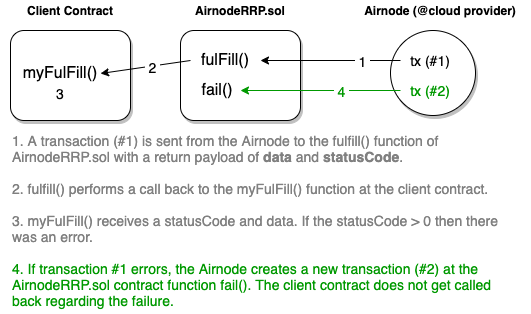

# {{$frontmatter.title}}

<TocHeader />
<TOC class="table-of-contents" :include-level="[2,3,4]" />

When a requester makes a request using `AirnodeRrp.sol`, it is returned a `requestId`. This `requestId` is a hash of all request parameters and a nonce. This allows Airnode to verify that the request parameters are not tampered with.

## Request Parameters

- `templateId` the id of a template to use, _(only used for `makeTemplateRequest`)_

- `airnode` (address) and `endpointId` specify the endpoint, _(only used for `makeFullRequest`)_

- `sponsor` and `sponsorWallet` (addresses) specify which wallet will be used to fulfill the request

- `fulfillAddress` and `fulfillFunctionId` specify which contract/function will be called to fulfill the request

- `parameters` specify the API and [reserved](../../specifications/ois.md#_5-4-reservedparameters
) parameters (see [Airnode ABI specifications](../../specifications/airnode-abi-specifications.md) for how these are encoded)

## Full Request

A full request does not refer to a template at all. Full requests are useful if the requester will not make a similar request ever again (e.g., in a prediction market context).

```solidity
function makeFullRequest(
    address airnode,
    bytes32 endpointId,
    address sponsor,
    address sponsorWallet,
    address fulfillAddress,
    bytes4 fulfillFunctionId,
    bytes calldata parameters
){...}
```

## Template Request

A template request refers to a template for the `airnode` address, `endpointId` and `parameters`.

```solidity
struct Template {
  address airnode;
  bytes32 endpointId;
  bytes parameters;
}
```

The requester can refer to the `templateId` of a template while making a request, and the Airnode will fetch these and use them in the request.

```solidity
function makeTemplateRequest(
    bytes32 templateId,
    address sponsor,
    address sponsorWallet,
    address fulfillAddress,
    bytes4 fulfillFunctionId,
    bytes calldata parameters
)
```

When a template is used to make a request, both the parameters encoded in `parameters` of the template and `parameters` provided at request-time by the requester will be used by the Airnode. In case the two include a parameter with the same name, the one provided at request-time will be used.

## Request Outcomes

A request made to an Airnode has three possible outcomes:

- Fulfill
- Fail
- Ignore

### Fulfill

`fulfill()` is the desired outcome and comes as _success_ (statusCode = 0) or as _errored_ ([statusCode](request.md#statuscode) > 0). This is the only outcome that returns results to a requester contract.

For a successful request, Airnode  calls the `fulfill()` function in `AirnodeRRP.sol` that will in turn call back the requster contract at `fulfillAddress` using function `fulfillFunctionId` to deliver `data` and a [`statusCode`](https://github.com/api3dao/airnode/blob/6f31a4c27d40e86101673bf37d223fef6625dfdd/packages/protocol/contracts/AirnodeRrp.sol#L148) of 0. If there was an error then statusCode will be non-0. The requester contract can then handle this error as it sees fit (e.g., ignore it, make a request to an alternative provider, etc.)

> 

### Fail

As noted in the diagram above, if the transaction that calls `fulfill()` reverts, the node calls the `fail()` method to report the failure. The node will not attempt to fulfill a failed request afterwards.

<Fix>
<p>
The following three paragraphs are a little dense. See Github issue: https://github.com/api3dao/api3-docs/issues/108
</p>
</Fix>

Airnode is stateless, which means that there is no database storing which requests have been fulfilled or failed, 
which are waiting on confirmations and which are still pending. This information is retrieved from the chain on 
each request-response cycle (roughly every minute). During each cycle, retrieved requests need to be ordered in 
the same way to ensure they are submitted using the same nonce. This is important because it's possible for a 
transaction to not have been confirmed by the time the next cycle runs. If this happens, the transaction is 
re-submitted with a "faster" transaction fee, overwriting the previous transaction.

However, Airnode is also dependent on the blockchain provider to supply it with the onchain data. If the 
blockchain provider is unavailable for whatever reason, it is possible that a request cannot be fully validated, 
which means that it cannot be submitted back to the blockchain. As mentioned above, keeping requests in the 
same order, using the same nonce is critical. Therefore, any request that cannot be fully validated due to a 
blockchain provider error becomes "blocked". This means that it and any requests after it are unable to be 
submitted during the current cycle and will be retried during the following cycle. It is important to note 
that this is specific to each requester. e.g. a request sent from requester A that becomes "blocked", will 
not block requests sent from requester B.

After X blocks (20 by default for EVM chains), any requests that would become "blocked", will instead become "ignored". 
This means that Airnode will stop attempting to process the request in order to process later requests.

### Ignore

If the Airnode cannot even fail a request (e.g., the requester is not sponsored by the sponsor), the request gets ignored.

## statusCode

Airnodes will return a `statusCode` when responding to a request. A non-0 statusCode is an error.

  |Code | Name | Status | Description |
  | --: | --- | --- | --- |
  |1    |RequestParameterDecodingFailed |Errored   |The request contains invalid parameters |
  |2    |RequestInvalid                 |Ignored   |The request ID cannot be verified against the other fields |
  |3    |TemplateNotFound               |Blocked   |The API call template could not be loaded |
  |4    |TemplateParameterDecodingFailed|Errored   |The API call template contains invalid parameters |
  |5    |TemplateInvalid                |Ignored   |The API call template cannot be verified against the other fields |
  |6    |SponsorWalletInvalid        |Ignored   |The request's sponsor wallet differs from the expected sponsor wallet |
  |7    |AuthorizationNotFound          |Blocked   |The API call authorization status could not be loaded |
  |8    |Unauthorized                   |Errored   |The requester contract submitting the API call request is not authorized |
  |9    |PendingWithdrawal              |Ignored   |The request cannot be actioned while there is a pending withdrawal |
  |10   |UnknownOIS                     |Errored   |The API call endpointId does not match a known OIS |
  |11   |UnknownEndpoint                |Errored   |The API call endpointId does not match a known endpoint |
  |12   |NoMatchingAggregatedCall       |Ignored   |The individual API call cannot be matched to an aggregated API call |
  |13   |ApiCallFailed                  |Errored   |The API call failed |
  |14   |ResponseParametersInvalid      |Errored   |The API call is missing a "_type" parameter |
  |15   |ResponseValueNotFound          |Errored   |A value could not be extracted from the API call response using the "_path" parameter |
  |16   |ResponseValueNotCastable       |Errored   |The API call response value could not be cast successfully using the "_type" parameter |
  |17   |FulfillTransactionFailed       |Errored   |The fulfill transaction could not be submitted successfully |

