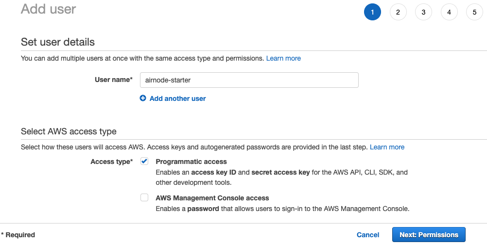
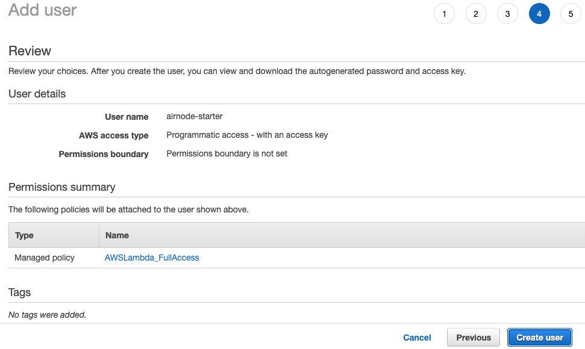
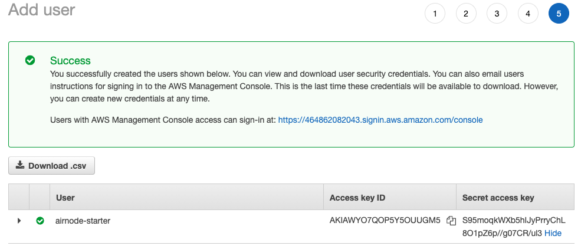

# {{$frontmatter.title}}

Airnode will deploy serverless functions to AWS Lambda. Follow these steps to create an IAM User with programmatic access and the necessary permissions.

1. Login (create an account if needed) to the [AWS Console](https://console.aws.amazon.com/).

1. From the *AWS Management Console* page access: **All Services > Security, Identity, & Complicance > IAM**.

1. From the *Identity and Access Management (IAM)* page select **Users** from the left SideBar.

1. On the *User List* page select the **Add user** button.

1. On the *Add Users* page enter a **User name**. Select the check box for **Programmatic access**. Select the **Next: Permissions** button.

    

1. Set permissions for the new **User**. For this tutorial select **Lambda Full Access**. Be sure to set the proper permissions for any production environment. Select the **Next: Tags** button.

    

1. **Tags** are not needed to run this tutorial. Select the **Next: Review** button.

1. Verify **AWS access type** is "Programmatic access - with an access key" and **Managed Policy** is "AWSLambda_Full_Access". Select the **Next: Create User** button.
    
    

1. The final page shows the newly created user and its keys. Be sure to write down the **Secret access key**, it can only be viewed once and tehn is hidden by AWS.

    

The keys (*Access key id and Secret access key*) are used by Airnode to install serverless functions to AWS. See the tutorial [airnode-start](../tutorials/airnode-starter.html) to learn more.
